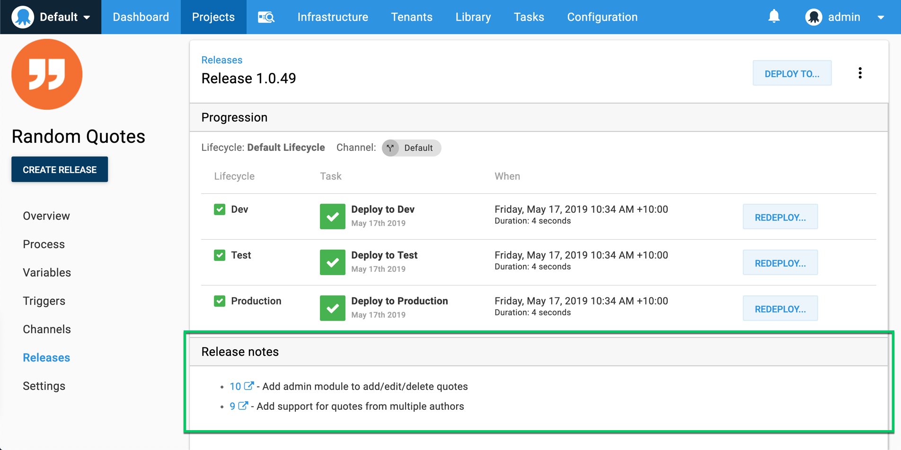
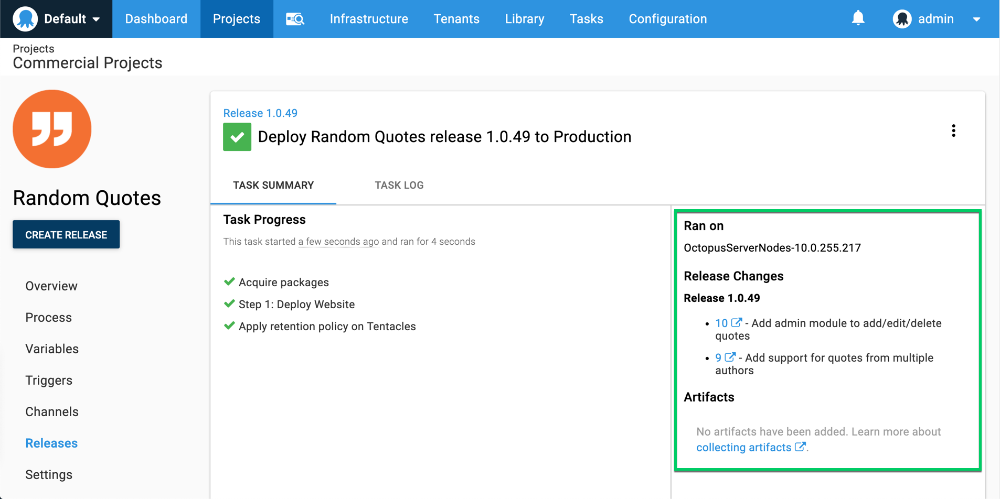

**Octopus 2019.4** added integration with GitHub to allow Octopus to display links to Github issues for work items received from your build server. The integration adds GitHub issue details and links to your releases and deployments and it can automatically retrieve release notes from GitHub to help automate the release note process. This feature builds upon the functionality to [track metadata and work item](/docs/packaging-applications/build-servers/metadata/index.md) information through your CI/CD pipeline.





This page described how to configure this functionality for Octopus and Jira.

## Connecting GitHub and Octopus Deploy

The GitHub Issue Tracker extension is very easy to configure with a small number of settings.

1. Configure the GitHub extension.

    In the Octopus web portal, navigate to **{{Configuration,Settings,GitHub Issue Tracker}}** and set the
    **GitHub Base URL**. This is required when resolving issue references that cross repo boundaries. For example, you might have a commit message with the following content:

    ```
    Fix bug with X

    Resolves MyOrg/SomeOtherRepo#1234
    ```

    `MyOrg/SomeOtherRepo#1234` refers to issue \#1234 in the `SomeOtherRepo` repository belonging to the `MyOrg` organization. While not all that common, this syntax is used when issues are tracked in a separate repo to the commit that resolves the issue.

    Ensure the **Is Enabled** property is set as well.

2. Configure the Release Note Options (optional).

    - **Username/password**: Set these values to allow Octopus to connect to GitHub and retrieve issue (work item) details from _private repositories_ when viewing packages or creating releases. If these are not provided, just the raw work item references will be used as the work item link descriptions. If they are provided the work item's title will be used as the work item link's description.

    The password should be a personal access token, rather than an actual password. You can create a token in your GitHub account settings in the 'Developer settings' area.
    
    - **Release Note Prefix**: If specified, Octopus will look for a comment that starts with the given prefix text and use whatever text appears after the prefix as the release note, which will come through to the [release notes templates](/docs/packaging-applications/build-servers/metadata/release-notes-templates.md) as the work item link's description. If no comment is found with the prefix then Octopus will default back to using the title for that work item.

    For example, a prefix of `Release note:` can be used to identify a customer friendly issue title vs a technical feature or bug fix title.

When configured, this integration will retrieve GitHub issue details and add details to your releases and deployments and generate release notes automatically.

## Commit Messages

The parsing of the commit messages is based on the GitHub concepts around [closing issues using keywords](https://help.github.com/en/articles/closing-issues-using-keywords).

The Octopus extension looks for these same keywords, and ignores issue references where the keywords are not also present.

## Next

 - Learn about other [Metadata and Work Items](/docs/packaging-applications/build-servers/metadata/index.md).
