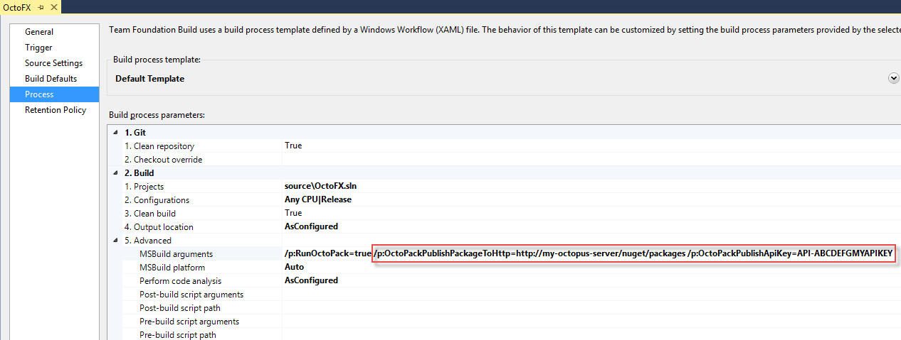

## Packaging Applications When Building With Team Build (XAML-based Builds) {#Packaging}

When Team Build builds your solution, you will need to package your applications ready to be deployed. This can be done by [installing OctoPack](/docs/packaging-applications/create-packages/octopack/index.md) on the projects that you plan to deploy.

When defining your build definition, you can expand the **Advanced** properties to specify custom arguments for MSBuild. At a minimum, you'll need to pass:

```
/p:RunOctoPack=true
```


:::success
**OctoPack**
There are plenty of other properties that you can pass here. For example, you can tell OctoPack to publish the resulting packages to a file share or another NuGet repository. See the "Publishing a new package to Octopus" section below, or [Learn more in the section on OctoPack](/docs/packaging-applications/create-packages/octopack/index.md).
:::

### Publishing a new package to Octopus

In most cases, you'll want to push your newly-created package to the built-in Octopus Deploy NuGet repository. To do this, you can use two additional MSBuild arguments to tell OctoPack to publish the package(s).

```
/p:OctoPackPublishPackageToHttp=http://my-octopus-server/nuget/packages
```

```
/p:OctoPackPublishApiKey=API-ABCDEFGMYAPIKEY
```



:::success
**Built-in Nuget and API keys**
To find your Octopus NuGet repository URL, see the [Package repositories](/docs/packaging-applications/package-repositories/index.md) section.

To create an API key, see the [How to create an API key](/docs/octopus-rest-api/how-to-create-an-api-key.md) section.
:::

## Deploying Automatically After a Build {#Deployingautomaticallyafterabuild}

### Using the Octopus CLI (Recommended) {#Deployingautomaticallyafterabuild-Using-OctopusCLI}

The Octopus CLI is a command line tool built on top of our REST API. Its fairly easy to hook up into almost any process from a simple script. In the case of old XAML-based builds, we recommend you include a call to `octo` in the *post-deploy script* of their build definition, so it gets called after MSBuild ran and Octopack created the package and pushed it to the repository.

The Octopus CLI has [plenty of commands](/docs/octopus-rest-api/octopus-cli/index.md), but the ones you should look into for the post-deploy script are:

- [Create-Release](/docs/octopus-rest-api/octopus-cli/create-release.md) to create a release in Octopus.
- [Deploy-Release](/docs/octopus-rest-api/octopus-cli/deploy-release.md) to deploy the previously created release.

### Using Lifecycles and Automatic Deployments {#Deployingautomaticallyafterabuild-Using-AutomaticDeployments}

**Octopus 2.6** introduced [Lifecycles ](/docs/deployment-process/lifecycles/index.md)and [Automatic Release Creation](/docs/projects/project-triggers/automatic-release-creation.md). You can use these two features to automatically deploy to one or more environments when a new package is pushed to the built-in NuGet repository.

First, turn on Automatic Release Creation to create a new release when your package is pushed. Then, using the project Lifecycle configure one or more environments in your first phase to deploy automatically when a new release is available.

By adding these features to the steps above, you can set up complete end-to-end continuous integration:

1. OctoPack will create new NuGet packages for your projects.
2. OctoPack will push those packages to the built-in NuGet repository.
3. Automatic Release Creation will create a new Release.
4. Your Lifecycle will trigger a deployment when the release is created.

## Video Walk-through {#VideoWalk-through}

This 6 minute video walks through the above steps to create an end-to-end continuous deployment process for Team Foundation Server.

:::Info
While the video was recorded using **Octopus 2.6**, it is still valid for modern versions of Octopus.
:::

<iframe src="//fast.wistia.net/embed/iframe/jmnuxifuyo" allowtransparency="true" frameborder="0" scrolling="no" class="wistia_embed" name="wistia_embed" allowfullscreen mozallowfullscreen webkitallowfullscreen oallowfullscreen msallowfullscreen width="640" height="360" style="margin: 30px"></iframe>
