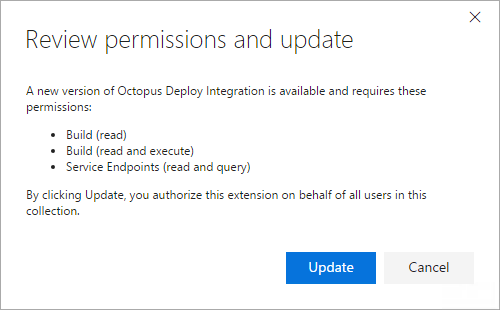

## Octopus extension versions

There have been four major versions of the Octopus Extension:

- [**Version 1.2.x**](https://s3-eu-west-1.amazonaws.com/octopus-downloads/tfs-2015-extension/octopusdeploy.octopus-deploy-build-release-tasks-1.2.28.vsix) - obsolete, but still usable for older versions of TFS and Azure DevOps
- [**Version 2.0.199**](https://s3-eu-west-1.amazonaws.com/octopus-downloads/tfs-2015-extension/octopusdeploy.octopus-deploy-build-release-tasks-2.0.199.vsix) - for TFS 2015 Update 2, TFS 2015 Update 3, TFS 2015 Update 4, and TFS 2017 RTM
- [**Version 3.0.222**](https://octopus-downloads.s3-eu-west-1.amazonaws.com/tfs-2015-extension/octopusdeploy.octopus-deploy-build-release-tasks-3.0.222.vsix) - download for TFS 2017 Update 1
- [**Version 4.0.x**](https://marketplace.visualstudio.com/items?itemName=octopusdeploy.octopus-deploy-build-release-tasks) - the current, most recent version of the extension, for Azure DevOps and TFS 2017 Update 2 and above

## Extension compatibility with Azure DevOps/Team Foundation Server

The following table shows compatibility between versions of Azure DevOps, TFS, and the Octopus extension

| Azure DevOps/TFS Version / Extension Version |   1.2.x   |   2.0.199     |     3.0.x     |     4.0.x     |
| -------------------------------------------- |:---------:|:-------------:|:-------------:|:-------------:|
| Azure DevOps                                 | Supported | Not supported |   Supported   |   Supported   |
| TFS 2017 Update 2                            | Supported |   See below   |   Supported   |   Supported   |
| TFS 2017 Update 1                            | Supported |   See below   |   Supported   | Not supported |
| TFS 2017 RTM                                 | Supported |   Supported   | Not supported | Not supported |
| TFS 2015 Updates 2,3,4                       | Supported |   Supported   | Not supported | Not supported |

TFS 2017 Update 1 is technically supported with version 2.0.199 of the extension, but we do not recommended it.

Any version older than TFS 2015 Update 2 is not supported by any extension version.

You may have success manually installing the task by following [these instructions](manually-install-the-build-task.md).

### Build information compatibility {#build-information-compatibility}

When passing [build information](docs/packaging-applications/build-servers/build-information/index.md) to Octopus from TFS, you may encounter issues when trying to use the build link generated by the Octopus TFS extension.

Specifically, the build link may return a `404 (Not Found)` error when viewed. The cause for the issue is believed to be the result of a change to the format of the build URL supported by TFS/Azure DevOps.

The Build information step in the Octopus TFS plugin expects the build to be viewed using a URL like this: 
`https://my-tfs-server-address/tfs/Projects/MyProject/_build/results?buildId=<BUILDID>`.

However, affected TFS versions expect the build to be viewed using a different URL like this: `https://my-tfs-server-address/tfs/Projects/MyProject/_build/index?buildId=<BUILDID>`.

Since the Build information step was created after this change, the only workarounds are to either try to create a URL re-write rule in TFS to display the build using the new URL format, or to update the TFS version.

## Upgrading extensions

The ease of upgrades depends very much on the version of Azure DevOps/TFS being used, and the extension versions involved.

### Extension upgrades in Azure DevOps and TFS 2017 update 1 and above

In Azure DevOps, extension versions within the same major version (e.g. 2.0.62 to 2.0.63) are applied automatically. These should never be breaking changes. The same applies in TFS 2017.1, the only difference being the need to upload the new extension to TFS manually.

Extension updates that increment major version numbers (e.g. 1.2.28 to 2.0.63) will result in both versions being available. Your administrator will be prompted to update the extension before it's available to users.

Once it's available, you can choose the version you want to use using the drop-down in the task details.

### Extension upgrades in TFS 2015 updates 2, 3, and 4, and TFS 2017 RTM

:::warning
Extension updates that increment major versions (e.g. 1.2.28 to 2.0.63) are breaking changes! Your build definitions will need to be updated before they can be successfully run again.
:::

Upgrades within the same major version number (e.g. 2.0.62 to 2.0.63) can be applied safely. These should never be breaking changes.

Upgrades that increment major versions (e.g. 1.2.28 to 2.0.63) are breaking changes and any builds using these tasks will fail until they are fixed. Version 2.x of the extension changed the way TFS connects to Octopus, so the new service connection must be configured before builds or releases will successfully run.
