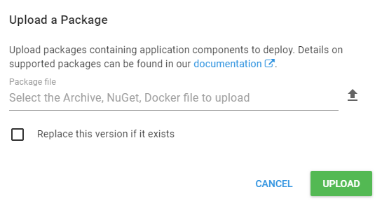

You can package full framework .NET applications from your continuous integration/automated build process with OctoPack. OctoPack adds a custom MSBuild target that hooks into the build process of your solution. When enabled, OctoPack will package your console application projects, Windows Service projects, and ASP.NET web applications when MSBuild runs.

OctoPack works by calling `nuget.exe pack` to build the NuGet package, and `nuget.exe push` to publish the package (if so desired). OctoPack understands .NET applications and uses that knowledge to build the right kind of package for each kind of .NET application.

:::warning
**OctoPack and .NET Core**
OctoPack is not compatible with .NET Core applications. If you want to package .NET Core applications see [create packages with the Octopus CLI](/docs/packaging-applications/create-packages/octopus-cli.md).
:::

## Install OctoPack {#UsingOctoPack-InstallingOctoPack}

OctoPack is a NuGet package that you can install using the NuGet package installer or however you prefer to install NuGet packages.

OctoPack should only be installed on projects that you are going to deploy, that means your console application projects, Windows Service projects, and ASP.NET web applications. Do not install OctoPack on unit tests, class libraries, or other supporting projects.

## Build packages {#UsingOctoPack-Buildingpackages}

Set the `RunOctoPack` MSBuild property to true, and OctoPack will create a NuGet package from your build. For example, if you are compiling from the command line, you might use:

```powershell
msbuild MySolution.sln /t:Build /p:RunOctoPack=true
```

After the build completes, you will find a NuGet package in the output directory. This package is ready to be deployed with Octopus. See [Package Deployments](/docs/deployments/packages/index.md).

## Add a NuSpec file {#UsingOctoPack-AddingaNuSpec}

A `.nuspec` file describes the contents of your NuGet package. You can provide your own simple `.nuspec` file to your project. 

When MSBuild is invoked OctoPack tries to establish the name of your NuSpec file using these rules:

1. OctoPack will look for a variable called `OctoPackNuSpecFileName` to use as the NuSpec file. 
1. If that isn't defined, OctoPack tries to find one based on your project name:
    - OctoPack will look for a variable called `OctoPackProjectName` to use as the NuSpec file.
    - If that isn't defined, OctoPack uses the project name. For example `Sample.Web.nuspec` if your project is named `Sample.Web`.

Note: The `.nuspec` file needs to be in the same directory as your `.csproj` file.

:::hint
If you don't provide a NuSpec file, OctoPack will create one by guessing some of the settings from your project.
:::

Here is an example `.nuspec` file:

```xml
<?xml version="1.0"?>
<package xmlns="http://schemas.microsoft.com/packaging/2010/07/nuspec.xsd">
  <metadata>
    <id>Sample.Web</id>
    <title>Your Web Application</title>
    <version>1.0.0</version>
    <authors>Your name</authors>
    <owners>Your name</owners>
    <licenseUrl>http://yourcompany.com</licenseUrl>
    <projectUrl>http://yourcompany.com</projectUrl>
    <requireLicenseAcceptance>false</requireLicenseAcceptance>
    <description>A sample project</description>
    <releaseNotes>This release contains the following changes...</releaseNotes>
  </metadata>
</package>
```

If you have an existing `.nuspec` file but you want the generated Octopus package name to be different from the `.nuspec` filename, you can use [NuGet replacement tokens](#nuget-replacement-tokens). For example, the `id` property in the `.nuspec` could be set as follows:

```xml
<id>$packageId</id>
```
Then you would pass the package id you wanted as part of the `OctoPackNuGetProperties` MSBuild parameter :

```text
/p:OctoPackNuGetProperties=packageid=YOUR-PACKAGE-ID
```

Remembering to replace `YOUR-PACKAGE-ID` with the id for your package.

### Include additional files with your NuSpec file

If you need to include additional files, or you want to explicitly control which files are included in the package, you can do so by adding a `<files>` element to your custom `.nuspec` file.

If the `<files>` section exists, by default OctoPack will not attempt to automatically add any extra files to your package, so you need to explicitly list which files you want to include. You can override this behavior with `/p:OctoPackEnforceAddingFiles=true` which will instruct OctoPack to package a combination of files using its conventions and those defined by your `<files>` section:

```xml
<files>
  <file src="bin\*.dll" target="bin" />
  <file src="Content\*.css" target="Content" />
  <file src="Files\**\*.*" target="Files" exclude="Files\SuperSecret.cert" />
</files>
```

### NuGet replacement tokens

You can use NuGet replacement tokens inside your NuSpec file:

```xml
<?xml version="1.0"?>
<package xmlns="http://schemas.microsoft.com/packaging/2010/07/nuspec.xsd">
  <metadata>
    <id>Sample.$suffix$</id>
    <title>$title$</title>
    <version>$version$</version>
    <authors>$myname$</authors>
    <owners>Your name</owners>
    <licenseUrl>http://yourcompany.com</licenseUrl>
    <projectUrl>http://yourcompany.com</projectUrl>
    <requireLicenseAcceptance>false</requireLicenseAcceptance>
    <description>A sample project</description>
    <releaseNotes>This release contains the following changes...</releaseNotes>
  </metadata>
</package>
```

To set a value for these parameters, use the MSBuild property OctoPackNuGetProperties:

```powershell
msbuild MySolution.sln /t:Build /p:RunOctoPack=true "/p:OctoPackNuGetProperties=suffix=release;title=My Title;version=1.0.0;myname=Paul"
```

Learn more about the [NuSpec file format](http://docs.nuget.org/docs/reference/nuspec-reference).

## What is packaged? {#UsingOctoPack-Whatispackaged?}

OctoPack only packages the files in your .Net applications that are required to deploy the application.

If you are packaging a .NET application, OctoPack will **automatically package all of the files in the build output directory for the project**. In most cases this will be the `bin`, `bin\Debug`, or `bin\Release` folder, depending on the build configuration and whether you have [changed the build output directory for your project in Visual Studio](https://msdn.microsoft.com/en-us/library/ms165410.aspx).

If you have customized the output directory, and you have added a custom files element to your custom nuspec file, the paths you specify must be relative to the nuspec file's location. This means that for the binaries files that are being built by the project you will have to use some combination of `..\` style prefix to refer to the assemblies.

For Windows Service or Console applications, and many Windows Forms or WPF applications, the build output directory contains everything you need to deploy your application.

The example below shows a Windows Service called `OctoFX.RateService.exe` and all of the files required to run the application, including libraries and configuration files.


## Include web application content files {#UsingOctoPack-Includingwebapplicationcontentfiles}

Web applications require additional files to run, such as Razor/ASPX files, configuration files, and assets such as images, CSS, and JavaScript files. OctoPack automatically determines whether a project is a web application or not based on whether it finds a `web.config` file.

When packaging a web application, OctoPack will automatically include the `bin` folder and any files configured with `Build Action: Content`.

You can see **Build Action** in the Solution Explorer properties window for the currently selected file in Visual Studio:


The example below shows a web app called **OctoFX.TradingWebsite**. All the files required to host the web app have been packaged, including the contents of the `bin` folder and any files with **Build Action: Content**:


### .NET configuration transformation

OctoPack won't run web.config transformation files, because these will be run as [part of the deployment instead](/docs/projects/steps/configuration-features/configuration-transforms/index.md). Make sure you set **Build Action: Content** for your .NET configuration transform files (like `web.Release.config`) to ensure these files are packaged and used as part of your deployment.

### .NET XML configuration transforms

You can use [.NET XML configuration transforms](/docs/projects/steps/configuration-features/xml-configuration-variables-feature.md) on any XML files including the `app.config` file for Windows Service, Console, Windows Forms, or WPF applications. Make sure the transform files are copied to the build output directory as part of your build, and they will be packaged by OctoPack so you can use them as part of your [deployment](/docs/projects/steps/configuration-features/index.md).

## Include additional files using copy to output directory {#UsingOctoPack-IncludingadditionalfilesusingCopytoOutputDirectory}

If you need to include other files in your package for deployment, you can use the Visual Studio properties panel to set the `Copy to Output Directory` attribute to `Copy if newer` or `Copy always`. These files will be copied to the build output directory when the project builds, and subsequently packaged by OctoPack.

## Version numbers {#UsingOctoPack-Versionnumbers}

NuGet packages have version numbers. When you use OctoPack, the NuGet package version number will come from (in order of priority):

1. The command line, if you pass `/p:OctoPackPackageVersion=<version>` as an MSBuild parameter when building your project.
2. If the assembly contains a `GitVersionInformation` type, the field `GitVersionInformation.NuGetVersion` is used.
3. If you pass `/p:OctoPackUseProductVersion=true` as an MSBuild parameter, `[assembly: AssemblyInformationalVersion]` (AKA Assembly's product version) is used.
4. If you pass `/p:OctoPackUseFileVersion=true` as an MSBuild parameter, `[assembly: AssemblyFileVersion]` (AKA Assembly's file version) is used.
5. If the `[assembly: AssemblyInformationalVersion]` value is not valid, the `[assembly: AssemblyFileVersion]` is used.
6. If the `[assembly: AssemblyFileVersion]` is the same as the `[assembly: AssemblyInformationalVersion]` (AKA ProductVersion), then we'll use the `[assembly: AssemblyVersion]` attribute in your `AssemblyInfo.cs` file.
7. Otherwise we take the `[assembly: AssemblyInformationalVersion]`.

During the build, messages are output at the `Normal` msbuild logging level which may help diagnose version retrieval problems.

### Version numbers are preserved as-is

NuGet 3 started removing leading zeros and the fourth digit if it is zero. These are affectionately known as "NuGet zero quirks" and can be surprising when working with tooling outside the NuGet ecosystem. We have made a choice to preserve the version as-is when working with Octopus tooling to create packages of any kind. Learn more about [versioning in Octopus Deploy](/docs/packaging-applications/create-packages/versioning.md).

To make this work for NuGet packages we have forked NuGet.

The fork of NuGet 3 available here: https://github.com/OctopusDeploy/NuGet.Client

The packages are available here: https://octopus.myget.org/feed/octopus-dependencies/package/nuget/NuGet.CommandLine

## Add release notes {#UsingOctoPack-Addingreleasenotes}

NuSpec files can contain release notes, which show up on the Octopus Deploy release page. OctoPack can add these notes to your NuGet package if you pass a path to a file containing the notes. For example:

```powershell
msbuild MySolution.sln /t:Build /p:RunOctoPack=true /p:OctoPackReleaseNotesFile=..\ReleaseNotes.txt
```

Note that the file path should always be relative to the C#/VB project file not the solution file.

## Publish your package {#UsingOctoPack-Publishing}

To publish your package to a NuGet feed, you can optionally use some extra MSBuild properties:

- `/p:OctoPackPublishPackageToFileShare=C:\MyPackages`: copies the package to the path given.
- `/p:OctoPackPublishPackageToHttp=http://my-nuget-server/api/v2/package`: pushes the package to the NuGet server.
- `/p:OctoPackPublishApiKey=ABCDEFGMYAPIKEY`: API key to use when publishing.
- `/p:OctoPackAppendProjectToFeed=true`: Append the project name onto the feed so you can nest packages under folders on publish.
- `/p:OctoPackAppendToPackageId=foo`: Append the extra name to the package ID (e.g. for feature branch packages). MyApp.Foo.1.2.3.nupkg.

## Push your packages to the Octopus built-in repository

Octopus provides a [built-in package repository](/docs/packaging-applications/package-repositories/index.md) for your deployment packages. The Octopus built-in repository is generally the best choice for deployment packages because it offers better performance and most suitable [retention policies](/docs/administration/retention-policies/index.md).

To push your packages to the Octopus built-in repository use the following settings:

- `/p:OctoPackPublishPackageToHttp=http://your.octopusserver.com/nuget/packages`: this is the URL to your Octopus Server noting the `/nuget/packages` path.
- `/p:OctoPackPublishApiKey=API-ABCDEFGMYAPIKEY`: the [Octopus API key](/docs/octopus-rest-api/how-to-create-an-api-key.md) you want to use for pushing packages noting [these security considerations](/docs/packaging-applications/package-repositories/built-in-repository/index.md#security-considerations).

## Push a NuGet package that already exists

When pushing to the [built-in Octopus package repository](/docs/packaging-applications/package-repositories/index.md) using [OctoPack](/docs/packaging-applications/create-packages/octopack/index.md) or [NuGet.exe](https://docs.microsoft.com/en-us/nuget/tools/nuget-exe-cli-reference), the default URL looks like this:

`http://MyOctopusServer/nuget/packages`

If a package with the same version already exists, the server will usually reject it with a 400 error. This is because each time you change an application, you should produce a new version of each NuGet package. Usually, customers set up their CI builds to automatically increment the package version number (e.g., 1.1.1, 1.1.2, 1.1.3, and so on).

Sometimes the package version number don't always change. This can happen if you are building a solution containing many projects, and only one project has changed. If this is the case, and only one project has changed, you can modify the URL to include a `?replace=true` parameter like this:

`http://MyOctopusServer/nuget/packages?replace=true`

This will force the Octopus Server to replace the existing NuGet package with the new version you have pushed. It works exactly the same as the check-box on the package upload pane:



## All supported parameters {#UsingOctoPack-Allsupportedparameters}

In addition to the common arguments above, OctoPack has a number of other parameters. The full list is documented in the table below.

| Parameter                              | Example value                           | Description                              |
| -------------------------------------- | --------------------------------------- | ---------------------------------------- |
| `RunOctoPack`                          | `True`                                  | Set to `True` for OctoPack to run and create packages during the build. Default: OctoPack won't run. |
| `OctoPackPackageVersion`               | `1.0.0`                                 | Version number of the NuGet package. By default, OctoPack gets the version from your assembly version attributes. Set this parameter to use an explicit version number. |
| `OctoPackAppConfigFileOverride`        | `Foo.config`                            | When packaging a project called YourApp, containing a file named `App.config`, OctoPack will automatically ignore it, and instead look for `YourApp.exe.config`. Provide this setting to have OctoPack select your specified config file, instead. |
| `OctoPackAppendToPackageId`            | `Release`                               | A fragment that will be appended to the NuGet package ID, allowing you to create different NuGet packages depending on the build configuration. E.g., if the ID element in the NuSpec is set to "`MyApp`", and this parameter is set to "`Release`", the final package ID will be "`MyApp.Release`". |
| `OctoPackAppendToVersion`              | `beta025`                               | Define a pre-release tag to be appended to the end of your package version. |
| `OctoPackEnforceAddingFiles`           | `True`                                  | By default, when your NuSpec file has a `<files>` element, OctoPack won't automatically add any of the other files that it would usually add to the package. Set this parameter to `true` to force OctoPack to add all the files it would normally add. |
| `OctoPackIgnoreNonRootScripts`         | `True`                                  | Octopus Deploy only calls `Deploy.ps1` files etc., that are at the root of the NuGet package. If your project emits `Deploy.ps1` files that are not at the root, OctoPack will usually warn you when packaging these. Set this parameter to `true` to suppress the warning. |
| `OctoPackIncludeTypeScriptSourceFiles` | `True`                                  | If your project has TypeScript files, OctoPack will usually package the corresponding `.js` file produced by the TypeScript compiler, instead of the `.ts` file. Set this parameter to `true` to force OctoPack to package the `.ts` file instead. |
| `OctoPackNuGetArguments`               | `-NoDefaultExcludes`                    | Use this parameter to specify additional command line parameters that will be passed to `NuGet.exe pack`. See the [NuGet pack command description](http://docs.nuget.org/docs/reference/command-line-reference#Pack_Command). |
| `OctoPackNuGetExePath`                 | `C:\Tools\NuGet.exe`                    | OctoPack comes with a bundled version of `NuGet.exe`. Use this parameter to force OctoPack to use a different `NuGet.exe` instead. |
| `OctoPackNuGetProperties`              | `foo=bar;baz=bing`                      | If you use replacement tokens in your NuSpec file (e.g., `$foo$`, `$bar$`, `$version$`, etc.), this parameter allows you to set the value for those tokens. See the section above on replacement tokens, and see the [NuSpec reference for details on replacement tokens](http://docs.nuget.org/docs/reference/nuspec-reference#Replacement_Tokens). |
| `OctoPackNuGetPushProperties`          | `-Timeout 500`                          | Additional arguments that will be passed to `NuGet.exe push` if you are pushing to an HTTP/HTTPS NuGet repository. See the [NuGet push command description](http://docs.nuget.org/docs/reference/command-line-reference#Push_Command). |
| `OctoPackNuSpecFileName`               | `MyApp.nuspec`                          | The NuSpec file to use. Defaults to `"<C#/VB project name>.nuspec"`. If the file doesn't exist, OctoPack generates a NuSpec based on your project metadata. |
| `OctoPackPublishApiKey`                | `API-ABCDEFGMYAPIKEY`                   | Your API key to use when publishing to a HTTP/HTTPS based NuGet repository |
| `OctoPackPublishPackagesToTeamCity`    | `False`                                 | By default, if OctoPack detects that the build is running under TeamCity, the NuGet package that is produced is registered as an artifact in TeamCity. Use this parameter to suppress this behavior. |
| `OctoPackPublishPackageToFileShare`    | `\\server\packages`                     | OctoPack can publish packages to a file share or local directory after packaging |
| `OctoPackPublishPackageToHttp`         | `http://my-nuget-server/api/v2/package` | OctoPack can publish packages to a HTTP/HTTPS NuGet repository (or the [Octopus built-in repository](/docs/packaging-applications/package-repositories/index.md)) after packaging. |
| `OctoPackReleaseNotesFile`             | `myreleasenotes.txt`                    | Use this parameter to have the package release notes read from a file. |
| `OctoPackProjectName`                  | `YourProjectName`                       | Use this parameter to override the name of your package so its not necessarily identical to your Visual Studio Project. This will only work when building a single Project/Package. For multiple projects you do not use this parameter and instead set the below property on your project's csproj file `<PropertyGroup><OctoPackProjectName>Foo</OctoPackProjectName></PropertyGroup>` |
| `OctoPackUseFileVersion`               | `true`                                  | Use this parameter to use `[assembly: AssemblyFileVersion]` (Assembly File Version) as the package version (see [version numbers](#UsingOctoPack-Versionnumbers)) |
| `OctoPackUseProductVersion`            | `true`                                  | Use this parameter to use `[assembly: AssemblyInformationalVersion]` (Assembly Product Version) as the package version (see [version numbers](#UsingOctoPack-Versionnumbers)). Introduced in OctoPack `3.5.0` |
| `OctoPackAppendProjectToFeed`          | `true`                                  | Append the project name onto the feed so you can nest packages under folders on publish |

## Learn more

 - Use [OctoPack to include BuildEvent files](/docs/packaging-applications/create-packages/octopack/octopack-to-include-buildevent-files.md)
 - [Troubleshooting OctoPack](/docs/packaging-applications/create-packages/octopack/troubleshooting-octopack.md)
 - [Package deployments](/docs/deployments/packages/index.md)
