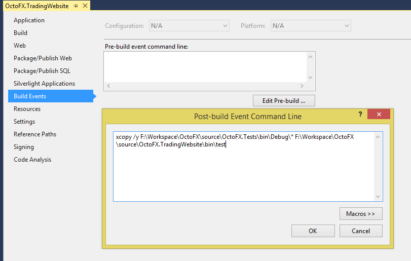
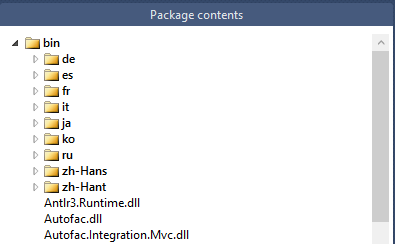
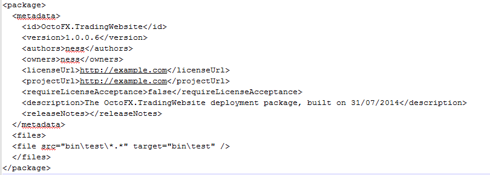
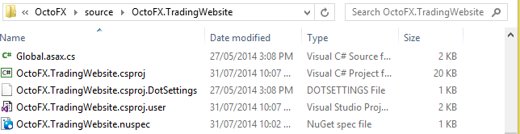
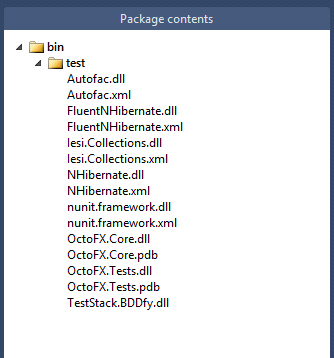
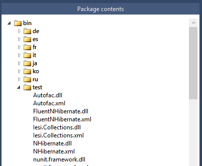

The [Using OctoPack](/docs/packaging-applications/create-packages/octopack/index.md) documentation page gives you all the details of how to add OctoPack to your Visual Studio solution and use MsBuild to package your solution into a NuGet package.

This page will give an example of extending the use of OctoPack when you have a PostBuild event in Visual Studio and want to include files that are not specifically part of your build, such as files that have been moved using Xcopy.

This shows, by example, the use of a PostBuild event in Visual Studio and the OctoPack option **OctoPackEnforceAddingFiles**.

I created a Post-Build Event using the Visual Studio Build Events feature. It uses Xcopy to move files from a path to my solution.



However when I use OctoPack to package my solution on build my moved files are not included in the build.



This is resolved by creating a NuSpec file, and creating a files tag to tell OctoPack to take my moved files, and put them inside a folder called `bin\test` in the package.



It is important to note here that for OctoPack to find and use a NuSpec file, it must be named the same as your project as seen above.



However, now when I run my OctoPack command, all I get are the files defined within the NuSpec file.



This is resolved by adding **/p:OctoPackEnforceAddingFiles=true**, this tells OctoPack to also add the files it would normally add while building as well as those targeted by my files tag in the NuSpec file.

```powershell
F:\Workspace\OctoFX\source>msbuild OctoFX.sln /t:Build /p:RunOctoPack=true /p:OctoPackPackageVersion=1.0.0.7 /p:OctoPackEnforceAddingFiles=true
```

Now my test folder and files, as well as my build files, are included in the package.



## Next

 - [Packaging Applications](/docs/packaging-applications/index.md)
 - [Use Octo.exe to create packages](/docs/packaging-applications/create-packages/octo.exe.md)
 - [Troubleshooting OctoPack](/docs/packaging-applications/create-packages/octopack/troubleshooting-octopack.md)
 - [Package deployments](/docs/deployment-examples/package-deployments/index.md)
