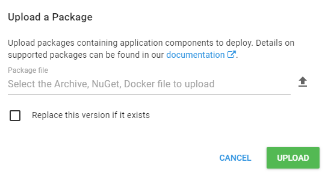

This feature was added in **Octopus 3.2.4**.

When pushing to the [built-in Octopus package repository](/docs/packaging-applications/package-repositories/index.md) using [OctoPack](/docs/packaging-applications/creating-packages/nuget-packages/using-octopack/index.md) or [NuGet.exe](https://docs.microsoft.com/en-us/nuget/tools/nuget-exe-cli-reference), the default URL looks like this:

`http://MyOctopusServer/nuget/packages`

If a package with the same version already exists, the server will usually reject it with a 400 error. This is because each time you change an application, you should produce a new version of each NuGet package. Usually, customers set up their CI builds to automatically increment the package version number (e.g., 1.1.1, 1.1.2, 1.1.3, and so on).

Sometimes the package version number may not always change. This can happen if you are building a solution containing many projects, and only one project has changed. If this is the case, and only one project has changed. In this case, you can modify the URL to include a `?replace=true` parameter like this:

`http://MyOctopusServer/nuget/packages?replace=true`

This will force the Octopus Server to replace the existing NuGet package with the new version you have pushed. It works exactly the same as the checkbox on the package upload pane:

