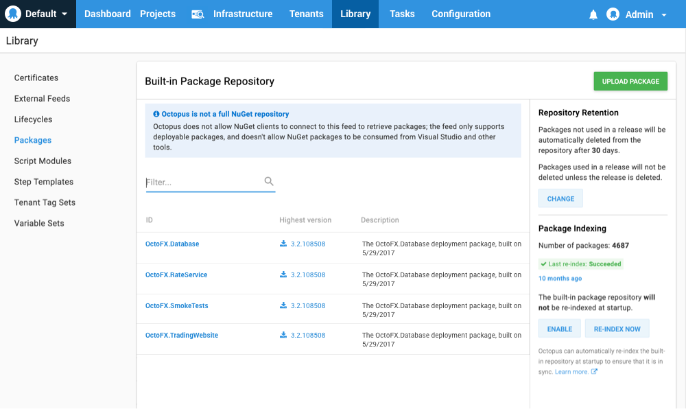

Your Octopus server comes with a built-in repository which is the best choice for deployment packages. It offers **better performance** for your deployments and the most **robust [retention policy](/docs/administration/retention-policies/index.md) support** for deployment packages.

:::hint
**Built-in Feed Can Only Be Consumed by Octopus**
It is important to understand that the Octopus Server provides a write-only repository; intended for hosting deployment packages only. Packages that are pushed to the Octopus Server can't be consumed by other NuGet clients like Visual Studio. If you need a NuGet feed for sharing libraries between your development projects, a separate NuGet repository is required.
:::

## Pushing Packages to the Built-In Repository {#pushing-packages-to-the-built-in-repository}

We offer several ways to add, upload, and push packages to the built-in feed:

- Using the Octopus web portal.
- Using your build server.
- Using Octo.exe.
- Using the Octopus API (HTTP POST).
- Using NuGet.exe push.
- Using npm.exe, grunt or gulp.
- Using curl.
- Security considerations.

## Using the Octopus Web Portal {#PushingpackagestotheBuilt-Inrepository-UsingtheOctopuswebportal}

You can manually upload a package file from your local machine via the Octopus web portal via the **{{Library,Packages}}** tab by clicking the *Upload package* button.


:::success
We generally recommend using a continuous integration/build server like [TeamCity](/docs/packaging-applications/build-servers/teamcity.md), [Jenkins](/docs/packaging-applications/build-servers/jenkins.md), [Bamboo](/docs/packaging-applications/build-servers/bamboo.md) or [Azure DevOps/Team Foundation Server (TFS)](/docs/packaging-applications/build-servers/tfs-azure-devops/index.md) to build, test, package and automatically push your release packages into the Octopus Deploy built-in repository. See below for examples on doing this.
:::

:::hint
For pushing packages using the methods described below you'll need:

1. The URL to your Octopus Server.
2. An [Octopus API key](/docs/octopus-rest-api/how-to-create-an-api-key.md) with the required permissions (see [security considerations](/docs/packaging-applications/package-repositories/built-in-repository/index.md#pushing-packages-to-the-built-in-repository)).
:::

## Using Your Build Server {#PushingpackagestotheBuilt-Inrepository-Usingyourbuildserver}

We have built integrations/plugins/extensions for the most popular build servers. You can read more about [integrating Octopus Deploy with your build server](/docs/octopus-rest-api/index.md). In most cases you simply provide the build server with the URL to your Octopus Server and an [Octopus API key](/docs/octopus-rest-api/how-to-create-an-api-key.md) with the required permissions  (see [security considerations](/docs/packaging-applications/package-repositories/built-in-repository/index.md#pushing-packages-to-the-built-in-repository)).

## Using Octo.exe {#PushingpackagestotheBuilt-Inrepository-UsingOcto.exe}

You can push one or more packages using Octo.exe, the command-line tool for Octopus Deploy. The example below will push `MyApp.Website.1.1.0.zip` and `MyApp.Database.1.1.0.zip` to the built-in repository, automatically replacing existing packages if there are conflicts.

```powershell
C:\> Octo.exe push --package MyApp.Website.1.1.0.zip --package MyApp.Database.1.1.0.zip --replace-existing --server http://my.octopus.url --apiKey API-XXXXXXXXXXXXXXXX
```

For more information refer to [Pushing packages with Octo.exe](/docs/octopus-rest-api/octo.exe-command-line/push.md).

## Using the Octopus API (HTTP POST) {#PushingpackagestotheBuilt-Inrepository-UsingtheOctopusAPI(HTTPPOST)}

You can upload a package via the [Octopus Deploy API](/docs/octopus-rest-api/index.md) - `POST /api/packages/raw HTTP 1.1`.

- [C# example (LINQPad)](https://github.com/OctopusDeploy/OctopusDeploy-Api/blob/master/Octopus.Client/LINQPad/Push%20Package%20to%20Built-In%20Repository.linq)
- [PowerShell example](https://github.com/OctopusDeploy/OctopusDeploy-Api/blob/master/REST/PowerShell/Packages/PushPackage.ps1)

## Using NuGet.exe Push {#PushingpackagestotheBuilt-Inrepository-UsingNuGet.exepush}

To push a package using `NuGet.exe` you'll need a the URL for the Octopus NuGet feed to use with your build server or `NuGet.exe`. To find this, open the **{{Library,Packages}}** tab of the Octopus web portal.  Simply click the **Show examples** link to see options to upload packages. The screen shows an example command-line that can be used to push packages to the feed using [NuGet.exe](http://docs.nuget.org/docs/start-here/installing-nuget). You'll need to supply the NuGet package file (`.nupkg`) and an [Octopus API key](/docs/octopus-rest-api/how-to-create-an-api-key.md).



:::success
If you're using a continuous integration server like TeamCity to produce packages you can use their built-in NuGet Push step. Supply the Octopus NuGet feed URL shown above and an [Octopus API key](/docs/octopus-rest-api/how-to-create-an-api-key.md) when prompted for the feed details.
:::

If a package with the same version exists, and you want to force the Octopus Server to replace it, you can modify the URL to include a `?replace=true` parameter:

`http://MyOctopusServer/nuget/packages?replace=true`

## Using npm.exe, Grunt or Gulp {#PushingpackagestotheBuilt-Inrepository-Usingnpm.exe,gruntorgulp}

You can upload packages using npm.exe or using our grunt or gulp tasks. Take a look at our [guide for packaging and deploying Node.js applications using Octopus Deploy](/docs/deployment-examples/node-on-linux-deployments/index.md).

## Using Curl {#PushingpackagestotheBuilt-Inrepository-Usingcurl}

You can upload packages using **curl**. Like all of the other examples you will need your Octopus Server URL and an API Key. This will perform a POST uploading the file contents as multi-part form data.

```powershell
curl -X POST https://demo.octopus.com/api/packages/raw -H "X-Octopus-ApiKey: API-YOURAPIKEY" -F "data=@Demo.1.0.0.zip"
```

:::success
You may need to use the `-k` argument if you are using an untrusted connection.
:::

## Security Considerations {#PushingpackagestotheBuilt-Inrepository-Securityconsiderationssecurityconsiderations}

To add a new package to the built-in feed requires the `BuiltInFeedPush` permission. To delete a package, or replace an existing package requires the `BuiltInFeedAdminister` permission.

For your convenience Octopus Deploy provides a built-in role called **Package Publisher** that has been granted the `BuiltInFeedPush` permission.

:::hint
**Consider Using a Service Account**
Instead of using your own API key, consider using a [Service Account](/docs/administration/managing-users-and-teams/service-accounts.md) to provide limited permissions since packages will normally be pushed by an automated service like your build server. Service Accounts are API-only accounts that cannot be used sign in to the Octopus Deploy web portal.
:::

:::hint
**Using Automatic Release Creation?**
If you are using [automatic release creation](/docs/deployment-process/project-triggers/automatic-release-creation.md) you will also require the permissions to create a release for all of the relevant projects in the required environments. To diagnose issues with pushing packages used for automatic release creation follow the troubleshooting guide on the [automatic release creation](/docs/deployment-process/project-triggers/automatic-release-creation.md) page.
:::

## Moving the Location of the Built-in Repository {#Packagerepositories-Movingthelocationofthebuilt-inrepository}

See [moving Octopus Server folders](/docs/administration/managing-infrastructure/server-configuration-and-file-storage/moving-octopus-server-folders.md#MovingOctopusServerfolders-OctopusHome).

## Built-in Repository Reindexing

Octopus automatically re-indexes the built-in repository at startup to ensure that it is in sync.

We do not recommend manually placing packages into the package store, however in certain limited circumstances (such as restoring a backup or a big package migration) it can be useful.

For most users, this will be a seamless background task. However, for some installations, this may cause performance issues. Users with `AdministerSystem` rights can disable the re-indexing task on the **{{Library,Packages}}** page.

Note that packages uploaded via the [recommended methods](/docs/packaging-applications/package-repositories/built-in-repository/index.md#pushing-packages-to-the-built-in-repository) will still be indexed.
