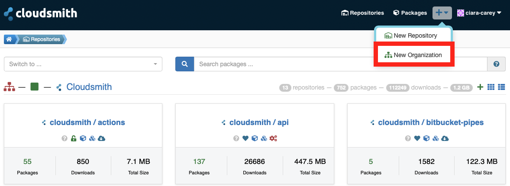
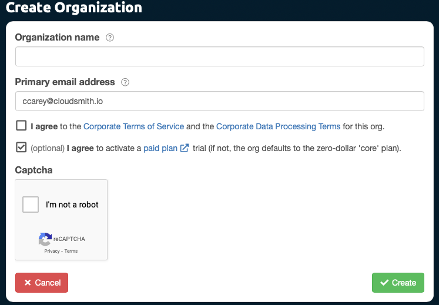
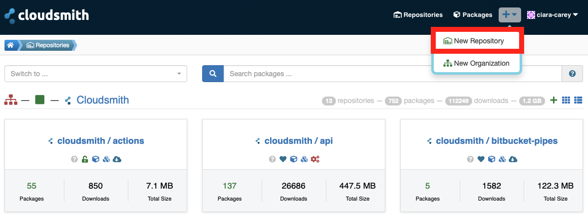
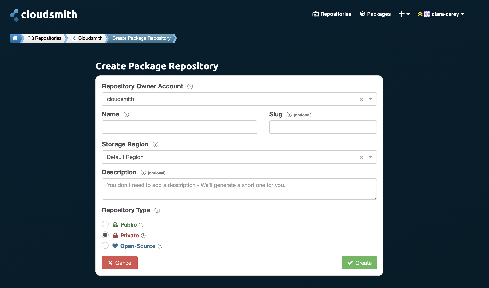
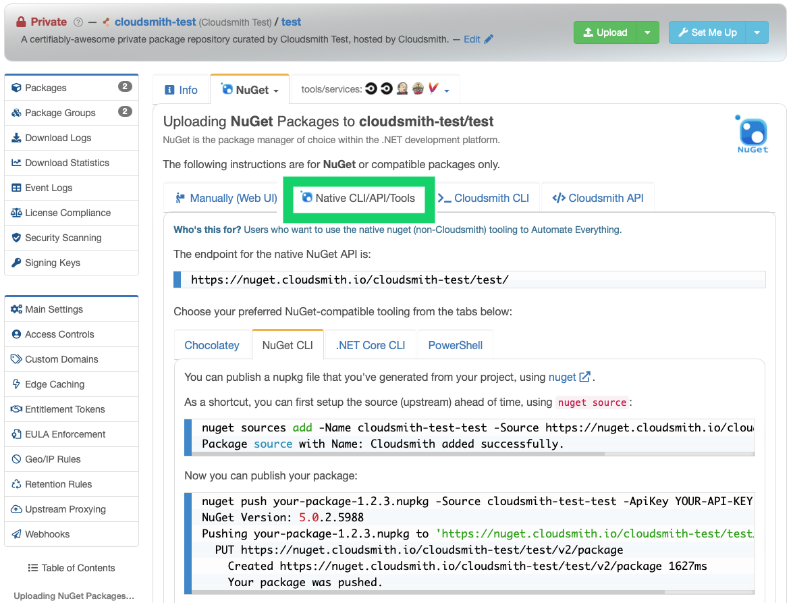
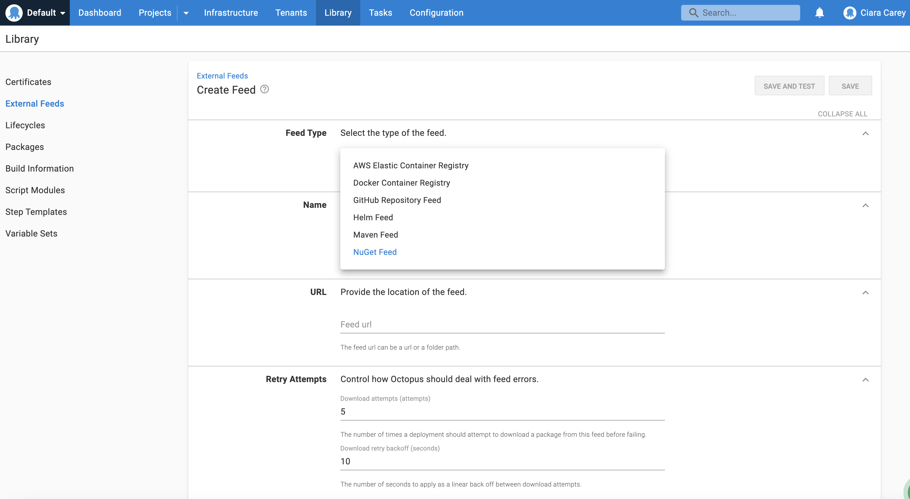
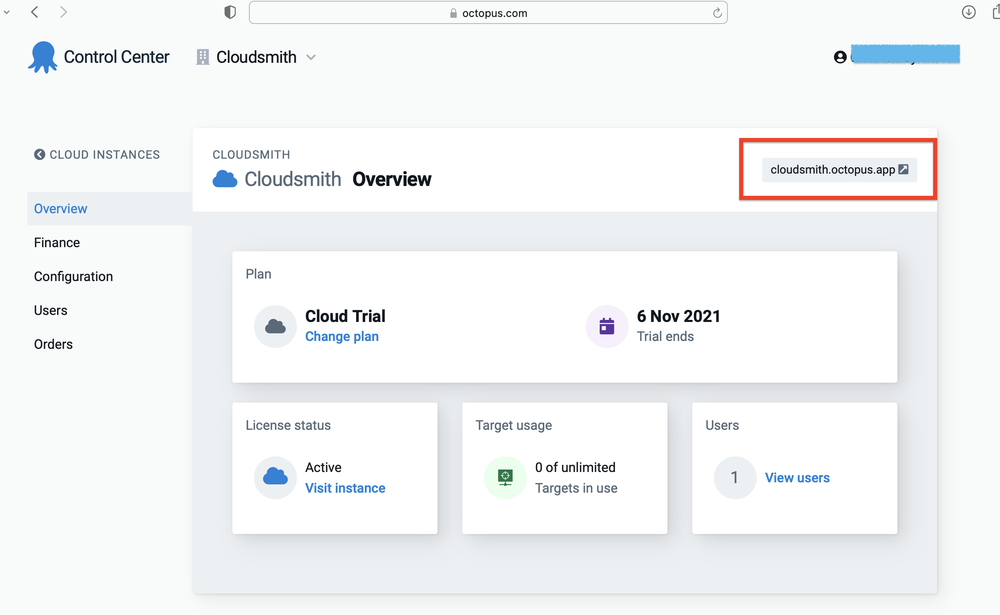
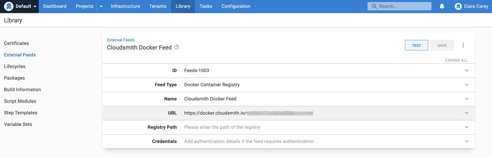
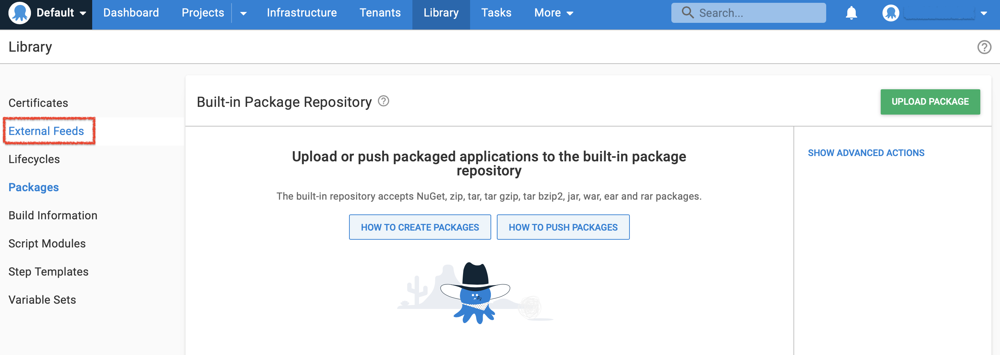
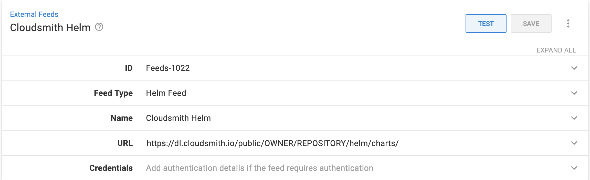

[Cloudsmith](https://www.cloudsmith.com) is a fully managed package management as a service that securely hosts all of your packages, in any format that you need, including NuGet, Helm, Docker, Maven, or NPM in one location and accessible across the organization.

:::hint
All Cloudsmith repositories are [multi-format](https://www.youtube.com/watch?v=Wgn-zJ8R3fg). This means you can mix and match different package types in one repository. A NuGet package can sit beside a Maven package, a Docker, or an NPM package.
:::

## Create a Cloudsmith Organization
Before setting up a Cloudsmith repository, you should create an [Organization](https://help.cloudsmith.io/docs/organisations) and invite others to join the Organization. Creating an Organization in Cloudsmith gives you the ability to configure and manage access for teams, individuals and machines that map to your companies organizational structure. 

You can create an Organization by clicking on the + dropdown on the top menu bar and selecting "New Organization".


This will take you to the "Create Organization" form below. You are required to enter a name for your Organization and a primary email address before creating your Organization (don't worry, we will check your organization name is unique for you before creating it).


Once you have created the Organization, we can go on to create a repository. For instructions on how to configure the settings for the Organization including instructions on how to create teams and invite users, click [here](https://help.cloudsmith.io/docs/organisations).

## Create a Cloudsmith Repository
You can create a new repository in three ways: 
- Via the Cloudsmith CLI
- Via the Website UI
- Via the Cloudsmith API

For this doc we will create a repository via the Cloudsmith Website UI but follow the instructions [here](https://help.cloudsmith.io/docs/create-a-repository) to create a repository via the CLI or API. 

### Create a repository via the Website UI
You can create a repository by clicking on the + dropdown on the top menu bar and selecting "New Repository".


That will take you to the "Create Package Repository" form:


Here you can create a new repo by selecting a Repository Owner (the Organization you want the repo to live under) and a name. You can also specify an optional 'slug' (identifier) for the repository, this is what will appear in the URL for the repository. The identifier can only contain lowercase alphanumeric characters, hyphens, and underscores. If you don't specify an identifier, one will be automatically generated from the repository name for you.

The Storage Region allows you to choose a geographic region for the repository (see [Custom Storage Regions](https://help.cloudsmith.io/docs/custom-storage-regions) for further details). 
Then you need to select the type; Public, Private or Open-Source.

## Upload your package to Cloudsmith
Cloudsmith provides three ways to push your packages/files/assets into your repositories:

- Upload via the package-specific native CLI / tools (where supported).
- Upload via the API using tools/integrations (such as the official Cloudsmith CLI).
- Upload directly via the website. 

Documentation for package-specific native CLI and tooling is available on the website within each repository.  For example, after selecting `NuGet` as the package format to upload, a new form will pop up, click the link 'upload setup documentation' and the following documentation is available: 


Below we will give an overview using package-specific native CLI for NuGet, Docker and Maven and for Helm we will use the Cloudsmith CLI. The Cloudsmith documentation gives more in depth information on how to do this [here](https://help.cloudsmith.io/docs/supported-formats).

The instructions below should be entered into a command line shell and we expect you to be in the same directory as your package. We will use this terminology in the following examples:

| Identifier | Description |
|------------|-----------------------------------------------------------------------|
| OWNER      | Your Cloudsmith account name or organization name (namespace) |
| REGISTRY   | Your Cloudsmith Repository name (also called "slug") |
| USERNAME   | Your Cloudsmith Entitlement Token (see Entitlements for more details) |
| USERNAME   | Your Cloudsmith username |
| PASSWORD   | Your Cloudsmith password |
| API-KEY    | Your Cloudsmith API Key |
| IMAGE_NAME | The name of your Docker image |
| TAG        | A tag for your Docker image |

### Install the Cloudsmith CLI tool
The instructions on how to upload a Helm package, require the Cloudsmith CLI to be installed. Follow the instructions [here](https://help.cloudsmith.io/docs/cli) for how to install the Cloudsmith CLI

### Generate Package
To upload, you need to generate your package first. You can do this with:
<details>
<summary>NuGet</summary>
<p>

```shell
nuget pack
```
</p>
</details>

<details>
<summary>Maven</summary>
<p>

```shell
  mvn package
```
</p>
</details>

<details>
<summary>Helm</summary>
<p>

```shell
  helm package .
```
</p>
</details>

<details>
<summary>Docker</summary>
<p>

```shell
  docker save -o your-image.docker your-image:latest
```
</p>
</details>

### Add Cloudsmith as Source
<details>
<summary>NuGet</summary>
<p>

```shell
  nuget sources add -Name example-repo -Source https://nuget.cloudsmith.io/OWNER/REPOSITORY/v3/index.json
```
</p>
</details>

<details>
<summary>Maven</summary>
<p>

```xml
# The distribution repositories define where to push your artifacts. 
# In this case it will be a single repository, but you can configure alternatives. 
# Add the following to your project pom.xml file:

<distributionManagement>
  <snapshotRepository>
    <id>NAME</id>
    <url>https://maven.cloudsmith.io/OWNER/REPOSITORY/</url>
  </snapshotRepository>
  <repository>
    <id>NAME</id>
    <url>https://maven.cloudsmith.io/OWNER/REPOSITORY/</url>
  </repository>
</distributionManagement>


#You must also configure your ~/.m2/settings.xml file with the API key of the uploading user:
<settings xmlns="http://maven.apache.org/SETTINGS/1.0.0"
  xmlns:xsi="http://www.w3.org/2001/XMLSchema-instance"
  xsi:schemaLocation="http://maven.apache.org/SETTINGS/1.0.0
                      https://maven.apache.org/xsd/settings-1.0.0.xsd">
  <servers>
    <server>
      <id>NAME</id>
      <username>USERNAME</username>
      <password>API-KEY</password>
    </server>
  </servers>
</settings>
```
</p>
</details>

<details>
<summary>Helm</summary>
<p>

No steps here for Helm
</p>
</details>

<details>
<summary>Docker</summary>
<p>

```shell
  docker login docker.cloudsmith.io
  # You will be prompted for your Username and Password. 
  # Enter your Cloudsmith username and your Cloudsmith API Key.
```
</p>
</details>

### Publish Package
<details>
<summary>NuGet</summary>
<p>

```shell
  nuget push PACKAGE_NAME-PACKAGE_VERSION.nupkg -Source example-repo -ApiKey API-KEY
```
</p>
</details>

<details>
<summary>Maven</summary>
<p>

```shell
  mvn deploy
```
</p>
</details>

<details>
<summary>Helm</summary>
<p>

```shell
  # The command to upload a Helm chart via the Cloudsmith CLI is:
  cloudsmith push helm OWNER/REPOSITORY CHART_NAME-CHART_VERSION.tgz
```
</p>
</details>

<details>
<summary>Docker</summary>
<p>

```shell
  # To publish an image to a Cloudsmith-based Docker registry, you first need to tag your image:\ndocker tag IMAGE_NAME:TAG docker.cloudsmith.io/OWNER/REGISTRY/IMAGE_NAME:TAG
  # You can then publish the tagged image using docker push:
  docker push docker.cloudsmith.io/OWNER/REGISTRY/IMAGE_NAME:TAG
```
</p>
</details>

## Adding Cloudsmith as an External Feed for Octopus Deploy
Now that we have created our repository we can add our Cloudsmith repository as an external feed in our Octopus Deploy account.

Log into your Octopus control center and navigate to the Octopus dashboard for your Organization. From here you can create a new external feed by navigating to **Library->External Feeds** and selecting **Add Feed**.

In the *Create Feed* page:
- Select the Feed type (NuGet, Helm, Docker, Maven), 
- Give the feed a name and in the URL field, enter the HTTP/HTTPS URL of your Cloudsmith repository. For more information on the URL Feed follow the section below on **URLs for Feeds**
- Populate the credentials of your Cloudsmith repository if necessary. For more information on the URL Feed follow the section below on **Adding Credentials for Private Repositories**.



## URLs for Feeds
This section contains information about what Cloudsmith feed URL to use for your specific package.
 
### NuGet
Create a new Octopus Feed by navigating to **Library->External Feeds** and selecting the *NuGet* Feed type.


- Give the NuGet feed a name
- Enter the HTTP/HTTPS URL of the feed for your Cloudsmith NuGet repository following the instructions in the box below:
<details>
<summary>NuGet V3</summary>
<p>

`https://nuget.cloudsmith.io/OWNER/REPOSITORY/v3/index.json`
</p>
</details>

<details>
<summary>NuGet V2</summary>
<p>

`https://nuget.cloudsmith.io/OWNER/REPOSITORY/v2`
</p>
</details>

Private repositories require authentication- refer to the section below on **Adding Credentials for Private Repositories** for information on how to add your credentials.

### Docker
Create a new Octopus Feed by navigating to **Library->External Feeds** and selecting the *Docker Container Registry* Feed type.


- Give the Docker feed a name
- Enter the HTTP/HTTPS URL of the feed for your Cloudsmith Docker repository following the instructions in the box below: 

`https://docker.cloudsmith.io/v2/OWNER/REGISTRY/`

Private repositories require authentication- refer to the section below on **Adding Credentials for Private Repositories** for information on how to add your credentials.

### Maven 
Create a new Octopus Feed by navigating to **Library->External Feeds** and selecting the *Maven* Feed type.


- Give the feed a name
- Enter the HTTP/HTTPS URL of the feed for your Cloudsmith Maven repository following the instructions in the box below:
<details>
<summary>Public URL with no authentication</summary>
<p>

`https://dl.cloudsmith.io/public/OWNER/REPOSITORY/maven/`
</p>
</details>

<details>
<summary>Entitlement Token Authentication</summary>
<p>

`https://dl.cloudsmith.xyz/TOKEN/OWNER/REPOSITORY/maven/`
</p>
</details>

<details>
<summary>HTTP Basic Authentication</summary>
<p>

`https://dl.cloudsmith.io/basic/cloudsmith-test/ciara-repo1/maven/`
</p>
</details>

Private repositories require authentication- refer to the section below on **Adding Credentials for Private Repositories** for information on how to add your credentials.

### Helm 
Create a new Octopus Feed by navigating to **Library->External Feeds** and selecting the *Helm* Feed type.


- Give the feed a name
- Enter the HTTP/HTTPS URL of the feed for your Cloudsmith Helm repository following the instructions in the box below:
<details>
<summary>Public URL with no authentication</summary>
<p>

`https://dl.cloudsmith.io/public/OWNER/REPOSITORY/helm/charts/`
</p>
</details>

<details>
<summary>Entitlement Token Authentication</summary>
<p>

`https://dl.cloudsmith.io/TOKEN/OWNER/REPOSITORY/helm/charts/`
</p>
</details>

<details>
<summary>HTTP Basic Authentication</summary>
<p>

`https://dl.cloudsmith.io/basic/OWNER/REPOSITORY/helm/charts/`
</p>
</details>

Private repositories require authentication- refer to the section below on **Adding Credentials for Private Repositories** for information on how to add your credentials.

##Adding Credentials for Private Repositories
Private Cloudsmith repositories require authentication. If you used a token in the URL then you do not need to add additional credentials.

:::hint
Private Cloudsmith repositories require authentication.  You can choose between two types of authentication, Entitlement Token Authentication or HTTP Basic Authentication. \n\nThe setup method will differ depending on what authentication type you choose to use.
:::

:::warning
Entitlement Tokens, User Credentials and API-Keys should be treated as secrets, and you should ensure that you do not commit them in configurations files along with source code or expose them in any logs
:::

When you are adding or editing your external feed, you can add credentials for your feed by populating the *Credentials* section. 


Provide one of the following three types of credentials:

- Cloudsmith Basic Authentication using your Username and Password
- Cloudsmith API Key
- An Entitlement Token

These will be populated in the Credentials section of the Octopus External Feed. 
<details>
<summary>Basic Authentication</summary>
<p>

`Feed username`: `USERNAME`

`Feed password`: `PASSWORD`
</p>
</details>

<details>
<summary>API Key</summary>
<p>

`Feed username`: `USERNAME`

`Feed password`: `API-KEY`
</p>
</details>

<details>
<summary>Entitlement Token</summary>
<p>

`Feed username`: `token`

`Feed password`: `TOKEN`
</p>
</details>

For more information about credentials check [here](https://help.cloudsmith.io/docs/docker-registry#private-registries).
