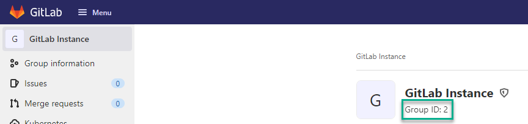

GitLab creates a Maven Registry for each Project or Group.  To add the Maven Registry to Octopus Deploy as an external feed, you will first need to get the Project or Group Id

Project Id

Group Id

## Adding a GitLab Maven repository as an Octopus External Feed
Create a new Octopus Feed by navigating to **{{Library, External Feeds}}** and select the `Maven Feed` Feed type. 

Give the feed a name and in the URL field, enter the HTTP/HTTPS URL of the feed for your GitLab Project or Group in the format:

Project:

`https://your.gitlab.url/api/v4/projects/[project id]/packages/packages/maven`

Group:

`https://your.gitlab.url/api/v4/groups/[group id]/-/packages/maven`

Replace the URL from the examples above.

Optionally add Credentials if they are required.