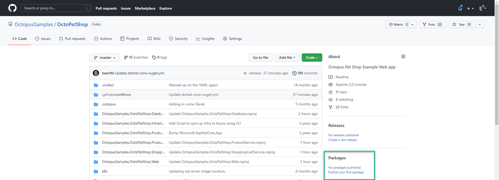
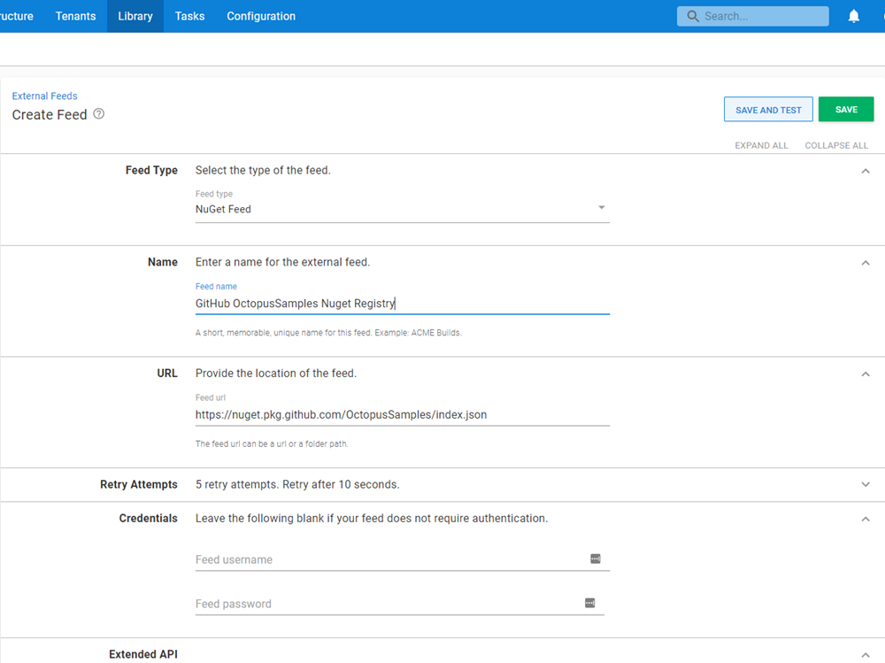

GitHub projects come with a built-in NuGet package registry that can be configured as an External Feed for Octopus Deploy.  The NuGet package registry is present by default and does not require any configuration on GitHub to be enabled.

:::info
Note: This feed type is different than a [GitHub Feed](https://octopus.com/docs/packaging-applications/package-repositories/github-feeds)
:::

## NuGet Package Registry Permissions
The GitHub Package Registry requires authentication in order to download packages, even if the repository is marked as Public.  To configure the External Feed, you will first need to create a GitHub Personal Access Token (PAT) with the `read:packages` permission

Once the token has been created, store it in a safe place.

## Adding a GitHub NuGet repository as an Octopus External Feed
Create a new Octopus Feed by navigating to **{{Library, External Feeds}}** and select the `NuGet Feed` Feed type. 

Give the feed a name and in the URL field, enter the URL of the feed for your GitHub NuGet Package Registry in the following format:

`https://nuget.pkg.github.com/YourGitHubAccountOrOrganizationName/index.json`

Replace `YourGitHubAccountOrOrganizationName` with your GitHub account or Organization name.

Enter username for the access token you created and use the token itself as the password

