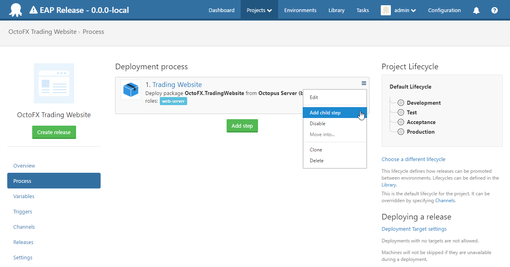
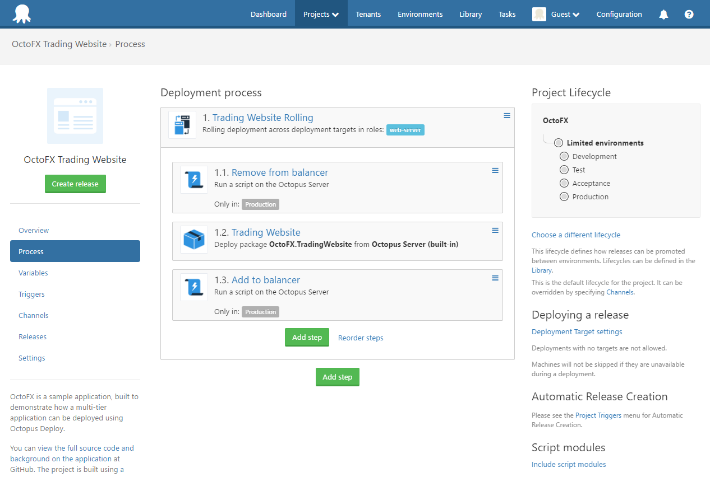

Rolling deployments are a pattern whereby, instead of deploying a package to all servers at once, we slowly roll out the release by deploying it to each server one-by-one. In load balanced scenarios, this allows us to reduce overall downtime.

Normally, when executing a deployment process with multiple steps, Octopus runs all of the steps **sequentially**; it waits for the first step to finish before starting the second, and so on.

NuGet package steps and [PowerShell steps](/docs/deploying-applications/custom-scripts/index.md), however, target roles, which may contain multiple deployment targets. When a single step targets multiple machines, the step is run on those machines **in parallel**. So to recap:

- Deployment steps are run in sequence
- The actions performed by each step are performed in parallel on all deployment targets

However, sometimes this isn't desired. If you are deploying to a farm of 10 web servers, it might be nice to deploy to one machine at a time, or to batches of machines at a time. This is called a **rolling deployment**.

## Configuring a rolling deployment {#Rollingdeployments-Configuringarollingdeployment}

Rolling deployments can be configured on a PowerShell or NuGet package step by clicking **Configure a rolling deployment**.

When configuring a rolling deployment, you specify a **window size**.

The window size controls how many deployment targets can be deployed to at once.

- A window size of 1 will deploy to a single deployment target at a time. Octopus will wait for the step to finish running on deployment target A before starting on deployment target B
- A window size of 3 will deploy to a three deployment targets at a time. Octopus will wait for the step to finish running on deployment targets A, B *or* C before starting on deployment target D

## Child steps {#Rollingdeployments-Childsteps}

Rolling deployments allow you to wait for a step to finish on one deployment target before starting the step on the next deployment target. But what if you need to perform a series of steps on one target, before starting that series of steps on the next target? To support this, Octopus allows you to create **Child Steps**.

First, open the menu for an existing step, and click **Add Child Step**.

Octopus has numerous steps that support rolling deployments depending on your install version including:

- Deploy to IIS step
- Deploy a Windows Service step
- Deploy a package step
- Run a Script
- Send an Email step
- Manual intervention required step
- Run an Azure PowerShell Script step
- Deploy an Azure Resource Group step
- Run a Service Fabric SDK PowerShell Script step 

After adding a child step, the deployment process will now show the step as containing multiple actions:

All child steps run on the same machine at the same time, and you can add more than one child step. You can also change the order that the steps are executed in using the **Reorder steps** link.

You can edit the parent step to change the roles that the steps run on or the window size.

With this configuration, we run the entire website deployment step - taking the machine out of the load balancer, deploying the site, and returning it to the load balancer - on each machine in sequence as part of a rolling deployment step.

## Rolling deployments with child steps in action {#Rollingdeployments-Rollingdeploymentswithchildstepsinaction}

This five minute video (with captions) will guide you through setting up a rolling deployment with child steps.

<iframe src="//fast.wistia.net/embed/iframe/7wfdk4vtge" allowtransparency="true" frameborder="0" scrolling="no" class="wistia_embed" name="wistia_embed" allowfullscreen mozallowfullscreen webkitallowfullscreen oallowfullscreen msallowfullscreen width="640" height="360" style="margin: 30px"></iframe>