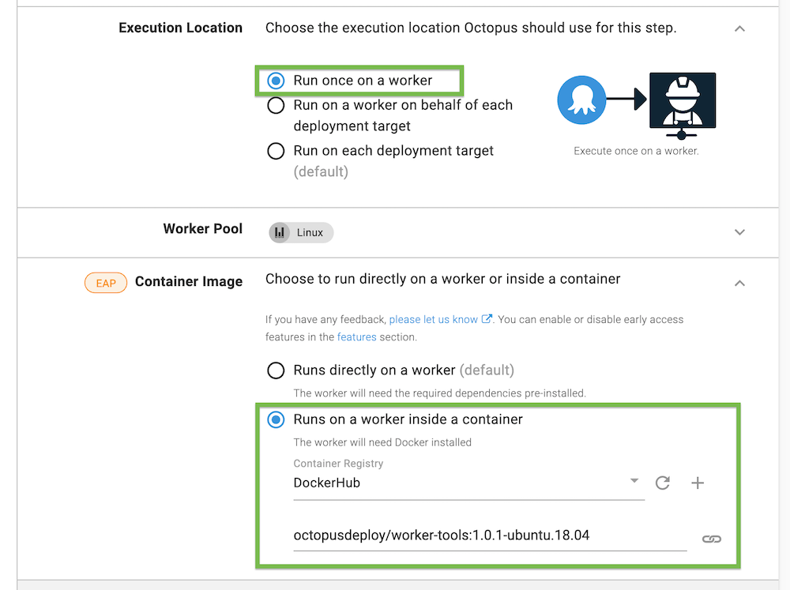

For a [step](/docs/projects/steps/index.md) running on a [worker](docs/infrastructure/workers/index.md) or on the [Octopus Server](docs/infrastructure/workers/built-in-worker.md), you can select a Docker image to execute the step inside of.

When an execution container is configured for a step, Octopus will still connect to the worker machine via a [Tentacle or SSH](/docs/infrastructure/workers/index.md#register-a-worker-as-a-listening-tentacle). The difference is that the specified image will be run as a container and the step will be executed inside the container.

See the [blog post](https://octopus.com/blog/execution-containers) announcing this feature for some added context.

## Requirements
You need Docker installed and running on the [worker](docs/infrastructure/workers/index.md)/Octopus Server ([built-in worker](/docs/infrastructure/workers/built-in-worker.md)), in order to use execution containers for workers

### Octopus cloud dynamic worker pools 
[Octopus Cloud dynamic workers](/docs/infrastructure/workers/dynamic-worker-pools.md) have Docker pre-installed and support execution containers, with the exception of Windows 2016 pools. Dynamic worker pools with a VM type of Windows Server Core 2016 do not have Docker installed, and they cannot be used to run execution containers. 


## How to use execution containers for workers 

- Configure a [feed](/docs/packaging-applications/package-repositories/docker-registries/index.md) in Octopus Deploy for a Docker registry.
  - [Add Docker Hub as an external feed](https://octopus.com/blog/build-a-real-world-docker-cicd-pipeline#add-docker-hub-as-an-external-feed).
- Add a project and define a deployment process (or add a [runbook](/docs/runbooks/index.md)).
- Set the **Execution Location** for your step to **Run on a worker**.
- In **Container Image** select **Runs on a worker inside a container**.
- Choose the previously added container registry.
- Enter the name of the image (aka execution container) you want your step to run in. (e.g. !docker-image <octopusdeploy/worker-tools:ubuntu.18.04>).
- Click **Save**.
- Click **Create release & deploy**.



## First deployment on a docker container

:::hint
Pre-pulling your chosen image will save you time during deployments.
:::

When you choose to run one or more of your deployment steps in a container, your deployment process will `docker pull` the image you provide at the start of each deployment during package acquisition.

For your first deployment this may take a while since your docker image won't be cached. You can pre-pull the desired docker image on your worker before your first deployment to avoid any delays.

## Which Docker images can I use? {#which-image}

:::hint
The easiest way to get started is to use the [worker-tools](#worker-tools-images) images built by Octopus Deploy.
:::

When a step is configured to use an execution container, you can choose from:
- One of the [worker-tools](#worker-tools-images) images built by Octopus Deploy.
- A [custom docker image](#custom-docker-images) you build. 

If you run into issues with the provided [worker-tools](#worker-tools-images) images or they don't meet your needs, you will have to create a custom image. Take a look at the [custom docker image](#custom-docker-images) section or the [blog post on extending execution containers](https://octopus.com/blog/extending-octopus-execution-container) to learn to create a custom image.

### The octopusdeploy/worker-tools Docker images {#worker-tools-images} 

For convenience, we provide some images on Docker Hub [octopusdeploy/worker-tools](https://hub.docker.com/r/octopusdeploy/worker-tools) which include common tools used in deployments. 

:::hint
We recommend using our `worker-tools` image as a starting point for your own custom image to run on a worker.
:::

The canonical source for what is contained in the `octopusdeploy/worker-tools` images is the `Dockerfile`'s in the [GitHub repo](https://github.com/OctopusDeploy/WorkerTools). For example: 
- The [Ubuntu 18.04 Dockerfile](https://github.com/OctopusDeploy/WorkerTools/blob/master/ubuntu.18.04/Dockerfile)
- The [Windows 2019 Dockerfile](https://github.com/OctopusDeploy/WorkerTools/blob/master/windows.ltsc2019/Dockerfile)

Some of the tools included are:

- Octopus Deploy CLI and .NET client library
- .NET Core
- Java (JDK)  
- NodeJS
- Azure CLI 
- AWS CLI 
- Google Cloud CLI
- kubectl 
- Helm
- Terraform
- Python

### Custom docker images {#custom-docker-images}

It can be beneficial to build your own custom Docker image when using execution containers, particularly when you wish the image size to be as small as possible.

#### Supported Windows base images

For Windows images, we recommend using a base image no older than the `ltsc2019` image. Octopus does not support images that are older than `ltsc2019`, and while containers based on these images can still run steps, you may run into unexpected issues.

:::hint
If your containers are based on an earlier image of Windows, we strongly recommend upgrading your workers to Windows 2019 and rebasing your Docker containers to use a 2019 base image.
:::

#### Supported Linux distributions

It's important to understand there are some limits to which Linux Docker images can be used as a container image. The Docker image must be based on a Linux distribution using the GNU C library, or **glibc**. This includes operating systems like Ubuntu, Debian, and Fedora.

:::warning
Linux distributions built on **musl**, most notably Alpine, do not support Calamari, and cannot be used as a container image. This is due to Calamari currently only being compiled against **glibc** and not **musl**.
:::

You can usually find the base operating system of a Linux Docker image by running the following command:

```bash
docker run --entrypoint='' [image name] /bin/cat /etc/os-release.
``` 

For example for the `octopusdeploy/worker-tools:2.0.1-ubuntu.18.04` image, you'd run:

```bash
docker run --entrypoint='' octopusdeploy/worker-tools:2.0.1-ubuntu.18.04 /bin/cat /etc/os-release.
```

#### Required OS dependencies

The operating system must also include a number of dependencies required to support .NET Core applications. When a step is configured to use an execution container, [Calamari](/docs/octopus-rest-api/calamari.md) (the Octopus deployment utility) is executed inside the specified container. Since Calamari is a .NET Core self-contained executable, any custom Docker image needs to include the dependencies required to execute a .NET self-contained executable.

The Microsoft [.NET Core documentation](https://docs.microsoft.com/en-us/dotnet/core/install/linux) lists the dependencies required for a .NET Core application with popular Linux distributions. 

:::hint
If a third party container is missing a library, it is usually the **libicu** library. The error **Couldn't find a valid ICU package installed on the system** indicates the ICU library is missing.
:::

If your chosen Docker image does not have these prerequisites, the easiest solution is to create a custom Docker image based on the image you wish to use, install the required libraries, push the image to a repository like DockerHub, and select your custom image as the container image. 

Microsoft also provides [base images that include these dependencies](https://hub.docker.com/_/microsoft-dotnet-core-runtime-deps/).

#### Custom docker image example

The following example is a basic Docker file that (when built) can run Calamari and PowerShell scripts:

```docker
FROM ubuntu:20.04

ARG POWERSHELL_VERSION=7.1.3\*

RUN apt-get update && \
    apt-get install -y --no-install-recommends \
        curl \
        unzip \
        apt-transport-https \
        software-properties-common && \
    apt-get clean && \
    rm -rf /var/lib/apt/lists/*

# Powershell core
# https://docs.microsoft.com/en-us/powershell/scripting/install/installing-powershell-core-on-linux?view=powershell-7.1#ubuntu-2004
RUN curl -LO -k "https://packages.microsoft.com/config/ubuntu/20.04/packages-microsoft-prod.deb" && \
    dpkg -i packages-microsoft-prod.deb && \
    apt-get update && \
    add-apt-repository universe && \
    apt-get install -y --no-install-recommends \
        powershell=${POWERSHELL_VERSION} && \
    apt-get clean && \
    rm -rf /var/lib/apt/lists/* && \
    rm -f packages-microsoft-prod.deb
```

To learn more about creating a custom docker image, we have a [detailed blog post](https://octopus.com/blog/extending-octopus-execution-container) that describes how to get started and the minimum set of dependencies you would need.

#### Tool paths

Because Calamari is executed directly inside the specified container, execution containers on workers are run in **non-interactive** mode. Since the execution container is not running interactively,  it does not process your `.bashrc` file. If the tool you have installed relies on `.bashrc` to modify the path (e.g. `nvm`) to include a non-standard folder, you will need to manually define the additional directories in the `$PATH` variable in your Dockerfile using the `ENV PATH` directive.

For example, if you install node.js via nvm, you will need to remediate the `$PATH` variable in your image with the location node.js gets installed to with the following directive in your Dockerfile: 

```bash
ENV PATH="/root/.nvm/versions/node/v${NODE_VERSION}/bin:$PATH"`
```

#### CMD and ENTRYPOINT directives

Docker images used with the execution containers feature require that no `CMD` or `ENTRYPOINT ` directives be defined in your Dockerfile. 

Including one of these directives will result in the step failing.
