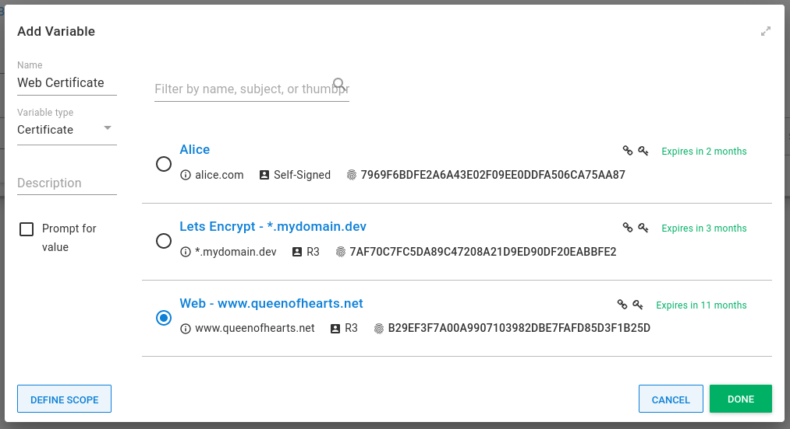
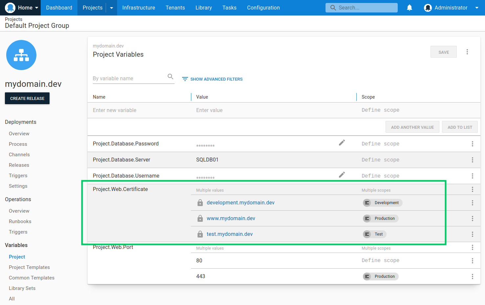

In the variable-editor, selecting *Certificate* as the [variable](/docs/projects/variables/index.md) type allows you to create a variable with a certificate managed by Octopus as the value.



Certificate variables can be [scoped](/docs/projects/variables/index.md#scoping-variables), similar to regular text variables.



## Expanded properties

At deploy-time, certificate variables are expanded. For example, a variable _MyCertificate_ becomes:

| Variable                          | Description                                            | Example value |
| ----------------------            | ------------------                                     | ------------- |
| `MyCertificate`                   | The certificate ID                                     | Certificates-1 |
| `MyCertificate.Type`              | The variable type                                      | Certificate
| `MyCertificate.Name`              | The user-provided name                                 | My Development Certificate
| `MyCertificate.Thumbprint`        | Thumbprint                                             | A163E39F59560E6FE33A0299D19124B242D9B37E
| `MyCertificate.RawOriginal`       | The base64 encoded original file, exactly as it was uploaded. |
| `MyCertificate.Password`          | The password specified when the file was uploaded. |
| `MyCertificate.Pfx`               | The base64 encoded certificate in PKCS#12 format, including the private-key if present.  |
| `MyCertificate.Certificate`       | The base64 encoded DER ASN.1 certificate.              |
| `MyCertificate.PrivateKey`        | The base64 encoded DER ASN.1 private key. This will be stored and transmitted as a [sensitive variable](/docs/projects/variables/sensitive-variables.md).                |
| `MyCertificate.CertificatePem`    | The PEM representation of the certificate (i.e. the PublicKey with header\footer).  |
| `MyCertificate.PrivateKeyPem`     | The PEM representation of the private key (i.e. the PrivateKey with header\footer).  |
| `MyCertificate.ChainPem`    | The PEM representation of any chain certificates (intermediate or certificate-authority). This variable does not include the primary certificate. |
| `MyCertificate.Subject`           | The X.500 distinguished name of the subject            |
| `MyCertificate.SubjectCommonName` | The un-attributed subject common name            |
| `MyCertificate.Issuer`            | The X.500 distinguished name of the issuer             |
| `MyCertificate.NotBefore`         | NotBefore date | 2016-06-15T13:45:30.0000000-07:00
| `MyCertificate.NotAfter`         | NotAfter date | 2019-06-15T13:45:30.0000000-07:00

### Example usage

Given the certificate variable `MyCertificate`, you can access the certificate thumbprint in a script like this:

```powershell PowerShell
Write-Host $OctopusParameters["MyCertificate.Thumbprint"]
```
```bash Bash
thumbprint=$(get_octopusvariable "MyCertificate.Thumbprint")
echo "$thumbprint"
```

It's possible to write the PEM representation of the certificate to a file for use directly with a web server e.g. Apache, or a reverse proxy like NGINX:

```bash
CERT=$(get_octopusvariable "MyCertificate.CertificatePem")
echo "$CERT" > my_cert.crt
```

If your certificate also contains any chain certificates (e.g. intermediate or certificate authority), they can also be written to a file that contains the primary certificate too:

```bash
CERT=$(get_octopusvariable "MyCertificate.CertificatePem")
CHAIN=$(get_octopusvariable "MyCertificate.ChainPem")
COMBINED_CHAIN="$CERT\n$CHAIN"
echo -e "$COMBINED_CHAIN" > my_combined.crt
```

If your certificate also has a private key that you need to export, you can use the `PrivateKeyPem` property:

```bash
KEY=$(get_octopusvariable "MyCertificateVariable.PrivateKeyPem")
echo "$KEY" > ssl.key
```

## Learn more

- [Variable blog posts](https://octopus.com/blog/tag/variables)