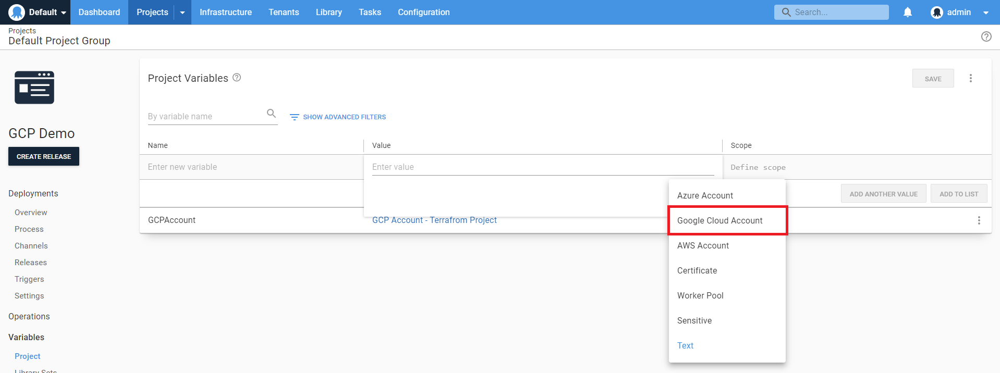
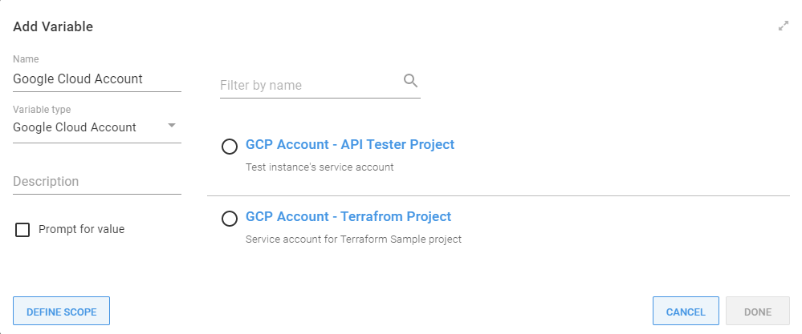

[Google cloud accounts](/docs/infrastructure/accounts/google-cloud/index.md) are included in a project through a project [variable](/docs/projects/variables/index.md) of the type **Google Cloud Account**. Before you create a **Google cloud account Variable**, you need to [create a Google cloud account](/docs/infrastructure/accounts/google-cloud/index.md) in Octopus:



The **Add Variable** window is then displayed and lists all the Google cloud accounts.

Select the Google cloud account you want to access from the project to assign it to the variable:




## Google cloud account variable properties

The Google cloud account variable also exposes the following properties that you can reference in a PowerShell script:

| Name and description | Example |
| -------------------- | ------------------------|
| **`JsonKey`** <br/> The JSON Key for the Google cloud account| |

### Accessing the properties in a script

Each of the above properties can be referenced in PowerShell.

```powershell
# For an account with a variable name of 'google cloud account'

# Using $OctopusParameters
Write-Host 'GoogleCloudAccount.Id=' $OctopusParameters["google cloud account"]
Write-Host 'GoogleCloudAccount.JsonKey=' $OctopusParameters["google cloud account.AccessKey"]

# Directly as a variable
Write-Host 'GoogleCloudAccount.Id=' #{google cloud account}
Write-Host 'GoogleCloudAccount.JsonKey=' #{google cloud account.JsonKey}
```

## Add an Google cloud account to Octopus

For instructions to set up a Google cloud account in Octopus, see [Google cloud accounts](/docs/infrastructure/accounts/google-cloud/index.md).

## Learn more

- [Variable blog posts](https://octopus.com/blog/tag/variables)