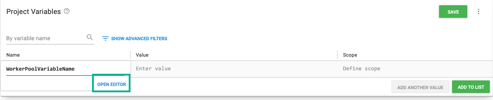
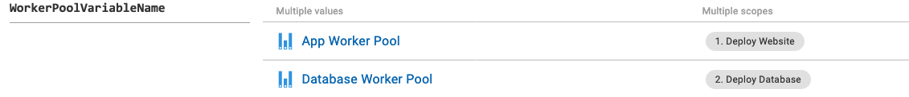
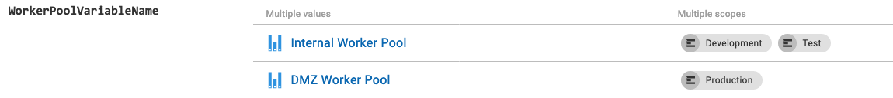

:::hint
Worker pool variables are only available in **Octopus 2020.1** and later.
:::

Worker pool variables are [variables](/docs/projects/variables/index.md) which can be used to select where a deployment or a [runbook](/docs/operations-runbooks/index.md) is executed. Steps that use workers can specify a worker pool directly on the step or have the step depend on a worker pool variable.  First you should set up your [worker](/docs/infrastructure/workers/index.md) and [worker pool](/docs/infrastructure/workers/worker-pools.md) infrastructure before you can use worker pool variables.

In Octopus, you can [scope](/docs/projects/variables/index.md#scoping-variables) worker pools to:

- [Environments](/docs/octopus-concepts/environments.md)
- [Processes](/docs/octopus-concepts/deployment-process.md)
- [Steps](/docs/deployment-process/steps/index.md)
- [Channels](/docs/deployment-process/channels/index.md)

## Add and create worker pool variables

1. Enter the variable name and select **Open Editor** select the **Change Type** drop-down and select **worker pool**.

2. In the **Add Variable** window, it lists all the available worker pools. Select the worker pool and then define the scope of the worker pool.

3. If required, add multiple values, binding each to the required scope. Worker pool variables can not be scoped to roles or targets as the pool is resolved during the planning phase of the deployment.

## Step Configuration

:::hint
Worker pool variables need to be configured on **all steps** in your deployment process that requires it.
:::

By default, deployment steps are not configured to run on a worker pool set by a variable, and you will need to change your deployment step to the variable required.

1. Open step and configure the deployment step to run on a worker.

2. Select **Runs on a worker from a pool selected via a variable**.

3. Pick the worker pool variable.

4. Save step.

## Worker Pool Variable examples

Worker pool variables have multiple use cases for consideration during set up. The benefit of worker pool variables is that you can use them separately or combine the examples.

### Environment

The most common would be to use environment-specific worker pools to separate this for development, test, and production. Often these sit in different network segments, and often production is in the cloud or in a DMZ, which would help with Security.

### Performance & Role separation

Worker pool variables enable different worker pools for different steps, and an example of that is using a separate worker pool for application deployments and a different worker pool for database deployments.

Running deployment tasks in parallel using different worker pools to enable better concurrency of tasks. Using worker pool variables for multiple tasks using parallel deployments on different workers would increase concurrency and performance of your deployment process.

Licensing requirements of Software installed on Workers may mean that the Software can't be justified on all Workers. You may choose to install the Software on a small subsection of Workers.

### Network & Security

[Network isolation](https://en.wikipedia.org/wiki/Network_segmentation) or [DMZ or a perimeter network](https://en.wikipedia.org/wiki/DMZ_(computing)) are common for most companies. They are considered best practices for most scenarios to control and manage the flow of your network and keep items separated. Using worker pool variables will allow you to control where your deployment or scripts run, which will ensure scripts or deployments can't access networks they may not be permitted.

### Multi-Cloud and Multi-Region workers

[Multi-cloud](https://en.wikipedia.org/wiki/Multicloud) and Multi-Region strategies are commonplace. It's common to have workloads spread over multiple clouds and locations such as:

- [Azure](https://azure.microsoft.com/en-us/)
- [AWS](https://aws.amazon.com/)
- [GCP](https://cloud.google.com/)
- On-Premises
- Private Cloud

## Learn more

- [Variable blog posts](https://octopus.com/blog/tag/variables)
- [Worker blog posts](https://octopus.com/blog/tag/workers)
