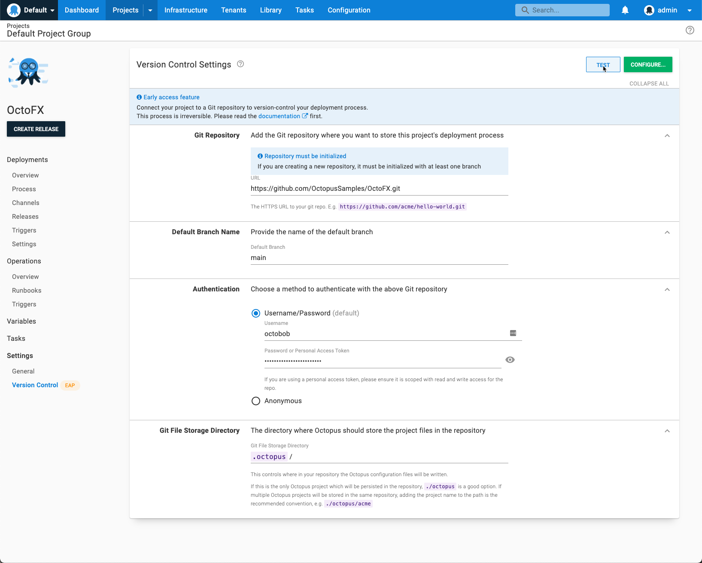
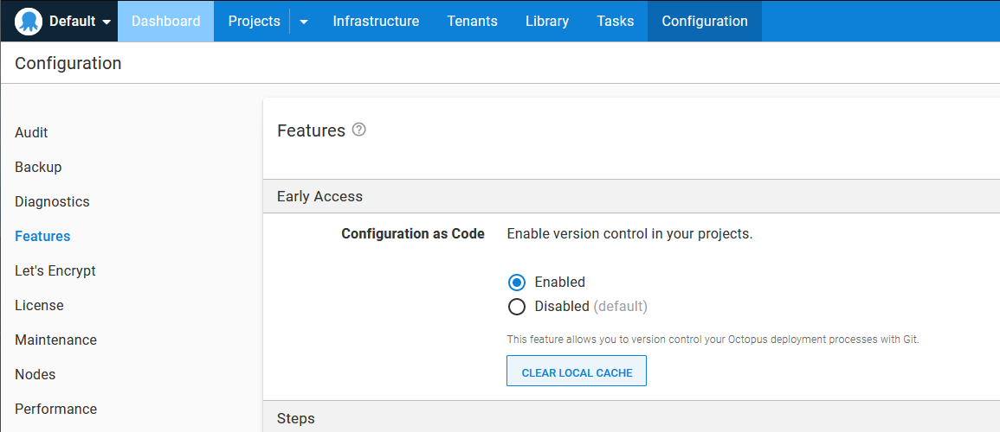
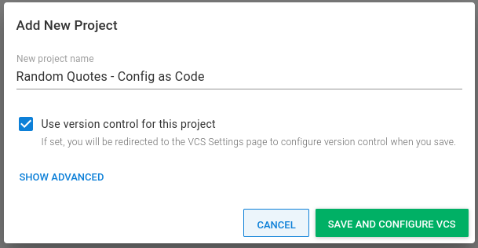
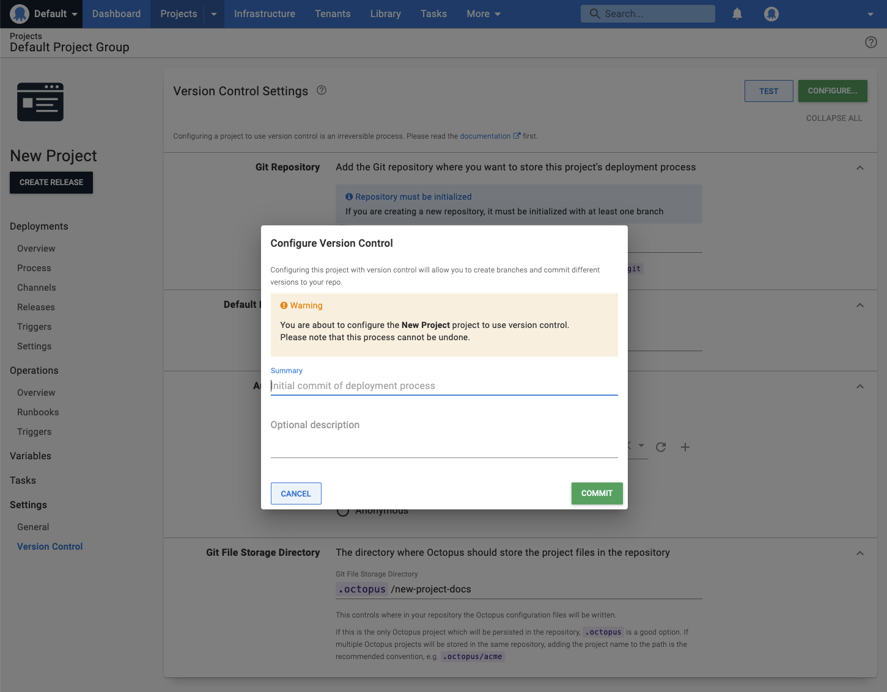

Version-control is configured per-project, and can be found under the {{Version Control}} navigation menu item.  This page will walk through how to configure a project to be version controlled.

## Enable the Configuration as Code feature.

To begin, you will need to ensure that you have a Git repository with an account that has permission to edit and a personal access token. Octopus will use need to authenticate. Once you have your Git repository, username and PAT, you will need to ensure the Configuration as Code feature is enabled in Octopus. You can access this feature under Configuration -> Features -> Configuration as Code.

## Creating a new version-controlled project

To get a a feel for the config-as-code feature, you may want to create a new project that you can test with before committing to permanently converting an existing project. When configured, this project's deployment process will be stored in a git repository.

Click the **New Project** button and select **Use version control for this project.**

Once you click the save button, you'll be sent to the version control screen to configure your version control settings.  Enter the URL for your git repository, the name of the default branch, your username and password / personal access token or stored Git Credentials. 

Learn more about [git credentials in Octopus Deploy](/docs/projects/version-control/config-as-code-reference.md).

Next, add the directory you would like Octopus to store the deployment process. You can have multiple deployment processes in the same repository if they all use a different sub-directory. E.g. `.octopus/acme`

## Configuring an existing project to be version-controlled

Note: This is a one way change. No project that has been converted to version control can be converted back. Make sure you are absolutely certain you want to do this and perhaps clone your project test that it works how you expect before converting important projects.

With the release of config-as-code, you can perform a one way conversion of existing projects into to a version controlled format. 

First, select the project you would like to convert and select {{Version Control}} under the **Settings** section in the left hand menu. This will load the page where you can enter the connection information for your Git repository. You need to provide the URL for your git repository, the name of the default branch, username and password / personal access token (or Anonymous for an open repository) and the directory you would like Octopus to store the deployment process.

Learn more about [git credentials in Octopus Deploy](/docs/projects/version-control/config-as-code-reference.md).

:::hint
You can have multiple deployment processes in the same repository if they all use a different sub-directory.
:::

Once you press the green configure button, you will be met with a window to confirm this change and give you the option to provide a summary and description for the first commit or cancel the conversion.

Your project is now configured with Version Control. You can see this change reflected on the Process page where you can change branches. You can also confirm this in your Git repository. The `.octopus` directory will not be created, and it should contain your _deployment_process.ocl_, _deployment_settings.ocl_, and _schema_version.ocl_ files. 

## Not everything is saved to version control

The Configuration as Code feature is per-project, and eventually it will include the deployment process, variables, and runbooks.  There are a number of project-level settings not stored in version control.

Learn more about [what is stored in version control](/docs/projects/version-control/config-as-code-reference.md).

## Using a project with version control enabled

In general, modifying a project via the Octopus UI with version control enabled is the same as modifying a project configured to save changes to SQL Server.  There are some minor differences though you should be aware of.

Learn more about [Editing a project with version control enabled](/docs/projects/version-control/editing-a-project-with-version-control-enabled.md).
