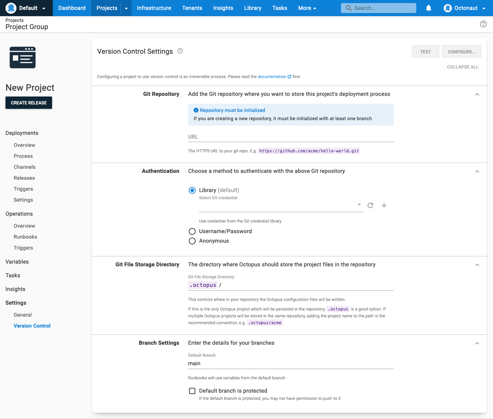

Git settings are configured per project and are accessed via the **{{ Settings, Version Control }}** link in the project navigation menu. This page will walk through how to convert a project to Git.

## Creating a new version-controlled project

To get a feel for the config-as-code feature, you may want to create a new project that you can test before committing to permanently converting an existing project. This project's deployment process, deployment settings, and non-sensitive variables will be stored in a Git repository when configured.

Click the **New Project** button and select **Use version control for this project.**

Once you click the **Save** button, you'll be sent to the version control screen to configure your version control settings. Enter the URL for your Git repository, your username and password / personal access token. 

Learn more about [Git credentials in Octopus Deploy](/docs/projects/version-control/config-as-code-reference.md).

Next, add the directory you would like Octopus to store the project configuration. You can connect multiple projects to the same repository if they all use a different sub-directory (e.g. `.octopus/acme` and `.octopus/another-project`).

:::hint
You can have multiple deployment processes in the same repository if they all use a different sub-directory.
:::

Finally, add your default branch name in Branch Settings and click **Configure**. Once you press the **Configure** button, a modal window will appear to confirm this change and give you the option to provide a summary and description for the first commit or cancel the conversion.

Your project is now configured with Version Control. You can see this change reflected on the left navigation of the page, where you can change branches. You can also confirm this in your Git repository. The `.octopus` directory will now be created, and it should contain the following files:

- _deployment_process.ocl_
- _deployment_settings.ocl_
- _variables.ocl_
- _schema_version.ocl_

If your repository has branch protection setup, see [Setting up in a repository with protected branches](/docs/projects/version-control/converting/index.md#setting-up-in-a-repository-with-protected-branches).

## Configuring an existing project to use Git

:::warning
Converting a project to use Git is a one-way change. Once you convert a project Git, you **cannot** convert it back. Please make sure you want to do this, and consider cloning your project to test how it works, so you know what to expect before converting important projects.
:::

Using config-as-code, you can perform a one-way conversion of existing projects to leverage Git.

Select the project you would like to convert and click on the **{{ Settings, Version Control }}** link on the project navigation menu.
Enter the connection information for your Git repository. You need to provide: 
- The URL for your git repository
- A Username and password / personal access token (or anonymous for a public repository)
- The directory you would like Octopus to store the deployment process in
- The name of the default branch

Learn more about [Git credentials in Octopus Deploy](/docs/projects/version-control/config-as-code-reference.md).

:::hint
You can have multiple deployment processes in the same repository if they all use a different sub-directory.
:::

Once you press the **Configure** button, a modal window will appear to confirm this change and give you the option to provide a summary and description for the first commit or cancel the conversion.

Your project is now configured with Version Control. You can see this change reflected on the left navigation of the page, where you can change branches. You can also confirm this in your Git repository. The `.octopus` directory will now be created, and it should contain the following files:

- _deployment_process.ocl_
- _deployment_settings.ocl_
- _variables.ocl_
- _schema_version.ocl_

If your repository has branch protection setup, see [Setting up in a repository with protected branches](/docs/projects/version-control/converting/index.md#setting-up-in-a-repository-with-protected-branches).

## Setting up in a repository with protected branches

If your default branch is protected, you can select that option under Branch Settings. You will need to provide a different branch name for the initial commit. If the branch doesn't exist, it will be created. Once you click the **Configure** button, Octopus will commit the OCL file to the initial commit branch. 

Next, you will need to merge your changes into the default branch in your Git provide using your usual workflow. You will not be able to use the default branch within the project until you have merged your changes from the initial commit branch to the default branch. However, you can continue to make changes to the initial commit branch until then.

Optionally, you can also nominate protected branches for your Project. This will prevent users from making direct commits to the nominated branches from the Octopus UI and encourage them to create a new branch instead. To nominate protected branches, type in the name or a wildcard pattern in the Protected Branches Pattern field under Branch Settings. This will apply to all existing and future branches.

*Note that this is independant of your branch protection rules in your Git Provider and does not offer any protection outside of the Octopus UI.*

## Migrating variables on an existing Git project

Since the initial public release of config-as-code, we've added support for additional project configuration in Git. You can now [migrate non-sensitive variables to Git](/docs/projects/version-control/converting/migrating-variables.md).

## Not everything is saved to version control

The Configuration as Code feature is per-project. Currently, only the deployment process, settings, and non-sensitive variables are saved to version control. Eventually, it will also include runbooks. 

Even after Runbooks are added, a number of project-level and instance-level settings will not be stored in version control.

Learn more about [what is stored in version control](/docs/projects/version-control/config-as-code-reference.md).

## Using a project with version control enabled

In general, modifying a project via the Octopus UI with version control enabled is the same as modifying a project configured to save changes to SQL Server. However, there are some minor differences.

Learn more about [Editing a project with version control enabled](/docs/projects/version-control/editing-a-project-with-version-control-enabled.md).
