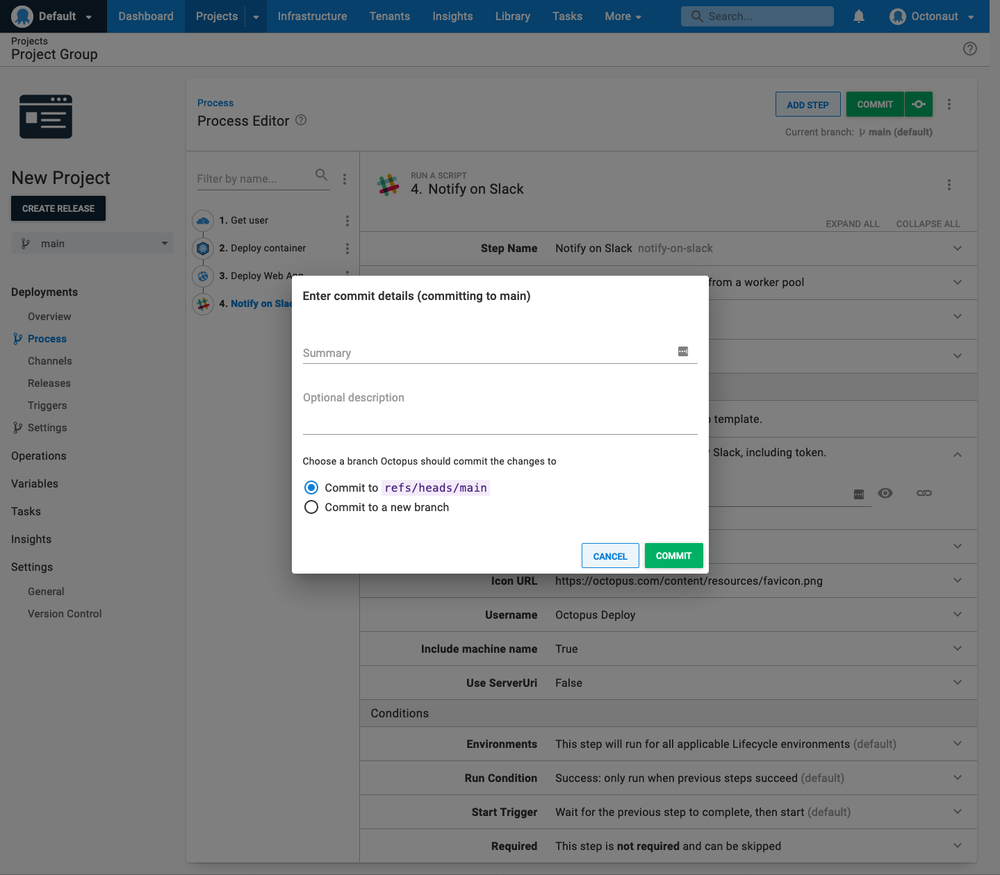

Once an Octopus Project is configured to be version-controlled, your experience making changes to a project will change. With the configuration as code feature, you can either edit the resources via the Octopus Deploy UI or your favorite file editing tool. This page will walk through what to expect.

## Editing via the Octopus UI

Editing via the Octopus Deploy UI works the same whether you are saving to a git repository or to SQL Server. You can add steps, update processes, remove steps, just like before. When you enable version control on a project, you get additional functionality.

### Branch Switcher 

The first difference is the addition of a branch-switcher. When editing the deployment process via the Octopus UI, the branch is selected in the branch-switcher at the top of the deployment process editor.

Each branch can have a different deployment process. For example, if you decide to move from running web applications on VMs to PaaS, you could create a branch to hold all your code changes and your deployment process changes. You can make the necessary updates to your deployment process to deploy to a PaaS target. The deployment process currently being used to deploy to **Production** can be left alone until you are ready to merge in both the code changes and the deployment process changes.

### Commits

Before enabling version control on the project, clicking on save updated a record in the SQL Server database. That record would be overwritten with each change. Once version control is enabled, that is no longer the case. You'll be generating commits each time you "save."  As such, the save experience has been updated. The **Save** button has been replaced with **Commit**, and clicking on that will allow you to enter a commit message before saving. Next to the **Commit** button is a quick save, useful when you made a minor change.

### Viewing and Editing OCL

Enabling version control also adds the option to **View/Edit OCL** to the `...` or overflow menu. Clicking on this option will open up a modal window allowing you to edit the OCL (Octopus Configuration Language) file directly.  

:::hint
The Octopus Deploy UI will only add non-default properties to the OCL files. For example, if a step isn't scoped to run for a specific environment(s), that property will not show up when you edit the OCL file in the UI.
:::

Once you are finished editing the OCL file, you can commit changes those changes to the git repo. The UI will automatically refresh.

## Editing via a text editor

Changes can also be made using your favorite text editor or IDE and committed and pushed just as you would any other code change. 

:::hint
We have a [Visual Studio Code Plug-in](https://marketplace.visualstudio.com/items?itemName=octopusdeploy.vscode-octopusdeploy) that will add syntax highlighting, OCL snippets, and an integrated tree view for navigating nodes in an HCL file.
:::

Any changes made to an OCL file via a text editor will not be reflected in the Octopus UI right away. The process for Octopus to reflect any changes is:

1. Commit the file.  
1. Push any changes to the remote git repo.
1. In the Octopus UI, click the **Fetch** button on the branch-switcher.

Octopus will periodically fetch from the remote, so you might not have to do the final step.

### OCL vs. Octopus Terraform Provider

While OCL is similar to HCL, it is not the exact same. In addition, there is not a 1:1 match between the resources generated for OCL and the resources for the [Octopus Terraform Provider](https://registry.terraform.io/providers/OctopusDeployLabs/octopusdeploy/latest/docs). That means you cannot copy resources between OCL files and TF files.

## Version Control features

Storing the deployment process in the same repository as your source code has many benefits. But don't forget to take advantage of all the version control features, including:

- Branching a deployment process when needing to make changes.
- Leveraging Pull Requests for approvals to any changes.
- Reverting changes if something doesn't work right.

If you make any changes outside of the Octopus UI (merging a branch, reverting a change, etc.), you'll need to perform a **Fetch** for those changes to be reflected in the Octopus UI.