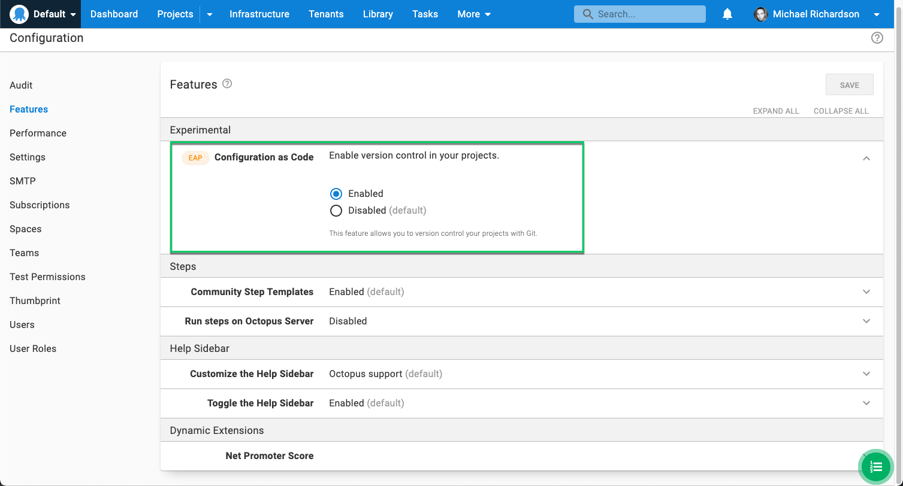

:::hint
The Early Access Preview of the config-as-code feature is available in Octopus Cloud instances, and is enabled via {{Configuration, Features}}
:::

## Introduction 

Welcome to the config-as-code Early Access Preview!  Support for version-controlling Octopus projects has been highly requested for a long time now, and we're excited to release the first cut. The goal of the EAP is to gather feedback, and help us evaluate which problems we have solved, and which are the most valuable to solve next.  

:::warning
Config-as-code is still in development. We strongly recommend not using it on critical production projects at this stage.
:::

The config-as-code EAP adds support for configuring Octopus projects with the details of a Git repository.  For the EAP, this is the _deployment process_ which is version-controlled.  

It was important to us that the Octopus UI remain fully functional for version-controlled projects, and it has.  You can continue to use the UI exactly as you always have, but with an additional super-power: Git branches are now exposed in the UI, allowing editing the deployment process on any branch via the UI. 

Of course, there is also now a text representation of the process in the git repository, and if you prefer editing text then open your favorite editor and go for it.  We refer to the text format as Octopus Configuration Language (OCL), and it is very much inspired by [HCL](https://github.com/hashicorp/hcl).

This means that where previously there was only a single current version of the deployment process, it is now possible to have many. When creating releases the relevant branch can be selected. We have also added [branch system variables](https://octopus.com/docs/projects/variables/system-variables#release-branch-information) that can be used in your custom deployment scripts.

### What's next?

We have some strong opinions on what's next.  We've always intended to version-control variables and runbooks, and we'd like to evolve the OCL schema to make it friendlier for editing by hand.  

But we are very interested to hear what's important to _you_. 

### We want your feedback

Our major goal for the early stages of this feature is to discover the ways people want config as code to evolve.  What scenarios would you like to see unlocked?  What doesn't work the way you hoped? 

You can provide feedback through whichever of the following channels you feel most comfortable with: 

- Feedback forms.  The orange EAP chips in the product link to feedback forms when clicked. This is a great way to provide structured feedback. 
- Community slack. The `config-as-code` channel in the [Octopus community slack](https://octopus.com/slack) is the best place to have a conversation with the team.
- Support. For errors or issues, see our [official support](https://octopus.com/support) channels. 

## Configuring a project to be version-controlled 

Version-control is configured per-project, and can be found under the {{Version Control}} navigation menu item. 

The _Git Repository_ field should contain the URL for the repository you wish the Octopus configuration to be persisted to. e.g. `https://github.com/OctopusSamples/OctoFX.git`  
The repository must be initialized (i.e. contain at least one branch).

The _Default Branch Name_ is the branch on which the Octopus configuration will be written. It is the also the default branch which will be used in various situations, for example
- When users view the project's deployment process for the first time in the Octopus UI, this is the initially selected branch 
- When creating releases, this will be the branch selected initially

The default branch must exist.

The _Authentication_ field specifies the credentials used by Octopus when authenticating with the git provider.  For the Password field, we recommend using a personal access token. Git providers allow you to create an access token in different ways:

* [GitHub - Creating a personal access token](https://docs.github.com/en/authentication/keeping-your-account-and-data-secure/creating-a-personal-access-token)
* [Azure DevOps](https://docs.microsoft.com/en-us/azure/devops/organizations/accounts/use-personal-access-tokens-to-authenticate)
* [BitBucket](https://confluence.atlassian.com/bitbucketserver063/personal-access-tokens-972354166.html)
* [GitLab](https://docs.gitlab.com/ee/user/profile/personal_access_tokens.html)

_Git File Storage Directory_ specifies the path within the repository where the Octopus configuration will be stored.  If only a single Octopus project will be stored in the repo, we recommend putting the configuration directly under the `.octopus` directory. If multiple projects will be persisted to the repository, adding the project name to the path is the recommended convention, e.g. `./octopus/acme`

## Making changes to the deployment process 

Once an Octopus project is configured to be version-controlled, any changes to the deployment process are made on a branch. 

### Via the Octopus UI

When editing the deployment process via the Octopus UI, the branch is selected in the branch-switcher at the top of the deployment process editor.

### Via code

Changes can also be made using your favorite text-editor or IDE, and committed and pushed just as you would any other code change. 
