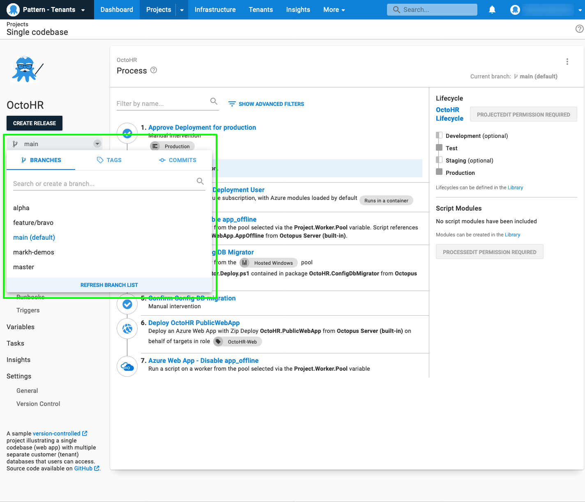

:::hint
The Early Access Preview of the config-as-code feature is available in Octopus Cloud instances, and is enabled via {{Configuration, Features}}
:::

## Introduction 

Welcome to the config-as-code Early Access Preview!  Support for version-controlling Octopus projects has been highly requested for a long time now, and we're excited to release the first cut. And it is only the first cut of what is an ongoing stream of work.  The goal of the EAP is to gather feedback, and help us evaluate which problems we have solved, and which are the most valuable to solve next.  

:::warning
Config-as-code is still in development. We strongly recommend not using it on critical production projects at this stage.
:::

The config-as-code EAP adds support for configuring Octopus projects with the details of a Git repository.  For the EAP, is is primarly the _deployment process_ which is version-controlled (though channels and some settings are also included). 

It was important to us that the Octopus UI remain fully functional for version-controlled projects, and it has.  You can continue to use the UI exactly as you always have, but with an additional super-power: Git branches are now exposed in the UI, allowing editing the deployment process on any branch via the UI. 

Of course, there is also now a text representation of the process in the git repository, and if you prefer editing text then open your favourite editor and go for it.  We refer to the text format as Octopus Configuration Language (OCL), and it is very much inspired by [HCL](https://github.com/hashicorp/hcl). 

This means that where previously there was only a single current version of the deployment process, it is now possible to have many. When [creating releases](#creating-releases) the branch can be selected. 

### What's next?

We have some strong opinions on what's next.  We've always intended to version-control variables and runbooks, and we'd like to make the OCL schema friendlier. 

But we are very interested to hear what's important to _you_. 

### We want your feedback

## Configuring a project to be version-controlled 

**TODO: screenshots and explain how to set a project up with git**

## Making changes to the deployment process 

### Via the UI

### Via code

## Channels and version control

## Creating releases {#creating-releases}

### Via the UI

### Via the CLI

### Build servers
