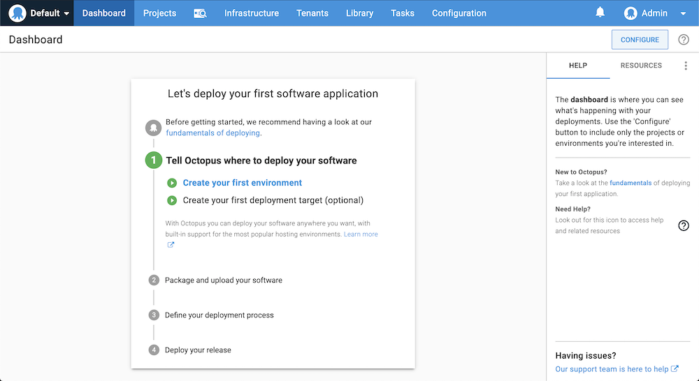
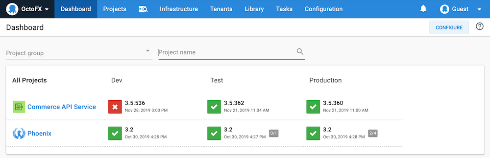

Whether you're self-hosting the Octopus Server or using Octopus Cloud, the Octopus Web Portal is where you manage your infrastructure, deployments, releases, operations processes, access the built-in repository, grant your team access to projects, and create your automated deployment and operations processes.

## Log into the Octopus Web Portal

If you're using an Octopus Cloud instance, use you Octopus Account to log at the URL you defined when you created the instance:

`https://yoururl.octopus.app`

If you're using the self-hosted Octopus Server, you can launch the web portal from the Octopus Manager or navigate to the URL you've defined if you've already [updated the Web Portal Bindings](docs/security/exposing-octopus/expose-the-octopus-web-portal-over-https.md), and log in with the credentials you created during the installation process.

## The Web Portal 

The first time you log into the Octopus Web Portal, you'll see some useful resources to help you navigate the portal and get started:

The main screen of the **Dashboard** links to areas of the portal you'll need to visit to configure your first deployment.

After you have configured your projects and deployments, the dashboard will display your projects and the status of the latest releases to the environments you've configured.

The **contextual help** panel on the right of the screen provides information about the screen you are currently viewing and the resources tab provides links to the related resources. You can hide or reveal the contextual help panel at any time by clicking the question mark icon.

The **Projects** tab is where you will define your projects, deployment processes and operations runbooks.

The **Infrastructure** tab is where you will manage your environments and deployment targets.

The **Tenants** tab is where you can define multiple end users who will all receive versions of your software tailored to them.

The **Library** tab is where you can managed you assets, including the built-in repository.

The **Tasks** tab is where you can check on the status and history of the background tasks your Octopus Server is managing.

The **Configuration** tab is where you can access the audit logs, create teams and manage permissions, and alter the configuration of your Octopus Server.

Next, [how does Octopus connect to my servers?](/docs/quickstart/how-does-octopus-connect-to-my-servers.md).
