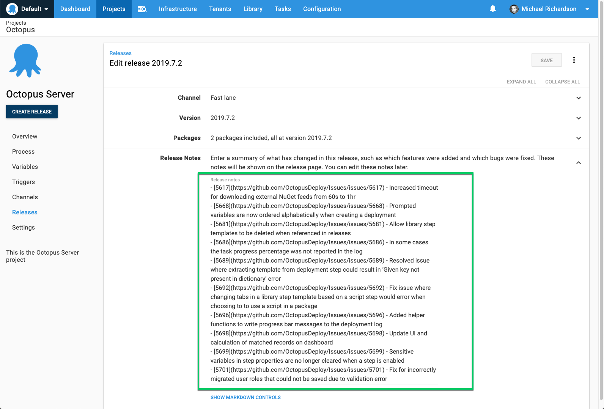

When you create a release, you can add notes:




## Using Variables in Release Notes

Release notes may contain variable expressions. These will be evaluated and substituted when the release is created.

Only variables in scope when the release is created will be available for use in release notes. Variables scoped to environments, tenants, target roles, or targets will _not_ be available as these scopes apply only during deployments.   

[Build information](/docs/packaging-applications/build-servers/index.md#build-information) associated with packages in the release may also be used in release notes.


## Accessing Release Notes During a Deployment

The release notes may be accessed during a deployment using the [Octopus.Release.Notes](/docs/projects/variables/system-variables.md#Systemvariables-Release) variable.  

Release notes are also rolled up into the [deployment notes](/docs/release-management/deployment-notes.md).

## Release Notes Templates {#Release-Notes-Templates}

A release notes template can be configured in {{Project,Settings,Release Notes Template}}

A release notes template is a convenient way to keep release notes consistent and avoid entering the same text repeatedly.   

Release notes templates will generally be most useful when combined with package build information, pushed from the build server.

The following are examples of using release notes templates with package [build information](/docs/packaging-applications/build-servers/index.md#build-information) and [issues](/docs/release-management/issue-tracking/index.md).

### Example Templates

The following example illustrates some sample text followed by the packages, with the packages rendered as a bullet point list:

```
Here are the notes for the packages
#{each package in Octopus.Release.Package}
- #{package.PackageId} #{package.Version}
#{each workItem in package.WorkItems}
    - [#{workItem.Id}](#{workItem.LinkUrl}) - #{workItem.Description}
#{/each}
#{/each}
```

Sometimes you might have different packages contributing to an application, e.g. app server and database might be separate packages. In these cases both packages might contain fixes for the same work item, which would look confusing in the release notes. To support this case there is a distinct list of work items, across all packages, included at the top level of the data. An example of using it is as follows:

```
#{each workItem in Octopus.Release.WorkItems}
- [#{workItem.Id}](#{workItem.LinkUrl}) - #{workItem.Description}
#{/each}
```

For some use cases there are actually no work items, the nature of the changes is such that the commit messages themselves should form the release notes. The raw commit data is available per package for the release notes templates:

```
Here are the notes for the packages
#{each package in Octopus.Release.Package}
- #{package.PackageId} #{package.Version}
#{each commit in package.Commits}
    - [#{commit.CommitId}](#{commit.LinkUrl}) - #{commit.Comment}
#{/each}
#{/each}
```
