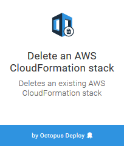
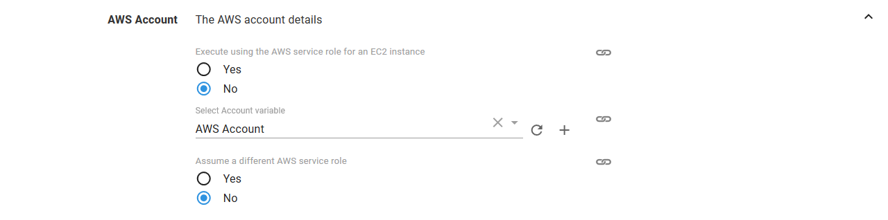
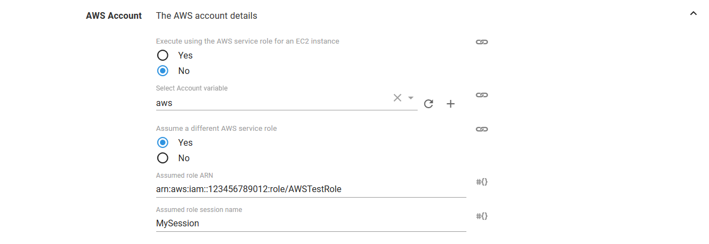

In addition to automating the creation of AWS resources, CloudFormation provides a simple method for destroying the resources it created as part of a stack.  Using a runbook, you can automate tearing down environments when they're no longer needed.

Octopus supports the deletion of an existing AWS CloudFormation stack through the Delete an AWS CloudFormation stack step. This step deletes a CloudFormation stack using AWS credentials managed by Octopus.

The proceeding instructions can be followed to configure the Delete an AWS CloudFormation stack step.

## Create the runbook

1. To create a runbook, navigate to **{{Project, Operations, Runbooks, Add Runbook}}**.
1. Give the runbook a name and click **SAVE**.
1. Click **DEFINE YOUR RUNBOOK PROCESS**, then click **ADD STEP**.
1. Add a **Delete an AWS CloudFormation stack** step.
1. Fill in the parameters for the template:

| Parameter  | Description | Example |
| ------------- | ------------- | ------------- |
| Region | The region your resources are located | us-west-1 |
| CloudFormation stack name | Name of existing stack | MySuperStack |

### AWS section

Select the variable that references the **Amazon Web Services Account** under the **AWS Account** section or choose to execute using a service role assigned to the EC2 instance. If you don't have an **AWS Account Variable** yet, check our [documentation on how to create one](/docs/projects/variables/aws-account-variables.md).

The supplied account can optionally be used to assume a different AWS service role. This can be used to run the AWS commands with a role that limits the services that can be affected.

:::hint
If you select **Yes** to **Execute using the AWS service role for an EC2 instance**, you do not need an AWS account or account variable. Instead the AWS service role for the EC2 instance executing the deployment will be used. See the [AWS documentation](https://g.octopushq.com/AwsDocsRolesTermsAndConcepts) for more information on service roles.
:::

### CloudFormation section

Under the **CloudFormation** section, the AWS region and stack name need to be defined.

:::hint
If the stack does not exist, this step will succeed and not attempt to delete it again.
:::

You can also optionally wait for the stack to be deleted completely before finishing the step by selecting the **Wait for completion** check-box.

:::hint
Unselecting the **Wait for completion** check-box will allow the step to complete once that CloudFormation deletion has been initiated. However unselecting the option means that the step will not fail if the CloudFormation stack deletion fails.
:::

In a single step, you can destroy all the resources created within a CloudFormation stack.

## Samples

We have a [Target - PostgreSQL](https://g.octopushq.com/TargetPostgreSQLSampleSpace) Space on our Samples instance of Octopus. You can sign in as `Guest` to take a look at this example and more runbooks in the `Space Infrastructure` project.
