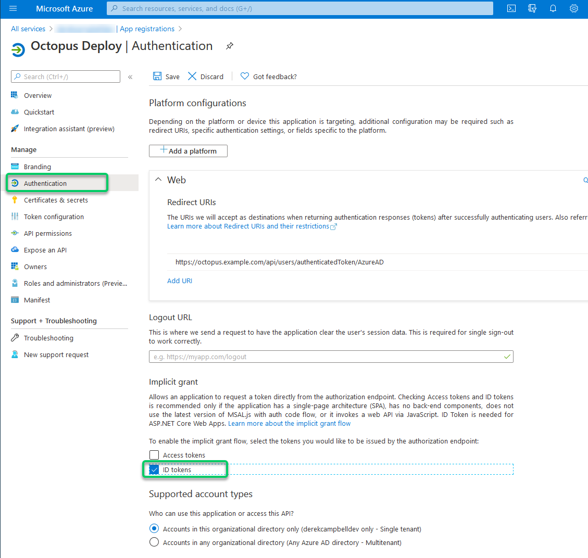
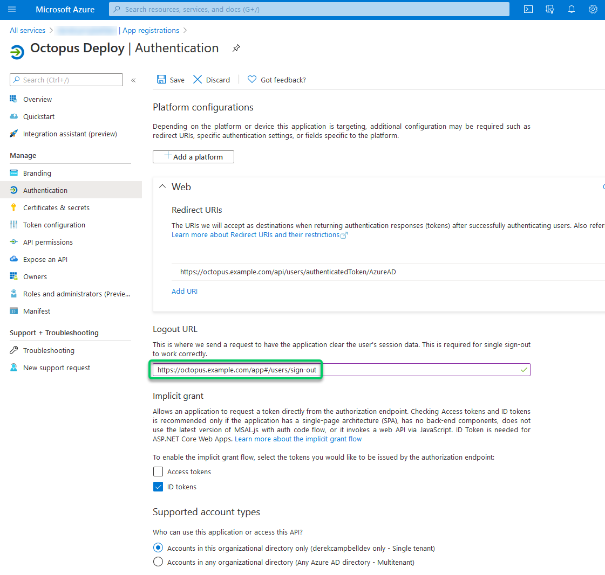
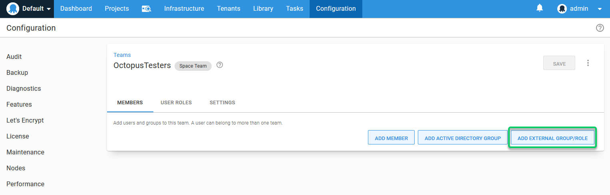
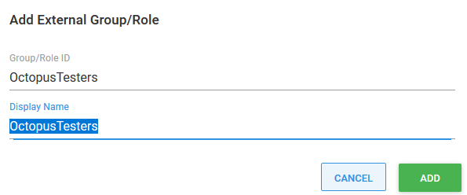

You can use Azure Active Directory (AAD) to authenticate when logging in to the Octopus Web Portal. To use Azure Active Directory (AAD) authentication with Octopus, you will need to do the following:

1. Configure AAD to trust your Octopus Deploy instance by setting it up as an App in AAD.
2. Optionally map AAD Users into Roles so you the users can be automatically connected to Octopus Teams.
3. Configure your Octopus Deploy instance to trust and use AAD as an Identity Provider.

:::hint
If your Octopus database is running in Azure SQL, it's also possible to configure an Azure Active Directory (AAD) Managed identity for use with your SQL database. See our [Using Azure Active Directory (AAD) in Azure SQL](/docs/installation/sql-server-database.md#using-aad-in-azure-sql) section for further information.
:::

## Configure Azure Active Directory (AAD)

First, you need to configure your Azure Active Directory to trust your instance of Octopus Deploy by configuring an App in your AAD.

### Configure Octopus Deploy as an App in your AAD

:::success
**Get the right permissions for your Azure Active Directory tenant before starting**
To configure your instance of Octopus Deploy as an App, you need administrator permissions to the desired Azure Active Directory tenant in your subscription.
:::

1. Log in to the [Azure Portal](https://portal.azure.com), click on your account positioned at the top-right of the screen, then select your desired directory:


2. Select the hamburger menu in the [Azure Portal](https://portal.azure.com)  and select **Azure Active Directory** from the Azure menu:


3. Select **App registrations** then choose **New application registration**:


4. Choose a **Name** like *Octopus Deploy*, select the correct **Supported account type**  for Single or Multi-Tenant, and enter a value for **Redirect URI** like `https://octopus.example.com/api/users/authenticatedToken/AzureAD`. Then click **Register**.
 - The URL must use HTTPS.
 - When users input their credentials, the value you specify for **Name** will appear at the top of the Azure authentication page.
 - The value you specify for **Redirect URI** should be the URL to your Octopus Server. This address is only linked within your browser, so it only has to be resolvable on your network, not from the public Internet.
 - Include `/api/users/authenticatedToken/AzureAD` at the end of your Octopus URL.

:::hint
Take care when you add this URL. They are **case-sensitive** and can be sensitive to trailing **slash** characters. You cannot use `HTTP` here and need to use `https`. You will need to use an SSL certificate from a Certificate Authority, such as [LetsEncrypt](https://letsencrypt.org/). You can do this by using Octopus Deploy [Let's Encrypt Integration](/docs/security/exposing-octopus/lets-encrypt-integration.md) or one from Active Directory Certificate Services.
:::


#### Enable ID Tokens and configure

:::hint
As of version `2022.2.XXXXX`, Octopus Deploy no longer uses implicit flow for OAuth by default. We suggest following the instructions for generating a client secret below instead.
:::

1. Within your new App registration in AzureAD navigate to Authentication.
2. Ensure the ID Tokens box is enabled:



#### Enable Logout URL if using Single Sign-On (optional)

1. Within your new App registration in AzureAD navigate to Authentication.
2. Input logout URL and enter `https://octopus.example.com/app#/users/sign-out` substituting your URL.



#### Mapping AAD users into Octopus teams (optional)

If you want to manage user/team membership via AAD, you must configure Roles for your App. To add Role(s), you can create and assign a new App Role in the Azure Portal or directly edit the App's manifest.

##### Create and Assign a new AAD App Role

1. Under App Roles, select **Create app role**.

   

2. Enter all required fields and click **Apply** to create the new app role.

   

   :::hint
   The **Value** property is the most important field. This value becomes the external Role ID you use later on when [adding this Role to a Team](/docs/security/users-and-teams/external-groups-and-roles.md#ExternalGroupsandRoles-AddExternalRole) in Octopus Deploy.
   :::

##### Edit AAD App Manifest

1. Under the App Registration, select **Manifest**, and then you can start editing your manifest file as required.


The example below illustrates two roles, one for administrators and one for application testers. You need to create each required group in the Manifest file.

:::success
Make sure you replace the `NEWGUID`s with a generated GUID (unique per entry). You can find these online and use them as required. An example is [guidgenerator.com](https://guidgenerator.com/).
:::

```json
{
  "appId": "myAppGuid",
  "appRoles": [
   {
      "id": "NEWGUID1",
      "allowedMemberTypes": ["User"],
      "description": "OctopusAdministrators",
      "displayName": "OctopusAdmins",
      "isEnabled": true,
      "value": "octopusAdmins"
   },
   {
      "id": "NEWGUID2",
      "allowedMemberTypes": ["User"],
      "description": "OctopusTesters",
      "displayName": "OctopusTesters",
      "isEnabled": true,
      "value": "octopusTesters"
   }
  ]
}
```

After you have completed editing the manifest, select the **Save** option.


:::hint
The **value** property is the most important one. This value becomes the external Role ID you use later on when [adding this Role to a Team](/docs/security/users-and-teams/index.md) in Octopus Deploy.
:::

:::success
**Want a more advanced manifest?**
For more advanced scenarios, please see the [Azure manifest file documentation](https://azure.microsoft.com/en-us/documentation/articles/active-directory-application-manifest/).
:::

#### Configure users and groups in Azure AD (optional)

After the App Role(s) have been defined, users/groups from Azure AD may be mapped into these Roles.

1. Under the App Registration, select your App registrations name under **Managed application in local directory**.


2. Choose **Users and groups** and select **Add user** to create a new role assignment.

3. Select the users you would like to assign roles to. Next, under **Select Role**, specify one of the AppRoles that you added to the App registration manifest.


4. To save your changes, select the **Assign** button.

:::hint
If you only have one role it will be automatically assigned. If you have **multiple** roles, a popup will appear when you click the **Assign** button so you can select the role to assign.
:::

## Configure Octopus Server

### Get the client ID and Issuer

There are two values you need from the Azure AD configuration to complete the Octopus configuration: the **Client ID** and **Issuer**.

#### Using the Azure portal

In the Azure portal, you can see the **Application (client) ID**  and **Directory (tenant) ID** on your App's Overview page.


### Setting the client ID and Issuer in Octopus Deploy

:::success
Your **Client ID** should be a GUID. This is the **Application (client) ID** in the Azure App Registration Portal.

Your **Issuer** should be a URL like `https://login.microsoftonline.com/GUID` where the GUID is a particular GUID identifying your Azure Active Directory tenant. This is the **Directory (tenant) ID** in the Azure App Registration Portal.
:::

When you have those values, run the following from a command prompt in the folder where you installed Octopus Server:

```powershell
Octopus.Server.exe configure --azureADIsEnabled=true --azureADIssuer=Issuer --azureADClientId=ClientID

#Eg:
# Octopus.Server.exe configure --azureADIsEnabled=true --azureADIssuer=https://login.microsoftonline.com/12341234-xxxx-xxxx-xxxx-xxxxxxxxxxxx --azureADClientId=43214321-xxxx-xxxx-xxxx-xxxxxxxxxxxx
```

Alternatively, these settings can be defined through the user interface by selecting **{{Configuration,Settings,Azure AD}}** and populating the fields **Issuer**, **ClientId**, and **IsEnabled**.


### Assign app registration roles to Octopus teams (optional)

If you followed the optional steps to modify the App registration's manifest to include new roles, you can assign them to **Teams** in the Octopus Portal.

1. Open the Octopus Portal and select **{{Configuration,Teams}}**.

2. Either create a new **Team** or choose an existing one.

3. Under the **Members** section, select the option **Add External Group/Role**.
 


4. Enter the details from your App registration's manifest. In this example, we need to supply `octopusTesters` as the **Group/Role ID** and `OctopusTesters` as the **Display Name**.
 


5. Save your changes by clicking the **Save** button.

### Octopus user accounts are still required

Even if you are using an external identity provider, Octopus still requires a [user account](/docs/security/users-and-teams/index.md), so that you can assign those people to Octopus teams and subsequently grant permissions to Octopus resources. Octopus will automatically create a [user account](/docs/security/users-and-teams/index.md) based on the profile information returned in the security token, which includes an **Identifier**, **Name**, and **Email Address**.

**How Octopus matches external identities to user accounts**

When the security token is returned from the external identity provider, Octopus looks for a user account with a **matching Identifier**. If there is no match, Octopus looks for a user account with a **matching Email Address**. If a user account is found, the external identifier will be added to the user account for next time. If a user account is not found, Octopus will create one using the profile information in the security token.

:::hint
**Existing Octopus user accounts**

If you already have Octopus user accounts and you want to enable external authentication:
- Make sure the Octopus **Email Address** matches the value configured in the external identity provider. 
- If the Octopus **Username** is an email address, make sure that value matches the one configured in the external identity provider.

This will maximize the chance for your existing users to sign in using an external identity provider and still belong to the same teams in Octopus.
:::

### Getting permissions

!include <admin-user>

## Next steps

Now that you're using an external identity provider, it is easy to increase your security. You could consider configuring [Multi-Factor Authentication](https://docs.microsoft.com/en-us/azure/multi-factor-authentication/multi-factor-authentication), after all, Octopus Deploy has access to your production environments!

You should also consider disabling any authentication providers you aren't using, like username and password authentication.

## Troubleshooting

If you are having difficulty configuring Octopus to authenticate with Azure Active Directory, check your [server logs](/docs/support/log-files.md) for warnings.

### Triple check your configuration

Unfortunately, the security-related configuration is sensitive to everything. Make sure:

- You don't have any typos or copy-paste errors.
- Remember, things are case-sensitive.
- Remember to remove or add slash characters.

### Check the OpenID Connect metadata is working

You can see the OpenID Connect metadata by going to the Issuer address in your browser and adding `/.well-known/openid-configuration` to the end. In our example, this would be something like `https://login.microsoftonline.com/b91ebf6a-84be-4c6f-97f3-32a1d0a11c8a/.well-known/openid-configuration`.

### Inspect the contents of the security token

Sometimes the contents of the security token sent back by Azure AD aren't exactly what Octopus expects; certain claims might be missing or named differently. This will usually result in the Azure AD user incorrectly mapping to a different Octopus user than expected. The best way to diagnose this is to inspect the JSON Web Token (JWT), which is sent from Azure AD to Octopus via your browser. To inspect the contents of your security token:

1. Open the Developer Tools of your browser and enable Network logging, making sure the network logging is preserved across requests.
2. In Chrome Dev Tools, this is called "Preserve Log".


3. Attempt to sign into Octopus using Azure AD and find the HTTP POST coming back to your Octopus instance from Azure AD on a route like `/api/users/authenticatedToken/azureAD`. You should see an **id_token** field in the HTTP POST body.
4. Grab the contents of the **id_token** field and paste that into [https://jwt.io/](https://jwt.io/), which will decode the token for you.


5. Don't worry if jwt.io complains about the token signature; it doesn't support RS256, which is used by Azure AD.
6. Octopus uses most of the data to validate the token, but primarily uses the **sub**, **email**, and **name** claims. If these claims are not present, you will likely see unexpected behavior.

### Contact Octopus Support

If you aren't able to resolve the authentication problems yourself using these troubleshooting tips, please reach out to our [support team](https://octopus.com/support) with:

1. The contents of your OpenID Connect Metadata or the link to download it (see above) can be different for each Azure AD App.
2. A copy of the decoded payload for some security tokens (see above) may work as expected, and others will not.
3. A screenshot of the Octopus User Accounts, including their username, email address, and name.
