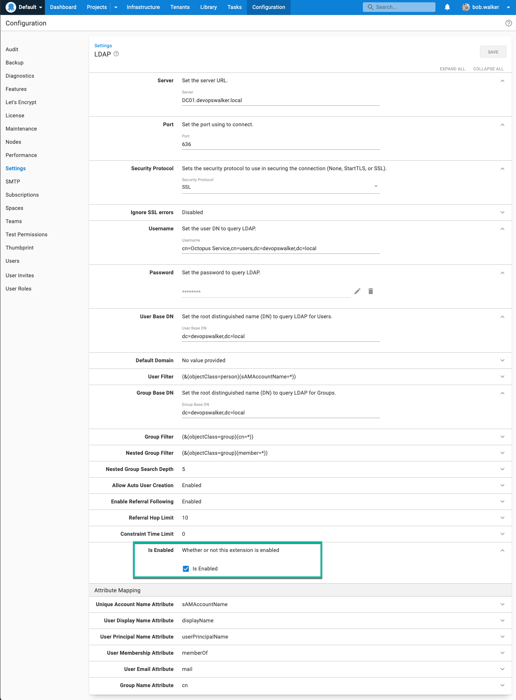
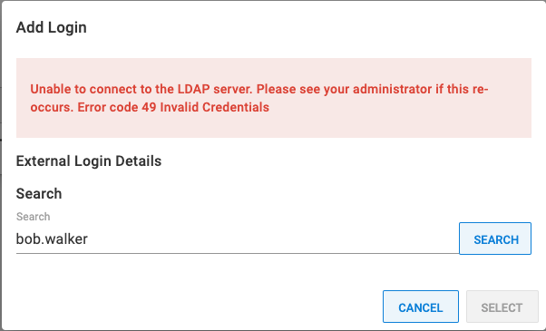

:::hint
LDAP authentication can only be configured for Octopus Server, the Octopus Linux Container, and not for [Octopus Cloud](/docs/octopus-cloud/index.md). See our [authentication provider compatibility](/docs/security/authentication/auth-provider-compatibility.md) section for further information.
:::

Octopus provides an LDAP authentication provider allowing you to utilize an existing LDAP Server to authenticate with Octopus.  

From **Octopus 2021.2**, the LDAP Authentication provider is available out-of-the-box as one of [a number of custom Server extensions](/docs/administration/server-extensibility/customizing-an-octopus-deploy-server-extension.md) provided as part of the Octopus Deploy installation. It is an open-source project, and the source code is available on [GitHub](https://github.com/OctopusDeploy/LdapAuthenticationProvider).

This guide will walk you through how to configure the LDAP authentication provider in Octopus Deploy.  This example will enable Octopus Deploy to authenticate to the domain `devopswalker.local`.  

## LDAP background

LDAP, or Lightweight Directory Access Protocol, is an open, vendor-neutral, industry-standard protocol for interacting with directory servers.  It is easy to confuse LDAP with a directory server such as Active Directory.  LDAP itself is not a directory server.  It is the protocol used to communicate with a directory server.  Like `http` is the protocol for web servers, or `wss` is the protocol to communicate with web servers via sockets.  The default configuration for Active Directory enables LDAP support.  

As LDAP is a protocol, not a directory server, it has these advantages:

1. You can leverage non-Microsoft directory servers such as OpenLDAP along with proprietary directory servers such as Active Directory.
2. Docker containers, such as the Octopus Linux Container, can use LDAP to authenticate to Active Directory or OpenLDAP servers without having to worry about attaching a computer to a domain.
3. It is easier to fine-tune the lookup filters and attributes to match your requirements.

## Secure your LDAP server

By default, LDAP traffic is not encrypted.  By monitoring network traffic, an eavesdropper could learn your LDAP password.  Before configuring the LDAP provider in Octopus Deploy, please consult the vendor documentation for your directory server for communicating over SSL or TLS.  Securing an LDAP server is outside the scope of this guide.  The rest of this guide assumes you have worked with your system administrators on securing your LDAP server.

## Understanding DNs

In LDAP, a DN, or a [distinguished name](https://en.wikipedia.org/wiki/Lightweight_Directory_Access_Protocol#Directory_structure), uniquely identifies an entry and the position in a directory information tree.  Think of it as a path to a file on a file system.

The domain in this example is `devopswalker.local`.  Translating that to a DN LDAP can understand is `dc=devopswalker,dc=local`.  All users are stored in the directory users.  The DN for that is `cn=users,dc=devopswalker,dc=local`.  A user account with the name `Bob Walker` has the DN `cn=Bob Walker,cn=users,dc=devopswalker,dc=local`

## What you will need

Before configuring the LDAP provider, you will need the following.

- The fully qualified domain name, or FQDN, of the server to query.  In this example, it will be `DC01.devopswalker.local`.
- The port number and security protocol to use.  This example will use the standard secure LDAP port 636 for the domain controller and SSL.
- The username and password of a service account that can perform user and group lookups.  In this example, it will use the DN `cn=Octopus Service,cn=users,dc=devopswalker,dc=local`.
- The root DN you wish to use for users and groups.  This example will be `cn=users,dc=devopswalker,dc=local` as both users and groups are in the same directory on the example server.

:::hint
This example uses a straightforward Active Directory configuration.  Your DN and FQDN might be much more complex.  Please consult your system administrator for all the required configuration values.
:::

## Getting permissions

!include <admin-user>

### Octopus user accounts are still required {#Octopususeraccountsarestillrequired}

Even if you are using an external identity provider, Octopus still requires a [user account](/docs/security/users-and-teams/index.md) so you can assign those people to Octopus teams and subsequently grant permissions to Octopus resources. Octopus will automatically create a [user account](/docs/security/users-and-teams/index.md) based on the profile information returned from the LDAP lookup.

**How Octopus matches external identities to user accounts**
You can configure the attributes to match external identities to user accounts.  By default, Octopus will use `sAMAccountName` for the unique account name and `displayName` for the display name.

:::success
**Already have Octopus user accounts?**
If you already have Octopus user accounts and you want to enable external authentication, simply make sure the Email Address matches in both Octopus and the external identity provider. This means your existing users will be able to sign in using an external identity provider and still belong to the same teams in Octopus.
:::

## Configuring LDAP authentication provider

Navigate to **{{Configuration, Settings, LDAP}}**.  Enter values in the following fields:

- **Server**: Enter the FQDN of your server.
- **Port**: Change the port (if your secure port is different from the default).
- **Security Protocol**: Change to SSL or StartTLS.
- **Username**: Enter the username that will be used to perform the user lookups.  It can either be `[username]@[domain name]` or the user's DN.  In this example it will be `cn=Octopus Service,cn=users,dc=devopswalker,dc=local`. 
- **User base DN**: enter the base DN for your users, which in the example is `cn=users,dc=devopswalker,dc=local`.
- **Group base DN**: enter the base DN for your users, which in the example is `cn=users,dc=devopswalker,dc=local`.
- **Is Enabled**: Check the check box to enable the feature.

:::hint
The root DN `cn=users,dc=devopswalker,dc=local` was selected because that is the directory for both users and groups in the example Active Directory server.
:::

## Testing the LDAP authentication provider

After configuring the LDAP authentication provider, you will want to test it.  There are two easy tests you can perform without logging out/logging as a different user.

- External User Lookup
- External Group Lookup

For the external user lookup, navigate to **{{Configuration, Users}}** and select a user account.  Once that screen is loaded, expand the LDAP section under logins and click the `ADD LOGIN` button.  If everything is working correctly, then you will see a modal window similar to this.

If the LDAP authentication provider or LDAP server is not configured properly, you will encounter an error similar to this.

The error `Unable to connect to the LDAP server.  Please see your administrator if this re-occurs.  Error Code 49 Invalid Credentials` is an LDAP lookup error caused by bad credentials.  That is easy to debug, but there might be a specific reason why that is failing.  You can find the specific error type code by looking at your Octopus server logs.

The external group lookup is the same as the external user lookup.  Except, go to **{{Configuration, Teams}}** and select a team.  Then click the button `ADD LDAP GROUP` and perform a search.  If everything is configured correctly, then you will see this message:

If the lookup fails, then perform the same troubleshooting you did for the user lookup.

## Signing in

After the above tests are successful, it is time to try the next test, logging into Octopus using the LDAP authentication provider.  We recommend creating a test account.  For this example, the test account `Professor Octopus`, was created and added to the `Developers` group.  

Signing in with the username `professor.octopus` worked as expected.  As stated earlier, the default configuration is to match on the `sAMAccountName` attribute.  Assuming the username and password were successful, the new user was created and assigned to the appropriate team.

## Changing the user filter

By default, Octopus matches on the `sAMAccountName` attribute.  In our testing, it proved to be more reliable than other options.  With that default, signing in using the UPN such as `professor.octopus@devopswalker.local`, will give you this error:

You might have a company policy (or personal preference) to use the UPN.  If so, change the User Filter to be `(&(objectClass=person)(userPrincipalName=*))`.  

That is because with Active Directory, the email address is stored on the user principal, not the user id.

## Troubleshooting

If you encounter errors configuring the LDAP authentication provider, you can do the following steps to troubleshoot any problems.

### Take Octopus out of the equation

The first recommendation is to use an LDAP lookup tool, such as [ldp.exe](https://docs.microsoft.com/en-us/previous-versions/windows/it-pro/windows-server-2012-r2-and-2012/cc771022(v=ws.11)) for Windows (or [ldapsearch](https://wiki.debian.org/LDAP/LDAPUtils) for Linux), to connect to your directory server over LDAP.  Run that tool from the same server hosting Octopus Deploy.  If that tool cannot connect, then chances are there is a firewall or some other configuration issue you'll need to fix.

### Review the logs

You can find all the LDAP failures in the Octopus logs on the Octopus Server.  Lookup the error codes and data codes to see what the specific error is.  You can look up that specific error code using your search engine of choice to find the specific error message and a more detailed description.

