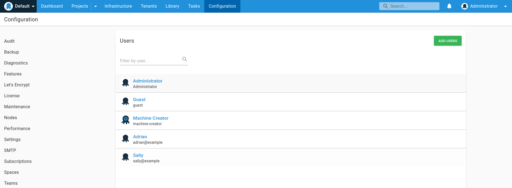
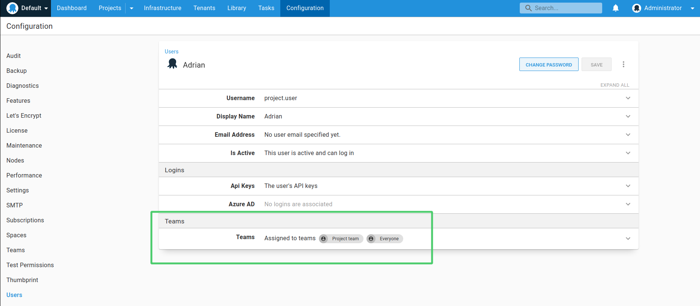

Octopus provides a Username / Password authentication provider allowing you to create user accounts in Octopus manually without any requirement for an external authentication provider.

The Username / Password provider is available out-of-the-box as one of [a number of custom Server extensions](/docs/administration/server-extensibility/customizing-an-octopus-deploy-server-extension.md) provided as part of the Octopus Deploy installation. It is an open-source project and the source code is available on [GitHub](https://github.com/OctopusDeploy/UsernamePasswordAuthenticationProvider).

When Username / Password authentication is enabled, the sign in page for the Octopus Web Portal will present users with the option to sign in with a standard Octopus account:


## Enable username and password authentication via UI {#usernamepassword-enable-in-ui}

You can enable Username / Password authentication from the Octopus Web Portal by navigating to **{{Configuration,Settings,Username / Password}}**. From there you can click the **Is Enabled** checkbox to enable or disable the Username / Password provider.


The Username and Password provider will now be activated and available for Octopus users.

## Managing user permissions {#usernamepassword-userpermissions}

When a new Octopus user created, they are automatically added to the **Everyone** team. To manage Octopus users, they can be found navigating to **{{Configuration,Users}}**. 



With any standard Octopus user, you can [assign user accounts to different teams](/docs/security/users-and-teams/index.md) to give them permissions to view projects or environments, or any additional permissions they may need:




## Configuring username and password login {#usernamepassword-configure}

Octopus Server can be configured to enable or disable username/password authentication via the command line, as follows:

```powershell
Octopus.Server.exe configure --instance=[your_instance_name] --usernamePasswordIsEnabled=true
```
