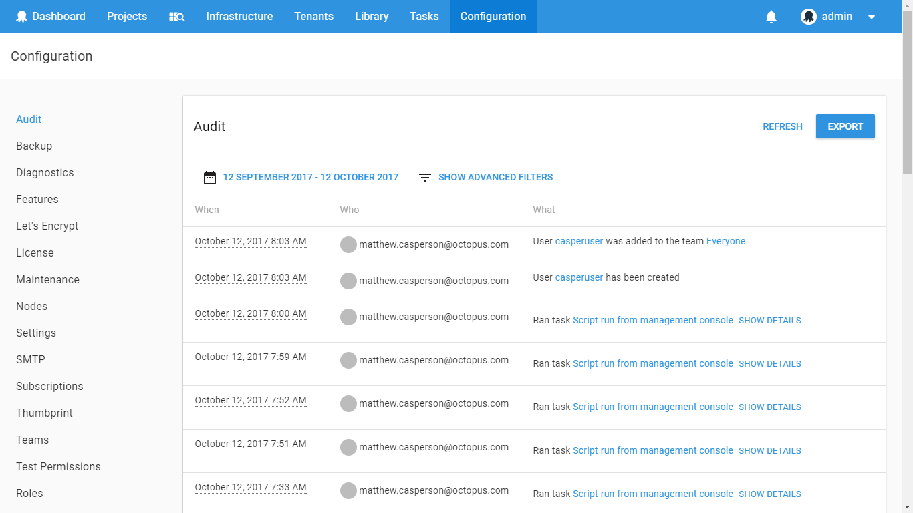
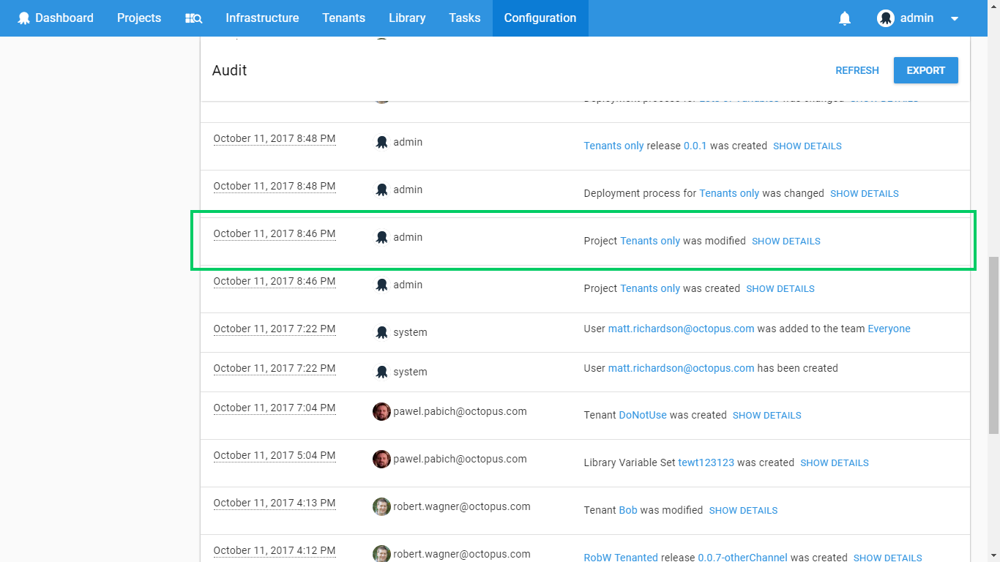
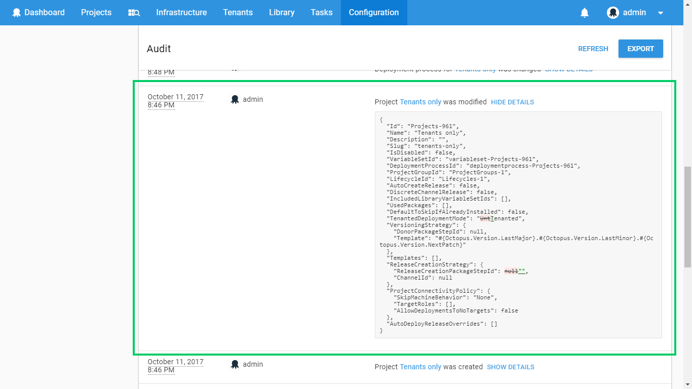
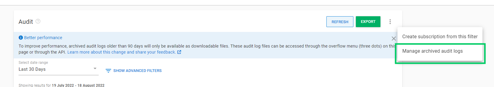

For team members to collaborate in the deployment of software, there needs to be trust and accountability. Octopus Deploy captures audit information whenever significant events happen in the system.

:::hint
The [Audit Retention functionality](#archived-audit-events) was introduced in **Octopus 2022.3** and will be made available to Cloud customers soon. We will make this available to the on-prem customers later in 2023.
:::

## What does Octopus capture? {#Auditing-WhatdoesOctopuscapture?}

Below is a short list of just some of the things that Octopus captures:

- Changes to [deployment processes](/docs/deployments/index.md) and [variables](/docs/projects/variables/index.md).
- Create/modify/delete events for [projects](/docs/projects/index.md), [environments](/docs/infrastructure/environments/index.md), [deployment targets](/docs/infrastructure/index.md), releases, and so on.
- Environment changes, such as adding new deployment targets or modifying the environment a deployment target belongs to.
- Queuing and canceling of deployments and other tasks.

Some general points worth noting:

- Octopus **does** capture the details of every mutating action (create/edit/delete) including who initiated the action.
- Octopus **does not** capture login and logout events for specific user accounts.
- Octopus **does not** capture when data is read, however certain sensitive actions like downloading a certificate with its private key is captured.
- Entries older than 90 days (default, configurable up to 365 days or 3650 days for self-hosted customers) are archived, and are no longer queryable through the user interface.
- Archived entries are stored on the file system, and can be accessed via the [Manage archived audit logs](#accessing-archived-logs) page.

If you are concerned that Octopus does not capture a specific action of interest to you, please contact our [support team](https://octopus.com/support).

## Viewing the audit history {#Auditing-Viewingtheaudithistory}

You can view the full audit history by navigating to the **Audit** tab in the **Configuration** area.

Some audit events will also include details, which you can see by clicking the **show details** link. For example:

This feature makes it extremely easy to see who made what changes on the Octopus Server.

## Security concerns

We take great care to ensure the security and integrity of your audit logs, to make sure they are a trustworthy indelible record of every important activity in your Octopus installation. If you have any concerns please [reach out to us](https://octopus.com/support).

### Viewing audit logs

To grant a user access to audit logs you can make use of a built-in User Role that contains **EventView**. All project related user roles contain it. **EventView** can also be scoped to narrow down which audit information a user can see, for example, it can be restricted to specific Projects or Environments. Learn more about [managing users and teams](/docs/security/users-and-teams/index.md).

In **Octopus 2019.1** we removed **AuditView** in an effort to simplify permissions so only **EventView** is now required.

### Streaming audit logs

From **Octopus 2022.4** [enterprise-tier](https://octopus.com/pricing) customers have the option to [stream their audit logs](/docs/security/users-and-teams/auditing/audit-stream.md) to their chosen security information and event management (SIEM) solution.

### Accessing archived logs {#accessing-archived-logs}

Audit entries older than the configured retention period (defaults to 90 days, configurable up to 365 days or 3650 days for self-hosted customer) are archived and can be accessed via the overflow menu (`...`) in the top right corner of the audit page by selecting the **Manage archived audit logs** option.

### Modifying and deleting audit logs is prevented

Octopus actively prevents modifying or deleting audit logs within the configured retention period via its API. That being said, a user with the appropriate permissions to the `Events` table in your Octopus SQL Database could modify or delete records in that table. If you are concerned about this kind of tampering you should configure the permissions to the `Events` table in your Octopus SQL Database appropriately.

Entries older than the retention period can be deleted by users with the appropriate permissions (typically `Octopus Manager`). An audit log entry will be created each time an archived event file is deleted. Archived files are saved at a filesystem level. So any user that has the appropriate permissions could view or delete these files. If this is a concern, you should restrict the permissions to access the configured folder appropriately.

:::warning
As a safeguard, deletion of audit log files is only allowed on files that are at least 30 days old from when they were created.
:::

### Sensitive values in audit logs

If you make a change to a sensitive value in Octopus, you will notice we write an audit log showing the fact the sensitive value changed. The value we show in the audit log is simply **an indicator the value has changed**. This is **not** the unencrypted/raw value. This is **not** even the encrypted value.

We take the sensitive value and hash it using an irreversible hash algorithm. We then encrypt that hash with a new, unique, non-deterministic salt. We use this irreversible value as an indicator that the sensitive value actually changed in some way.

### Archived audit logs {#archived-audit-events}

:::hint
Audit Retention functionality was introduced in **Octopus 2022.3** and will be made available to Cloud customers soon. We will make this available to the on-prem customers later in 2023.
:::

Audit log entries can require a significant amount of database space to store, degrading overall system performance. For this reason, Octopus Server applies a retention policy to automatically archive audit log entries older than the configured number of days and remove them from the database. The retention period can be configured via **{{Configuration, Settings, Event Retention}}**. The location of the archived audit log files can be changed via **{{Configuration, Settings, Server Folders}}**.

Periodically, Octopus will apply the retention policy to the existing entries and store them as [JSONL](https://jsonlines.org/) files, grouped as a single file for each day (for example, `events-2019-01-01.jsonl`). These files can be accessed through a separate page available via the overflow menu (`...`) in the top right corner of the audit page.

Users with appropriate permissions (typically `Octopus Manager`) can download or delete the archived files. The downloaded files are intended to be imported into a datalake for querying and analysis.

:::warning
**Take care deleting archived files**
Deleting the archived files will permanently erase the audit entries. As a safeguard, deletion of audit log files is only allowed on files that are at least 30 days old from when they were created.
:::

The archived files can also be accessed via the Octopus REST API endpoints `/api/events/archives` and `/api/events/archives/{filename}`.

## IP address forwarding

From **Octopus 2023.1**, the originating IP address of a request is recorded as part of any audit event. If you host Octopus on-premises and run multiple nodes in a High Availability setup, incoming requests will be redirected from your load balancer. This means that by default, the IP address recorded with any event will be the IP address of your load balancer. To resolve this, you can configure any trusted network addresses via **{{Configuration, Settings, Web Portal, Trusted Proxies}}**.

If any trusted proxies have been configured, Octopus will attempt to read the value of the `X-Forwarded-For` header instead of the IP address of the request. If this header is present, the rightmost IP address that is **not** included in the list of trusted proxies will be used as the IP address for the event.

For example, if the network address `0.0.0.0/0` is included as a trusted proxy, then any request will always use the leftmost (client) IP address found in the `X-Forwarded-For` header. The subnet mask must be included if you want only to specify a single IP address rather than a network (e.g., `192.168.0.1/32`).
