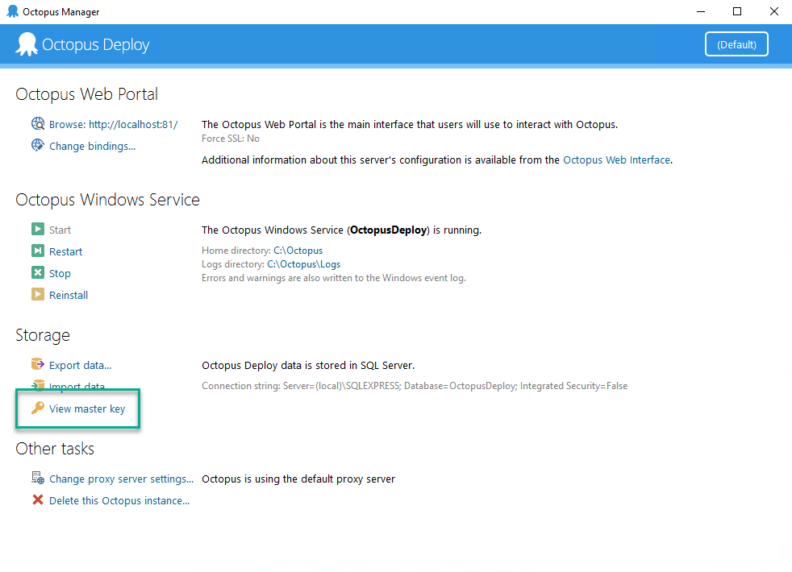

Backing up Octopus Deploy involves these steps:

1. Enable Maintenance Mode
1. Backup the master key
1. Backup the license key
2. Backup the SQL Server Database
3. Backup the server folders

### Enable Maintenance Mode

Maintenance mode prevents non-Octopus Administrators from doing deployments or making changes.  To enable maintenance mode go to **{{Configuration, Maintenance}}** and set the button to `On`.  

### Backup the Octopus Master Key
The master key is used by Octopus Deploy to encrypt and decrypt sensitive values in the Octopus Deploy database.  Without the master key you will need to re-enter all sensitive information.

To view the master key you will need login permissions on the server hosting Octopus Deploy.  Once logged in open up the Octopus Manager and click the view master key button on the left menu.



Save the master key to a secure location, such as a password manager or a secret manager.  

An alternative means of accessing the master key is to run the `Octopus.Server.exe show-master-key` from the command line.  Please note: you will need to be running as an administrator to do that.


### Backup the license key

Just like the master key, the license key is necessary if you need to restore an existing Octopus Deploy instance.  You can access the license key by going to **{{Configuration, License}}**.  

### Backup the SQL Server database

Always backup the database prior to upgrading Octopus Deploy.  The simplest backup possible is a full database backup.  Execute the below t-sql command to save a backup to a NAS or file share.

```
BACKUP DATABASE [OctopusDeploy]
          TO DISK = '\\SomeServer\SomeDrive\OctopusDeploy.bak'
             WITH FORMAT;
```

The `BACKUP DATABASE` t-sql command has dozens of various options.  Please refer to [Microsoft's Documentation](https://docs.microsoft.com/en-us/sql/relational-databases/backup-restore/create-a-full-database-backup-sql-server?view=sql-server-ver15) or consult a DBA as to which options you should use.  

### Backup the server folders

The server folders are use to store large binary data outside of the database.  By default they are located in `C:\Octopus`.  If you have High Availability configured, they are stored on a NAS or some other file share.

- **Packages** Default location is `C:\Octopus\Packages\` -> stores all the packages in the internal feed.
- **Artifacts** Default location is `C:\Octopus\Artifacts` -> stores all the artifacts collected during a deployment along with project images.  
- **Tasklogs** Default location is `C:\Octopus\Tasklogs` -> stores all the deployment logs.  

Any standard file-backup tool will work.  Very rarely will an upgrade touch these folders.  Backup this folder before changing major versions (2020.x to 2021.x), but is unneccesary for minor or patch version upgrades or when you are cloning an existing instance.