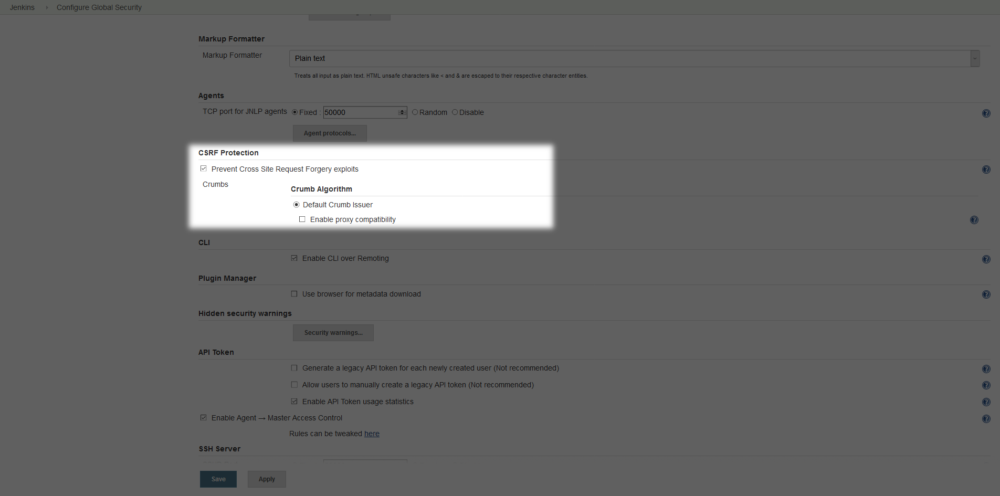
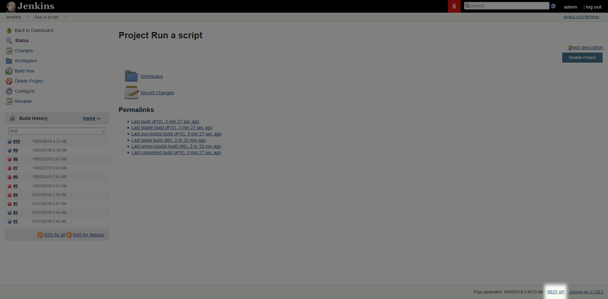
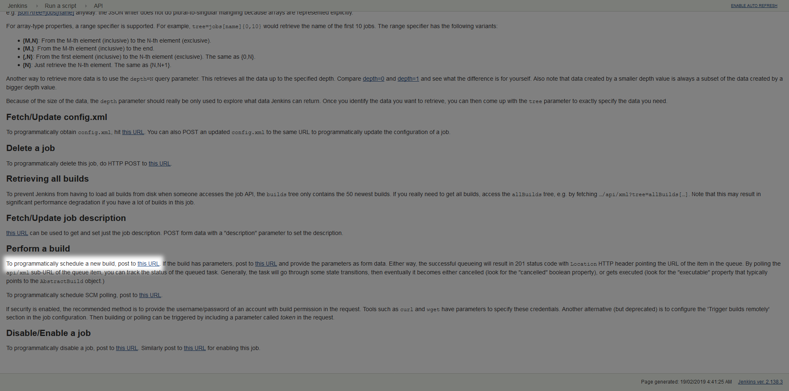

Although the typical deployment workflow sees a CI system like Jenkins triggering a deployment in Octopus, it is sometimes useful to have the reverse where Octopus trigger builds in Jenkins. This page looks at how you can trigger a Jenkins deployment using its REST API and Powershell.

## Jenkins CSRF Security

Jenkins has a security feature to prevent [Cross Site Request Forgery](https://support.cloudbees.com/hc/en-us/articles/219257077-CSRF-Protection-Explained) attacks, which is found under {{Jenkins>Manage Jenkins>Configure Global Security>Prevent Cross Site Request Forgery exploits}}.



In practical terms this means that each request to the Jenkins API needs to have what is known as a crumb defined in the headers. To generate this crumb, we need to make a request to http://jenkinsserver/jenkins/crumbIssuer/api/json.

The Powershell below shows you how to generate a crumb.

```
$user = 'user'
$pass = 'password'

# The header is the username and password concatenated together
$pair = "$($user):$($pass)"
# The combined credentials are converted to Base 64
$encodedCreds = [System.Convert]::ToBase64String([System.Text.Encoding]::ASCII.GetBytes($pair))
# The base 64 credentials are then prefixed with "Basic"
$basicAuthValue = "Basic $encodedCreds"
# This is passed in the "Authorization" header
$Headers = @{
    Authorization = $basicAuthValue
}
# Make a request to get a crumb. This will be returned as JSON
$json = Invoke-WebRequest -Uri 'http://jenkinsserver/jenkins/crumbIssuer/api/json' -Headers $Headers
# Parse the JSON so we can get the value we need
$parsedJson = $json | ConvertFrom-Json
# See the value of the crumb
Write-Host "The Jenkins crumb is $($parsedJson.crumb)"
```

## REST API Links

Now that we have a crumb, we can use it to call the Jenkins REST API. You can find the URL to call to interact with the Jenkins system with the `REST API` link in the bottom right hand corner of each screen.



In this example we want to trigger the build of a Jenkins project, so we open the project and find that the `REST API` link points us to a URL like http://jenkinsserver/jenkins/job/Run%20a%20script/api/. If we open this link we'll see a page of documentation describing the common operations that are available. In particular we are interested in the link that is embedded in the sentence `to programmatically schedule a new build, post to this URL.` The link takes us to a URL like http://jenkinsserver/jenkins/job/Run%20a%20script/build.



## Triggering the Build

We now have the links that we need to trigger a build, and the crumb that is required by Jenkins with each API request. Let's finish off the Powershell script that will make this final request to start a build in Jenkins.

```
$user = 'user'
$pass = 'password'

# The header is the username and password concatenated together
$pair = "$($user):$($pass)"
# The combined credentials are converted to Base 64
$encodedCreds = [System.Convert]::ToBase64String([System.Text.Encoding]::ASCII.GetBytes($pair))
# The base 64 credentials are then prefixed with "Basic"
$basicAuthValue = "Basic $encodedCreds"
# This is passed in the "Authorization" header
$Headers = @{
    Authorization = $basicAuthValue
}
# Make a request to get a crumb. This will be returned as JSON
$json = Invoke-WebRequest -Uri 'http://jenkinsserver/jenkins/crumbIssuer/api/json' -Headers $Headers
# Parse the JSON so we can get the value we need
$parsedJson = $json | ConvertFrom-Json
# See the value of the crumb
Write-Host "The Jenkins crumb is $($parsedJson.crumb)"
# Extract the crumb filed from the returned json, and assign it to the "Jenkins-Crumb" header
$BuildHeaders = @{
    "Jenkins-Crumb" = $parsedJson.crumb
    Authorization = $basicAuthValue
}
Invoke-WebRequest -Uri "http://jenkinsserver/jenkins/job/Run%20a%20script/build" -Headers $BuildHeaders -Method Post
```

Running this script will display the crumb value, as well as the result of the API call to start a job. Notice that the result was a HTTP 201 code. This code indicates that a job was created on the Jenkins server.

```
PS C:\Users\Matthew\Desktop> .\jenkins.ps1
The Jenkins crumb is 574608b1e95315787b2fa0b74fce2441


StatusCode        : 201
StatusDescription : Created
Content           : {}
RawContent        : HTTP/1.1 201 Created
                    Date: Tue, 19 Feb 2019 04:46:46 GMT
                    Server: Apache
                    X-Frame-Options: SAMEORIGIN
                    X-Content-Type-Options: nosniff
                    Location: http://jenkinsserver/jenkins/queue/item/11/
                    Content-L...
Headers           : {[Date, System.String[]], [Server, System.String[]], [X-Frame-Options, System.String[]], [X-Content-Type-Options, System.String[]]...}
RawContentLength  : 0
RelationLink      : {}
```
