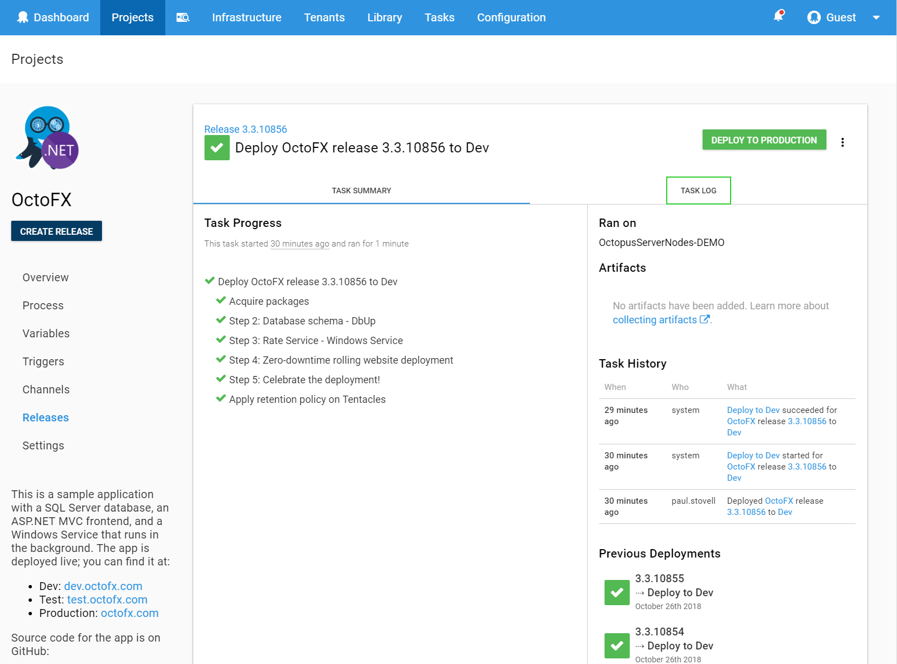

When you contact Octopus Deploy support with a deployment-related issue, we'll sometimes ask you to send the full task log so that we can understand what went wrong.

To download the task log do the following:

1. Select the deployment/task that you're having an issue with.
2. Select the **Task Log** tab.

3. Click **RAW** to display the raw log.
3. Click **DOWNLOAD** to download the log to a text file.

Send this file to us, or attach it to your support request.

:::hint
You might want to open the file in a text editor, and redact any sensitive information like hostnames or company information, before sending the log to us.
:::
