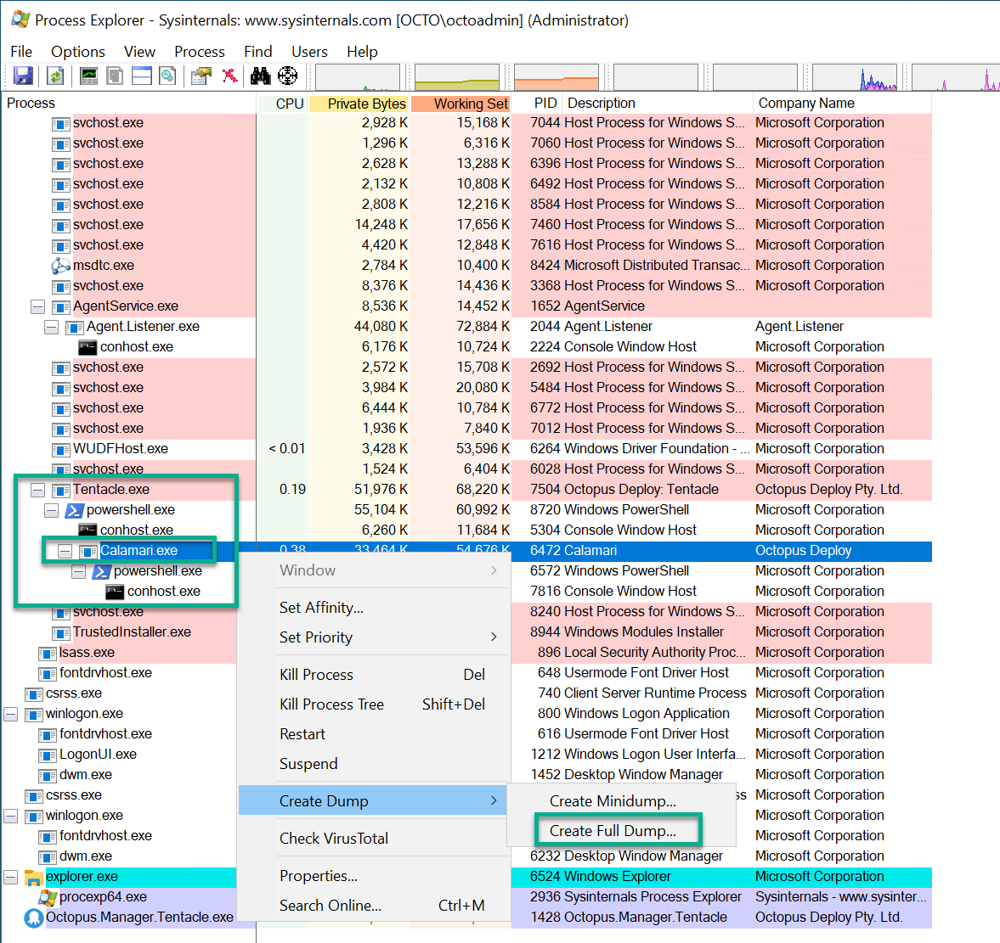

For some problems, such as unresponsive servers/Tentacles and hung tasks, providing a dump or dump analysis of the Octopus Server and/or Tentacle process may speed up diagnosis and resolution.

## Create a process dump

A process dump consists of all the memory the process is currently using.
This includes deployment variables, credentials and certificates.

Creating a process dump will pause the process for anywhere between a few seconds
to a few minutes, depending on the amount of memory in use and the disk speed.

:::hint
Due to the nature of data contained in a process dump, we take great care in handling these files and will provide a secure upload facility. 
We will also delete them as soon as they have been analyzed.
:::

If you are capturing a process on your Octopus Server follow the below instructions:

1. Right click on the task bar and select **Task Manager**.
1. Select the **Details** tab.
1. Find the relevant process. In this case **Octopus.Server.exe**
1. Right click on it and select **Create dump file**.
1. Note where the file is saved (generally in your temp folder).

:::warning
When capturing a process dump for **Tentacle.exe**, please also capture any child **Calamari.exe** processes. To do this, follow the process below.
:::

We recommend using [Process Explorer](https://docs.microsoft.com/en-us/sysinternals/downloads/process-explorer) to capture child processes associated with Tentacle.exe, such as the Calamari.exe process. To capture child processes for Tentacle:

1. On the tentacle that is having the issues. Download and install [Process Explorer](https://docs.microsoft.com/en-us/sysinternals/downloads/process-explorer)
from Microsoft.
1. Once installed you need to **run the program as an administrator** by right clicking on the relevent procexp.exe file and selecting `Run as Administrator`.
1. Once opened you need to make sure the process tree is shown by clicking on the `View` menu on the top navigation bar and selecting `Show Process Tree`.
1. You will notice the program looks similar to task manager. Navigate to the **tentacle.exe** process in the list of tasks.
1. Run the process that is causing the issue/fault in Octopus (ie run the deployment or task that is failing). 
1. Once that task is running in Octopus go back to Process Explorer on the tentacle and you will now see the tentacle.exe process can be expanded to show the calamari process. This can be expanded further to see the powershell.exe processes associated with both the tentacle.exe and calamari.exe. 
1. To capture the dump file for calamari.exe make sure your tentacle.exe process is expanded in process explorer and find calamari.exe.
1. Right click on it and select `Create Dump` and then `Create Full Dump`
1. Note where the file is saved (generally in your temp folder)

:::hint
Sometimes the deployment in Octopus can complete or error out too quickly, which means you do not get a chance to capture the failing process. If this is happening [get in touch with us](https://octopus.com/support) and we can suggest some workarounds to make the process last longer so you can capture the dump correctly.
:::

## Dump file analysis

This process creates an analysis file from a process dump file. This analysis file contains a limited set of information outlining the current state of the
application. This file can contain connection strings, Tentacle thumbprints, project, step and machine names.

It should not contain sensitive variables or certificates. For our purposes it contains for which threads are running and where they are in the code.

:::hint
This process can be performed on a different computer to the one the dump file was captured on
:::

1. Download and install the [Debug Diagnostics tools](https://www.microsoft.com/en-us/download/details.aspx?id=49924)
from Microsoft.
1. Run `DebugDiag Analysis` from the start menu.
1. Check `CrashHangAnalysis`.
1. Click `Add Data Files` and select the dump file.
1. Click `Start Analysis`.
1. Wait.

The result will open in Internet Explorer. Note the location of the file,
which is usually in `<MyDocuments>\DebugDiag\Reports`.
