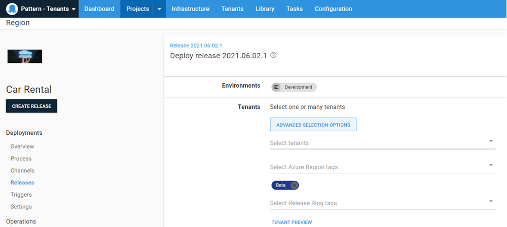

The developers for Car Rental have finished some work on a new feature and are ready to test it out in stores.  Let's follow the release that was created as it's deployed to tenants in the `Beta` release ring.

## Creating the release

Creating a release for a tenanted application is the same process as any other application.  Click on the **CREATE RELEASE** button and **SAVE**

## Deploying a release to a Tenant Tag

One of the differences for deploying a tenanted application is scheduling the deployment.  For an untenanted application, clicking the **DEPLOY** button is all you have to do.  For a tenanted application, there are a few more options to choose from:
- Selecting which tenants to deploy to
- Deploying to tenants based on Tenant Tag Sets

For this release, we want to deploy to tenants who participate in the `Beta` Release Ring tenant tag.

Deploying to the Development environment, we can see that because of the `Beta` Release Ring tag set, it automatically chose `De Moines` as the tenant to deploy to.

Promoting the same release to Test for the same Release Ring, it chooses all tenants who have the `Beta` tag.

It is worth noting that because we assigned the infrastructure to their respective tenants, Octopus Deploy already knows what targets to deploy to.  Deploying to Staging and Production would yield the same results as Test as `De Moines` and `Norfolk` are the only two locations who are participating in the `Beta` tag.

<a class="btn btn-secondary" href="/docs/tenants/guides/multi-tenant-region/assigning-tenants-to-infrastructure">Previous</a>&nbsp;&nbsp;&nbsp;&nbsp;&nbsp;<a class="btn btn-success" href="/docs/tenants/guides/multi-tenant-region/region-specific-workers">Next</a>