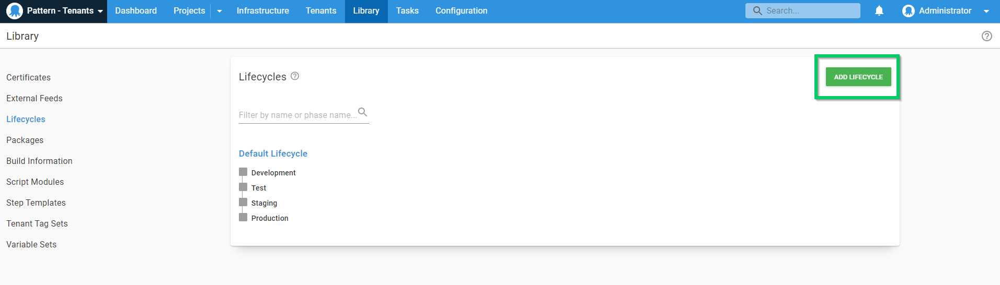
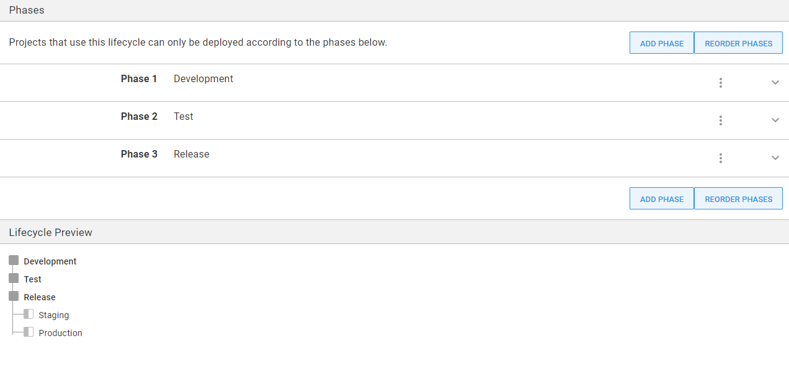

The first step in this guide is to create a new [lifecycle](/docs/releases/lifecycles/index.md) for our project.

To create a new Lifecycle, navigate to **{{Library, Lifecycles, ADD LIFECYCLE}}**.

Give the **Lifecycle** a name, an optional description, and four phases. The lifecycle should ensure all releases are deployed to Development, Test, *optionally* to Staging, then lastly into Production. 

 

In the next step, we'll [create the project](/docs/tenants/guides/multi-tenant-saas-application/creating-new-tenants.md) needed for this scenario.

<a class="btn btn-secondary" href="/docs/tenants/guides/multi-tenant-saas-application">Previous</a>&nbsp;&nbsp;&nbsp;&nbsp;&nbsp;<a class="btn btn-success" href="/docs/tenants/guides/multi-tenant-saas-application/creating-new-project">Next</a>