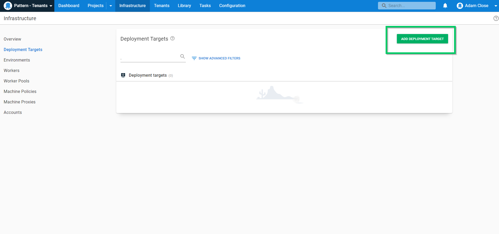
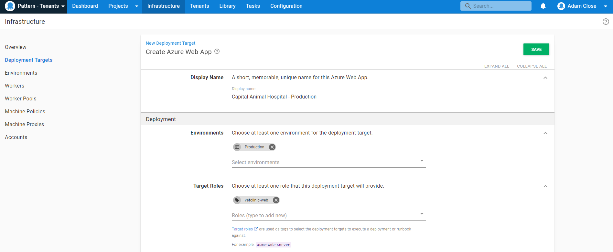

In this section, we need to add and associate our infrastructure to our tenants. Some customers have a staging environment, and some have only a production environment, so we will only need to add a deployment target for environments to the tenants.

To add a new Azure Web Target, go to **{{Infrastrucure, Deployment Targets Templates, ADD DEPLOYMENT TARGET}}**

Next, go to **{{Azure, Azure Web App, ADD}}**

Add a Display Name, Environment and Target Role.

If you're adding an Azure Web App, fill in the Azure subscription, Azure Web App and optionaly Azure Web App Slot and Worker Pool.

Next, associate the deployment target with a tenant.

Do this for the rest of your deployment targets and tenants.

In the next step, we'll create the [deployment process](/docs/tenants/guides/multi-tenant-saas-application/creating-project-deployment-process.md) needed for this scenario.

<a class="btn btn-secondary" href="/docs/tenants/guides/multi-tenant-saas-application/creating-project-template-variables">Previous</a>&nbsp;&nbsp;&nbsp;&nbsp;&nbsp;<a class="btn btn-success" href="/docs/tenants/guides/multi-tenant-saas-application/creating-project-deployment-process">Next</a>