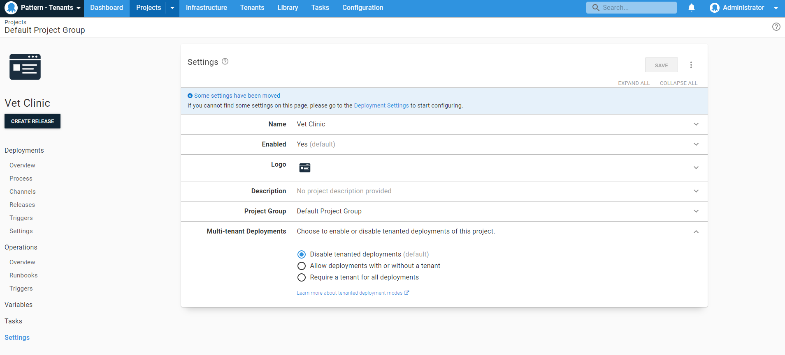

The first step in this guide is to create a project that will be deployed to our tenants.

!include <tenants-create-project>

3. Next, you need to make sure the project has [tenanted deployments](/docs/tenants/tenant-creation/tenanted-deployments.md) enabled

    

The next step will define the [Tenant tag set](/docs/tenants/guides/multi-tenant-saas-application/creating-new-project.md) needed for this scenario.

<a class="btn btn-secondary" href="/docs/tenants/guides/multi-tenant-saas-application">Previous</a>&nbsp;&nbsp;&nbsp;&nbsp;&nbsp;<a class="btn btn-success" href="/docs/tenants/guides/multi-tenant-saas-application/creating-tenant-tag-set">Next</a>