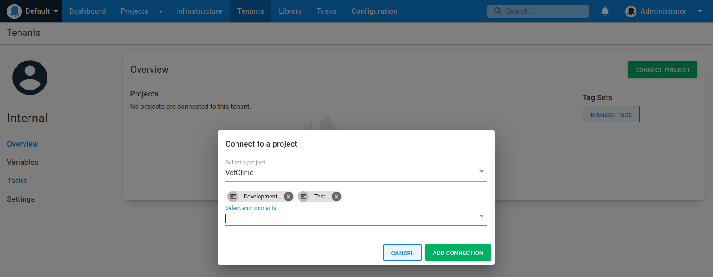
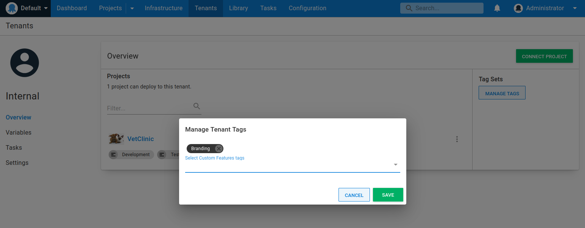

VetClinic has four customers; an internal customer used for development and testing, and three customers

- VetClinic Internal
- Capital Animal Hospital
- Companion Care Vets
- Midland Veterinary

Each customer is modeled as a tenant and has two environments they deploy to. The internal tenant is used to deploy new releases to development and test before they are promoted to the other tenants, who deploy to staging and production.

To create your tenants follow these steps:

!include <tenants-create-tenant>

Once the tenant is created, you need to associate the tenant with a project and environment. You can choose to connect the tenant with many projects and environments. For the internal tenant, we only need to be able to deploy VetClinic to the development and test environments. The customer tenants need staging and production but not development and test.

Each customer is deployed into exactly one Azure region. To ensure that the application is deployed to the correct location, we must associate each tenant with the correct tag.

In the tenant overview, Click on **MANAGE TAGS** to edit which tags are associated to a Tenant and select one of the Azure regions for your tenant

Repeat this process for each of the tenants. 

The next section covers the [tenant infrastructure](/docs/tenants/guides/multi-tenant-saas-application/creating-new-azure-infrastructure.md) needed for this scenario.

<a class="btn btn-secondary" href="/docs/tenants/guides/multi-tenant-saas-application/creating-tenant-tag-set">Previous</a>&nbsp;&nbsp;&nbsp;&nbsp;&nbsp;<a class="btn btn-success" href="/docs/tenants/guides/multi-tenant-saas-application/creating-new-azure-infrastructure">Next</a>