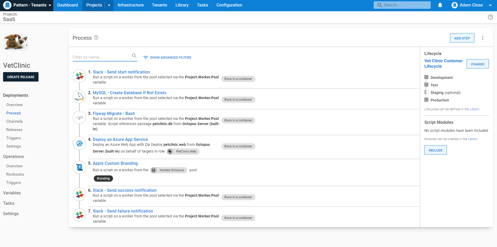

In this part of the guide, we will create our deployment process to deploy our package to our deployment targets. At this point, you can all the steps you need to deploy your application. In this case, we have the following steps;

* Send slack message to noifty team of deployment
* Create MySQL database
* Migrate Database Changes
* Deploy App to Azure App Service 
* Apply custom branding 
* Send Slack message for succesfull deployment
* Send Slack message for failed deployment

The step, ***Apply custom branding***, only needs to run for tenants that have the branding tag applied. To configure this, go into your step, open Tenants under conditions, and choose branding tag from the custom feature tenant tag.

This will ensure this step only runs for tenants that have the branding tag applied.

<a class="btn btn-secondary" href="/docs/tenants/guides/multi-tenant-saas-application/creating-new-octopus-infrastructure">Previous</a>