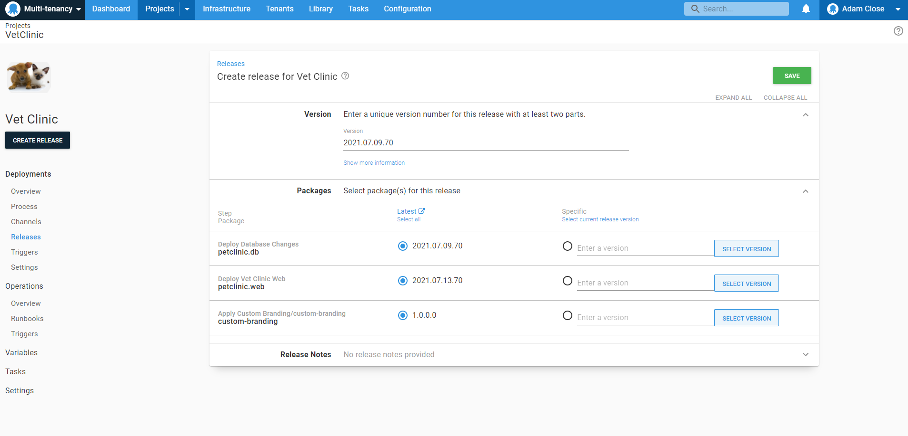

In this section, we will create a release, and then deploy to development, test, staging and production.

Creating a release for a tenanted application is the same process as any other application. In your project, Click on the **CREATE RELEASE** button and click **SAVE**

As part of our project lifecycle, we need to deploy our release to development first, followed by test using the `Internal` tenant.

Once the deployment to development and test have completed, we now have the option of deploying to our staging environment for customers that have staging configured and available.

Once we have deployed to staging, we can deploy to the last environment in our lifecycle, production. 

One of our tenants, `Capital Animal Hospital` has the `Branding` tenant tag [we created earlier in the guide](/docs/tenants/guides/multi-tenant-saas-application/creating-tenant-tag-set.md) associated with them. As a result, the **Apply Custom Branding** step was applicable to them and we can see from the logs that it ran that step when we deployed to production for `Capital Animal Hospital`.

<a class="btn btn-secondary" href="/docs/tenants/guides/multi-tenant-saas-application/creating-project-deployment-process">Previous</a>