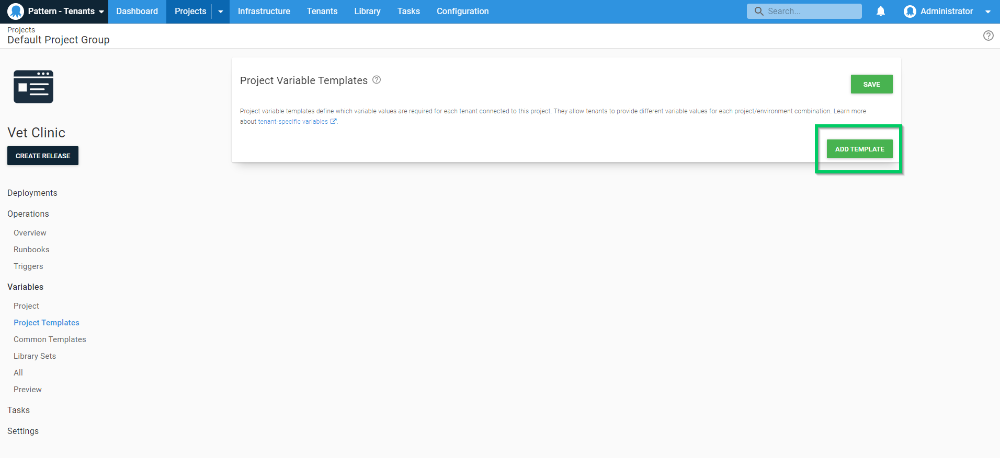

Each Customer has there own database and a unique name for everthing environment. To make this managable we can  [create project template variables](/docs/tenants/tenant-variables.md) for the database name.

To create Project Template Variables navigate to **{{Projects, Projects, Variables, ADD TEMPLATE }}**.

Next, add a variable name, label, help text, control type and an optional Default value.

<a class="btn btn-secondary" href="/docs/tenants/guides/multi-tenant-saas-application/creating-new-project">Previous</a>&nbsp;&nbsp;&nbsp;&nbsp;&nbsp;<a class="btn btn-success" href="/docs/tenants/guides/multi-tenant-saas-application/creating-tenant-tag-set">Next</a>