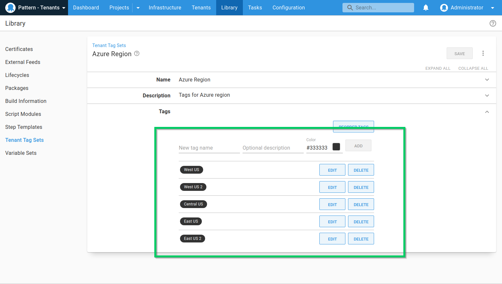

Customers who use Vet Clinic can choose from a pre-defined list of Azure regions to host their web application. To designate which tenant (customer) is in which region we define [Tenant Tag Sets](/docs/tenants/tenant-tags.md).

For this scenario, we need a single tenant tag set for the Azure region.

To create Tenant Tags Sets navigate to **{{Library, Tenant Tag Sets, ADD TAG SET}}**.

Give the **Tag Set** a name, an optional description, and create some Tags.  For the Vet Clinic application, we need to create an Azure Region Tag Set with the following Azure Regions as the Tags:

* West US 
* West US 2
* Central US 
* East US
* East US 2

In the next step, we'll [create the tenants](/docs/tenants/guides/multi-tenant-saas-application/creating-new-tenant.md) needed for this scenario.

<a class="btn btn-secondary" href="/docs/tenants/guides/multi-tenant-saas-application/creating-new-project">Previous</a>&nbsp;&nbsp;&nbsp;&nbsp;&nbsp;<a class="btn btn-success" href="/docs/tenants/guides/multi-tenant-saas-application/creating-new-tenants">Next</a>