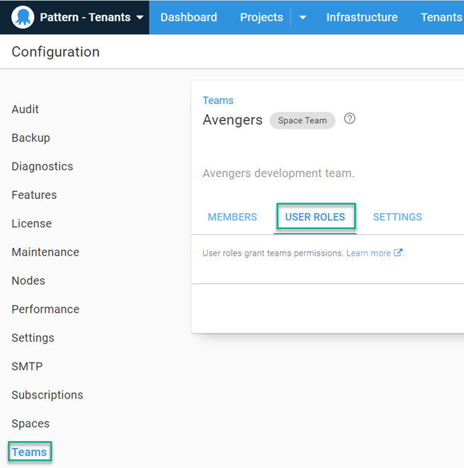
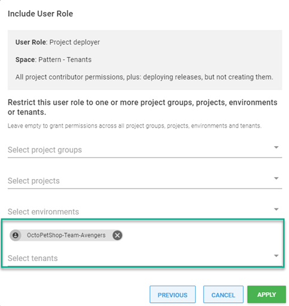

With the Teams multi-tenant pattern, it is likely that each team will need the ability to deploy to their development environment.  Scoping the team to their specific tenant will ensure they can only deploy to their dedicated infrastructure.

## Scoping team to tenant

Once you've created your team, click on the **USER ROLES** tab.

Click on **INCLUDE USER ROLE** then select the role to include for the team.  After the role has been selected, click on **DEFINE SCOPE**

Select the tenant and click **APPLY**

This configures the team with `Project Contributor` permissions to any project with the Tenant Tag `OctoPetShop-Team-Avengers`

