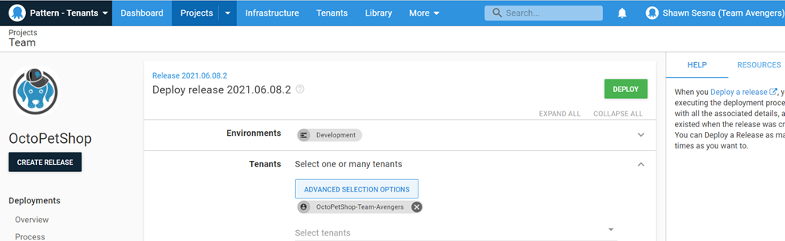

Scoping the Teams to their respecitive tenants give Teams Avengers and Radical the autonomy of deploying Octo Pet Shop without interfering with the each other.

## Scoped team creating a release
Developers for Team Avengers have the ability to create a release, but only deploy to their own tenant.  When deploying to Development, the OctoPetShop-Team-Avengers tenant is automatically selected.

Depending on how you scope your team for Environment, because the `OctoPetShop-Team-Avengers` tenant is only scoped for Development, attempting to deploy to test will result in a missing resource and the **DEPLOY** button disabled

