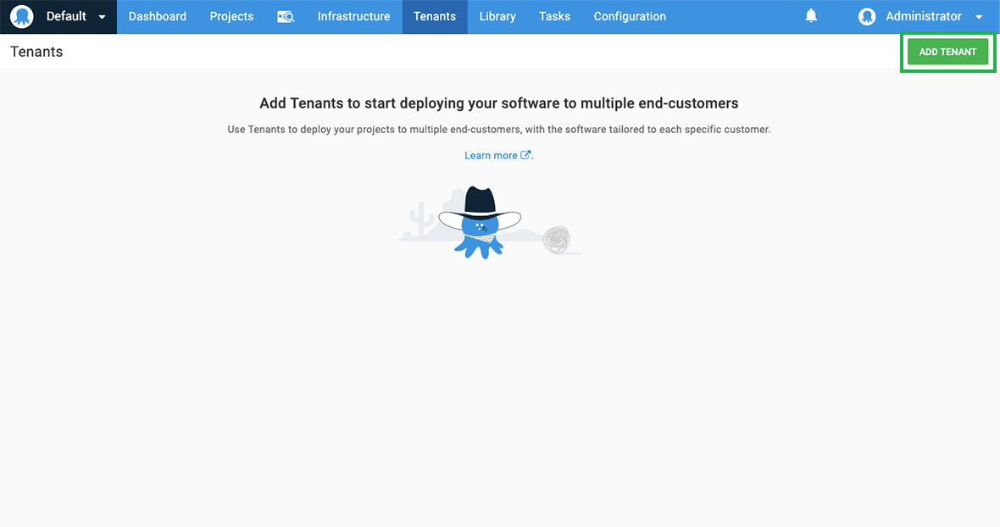
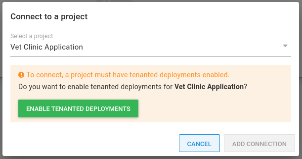
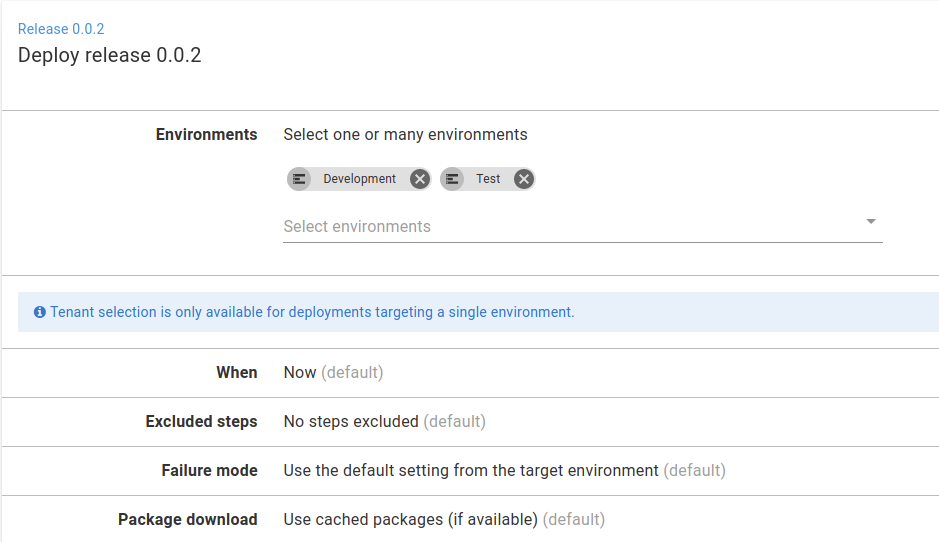

This section describes the multi-tenancy feature of Octopus Deploy.

Tenants in Octopus Deploy allow you to easily manage separate instances of your application in an environment. Without tenants, you can only deploy a single instance of your application to an environment.

Tenants enable:

1. Deploying multiple instances of your project to the same [Environment](/docs/infrastructure/environments/index.md).
2. Managing configuration settings unique to each tenant.
3. Promoting releases using safe tenant-aware lifecycles.
4. Tailoring the deployment process using tenant tags.
5. Deploying to shared or dedicated infrastructure per tenant.
6. Limiting access to tenants by scoping team roles to tenants.
7. Creating release rings so that you can easily deploy to alpha and beta tenants.
8. Managing large groups of tenants using tenant tags.
9. Building simple multi-tenant deployment processes that can scale as you add more tenants.

## Types of tenants {#types-of-tenants}

We designed tenants to be generic so that they can satisfy multiple use cases.

Tenants usually represent the customers of your application, especially when it comes to SaaS products.

Tenants can also represent:

- Geographical regions or datacenters
- Developers, testers, or Teams
- Feature branches

Learn more about [tenant types](/docs/tenants/tenant-types.md).

## When to use tenants {#when-to-use-tenants}

:::success
You don't need tenants to implement a multi-tenant SaaS application. You can architect your application so that one instance can serve multiple customers. We built multi-tenancy for situations where you want to deploy your application more than once in an environment.
:::

Here are some signs that you should consider using tenants:

- You need to deploy different versions of your application to the same environment.
- You are creating multiple environments of the same type. This could be multiple Test environments for different testers or multiple Production environments for different customers.

Check out our [multi-tenancy guides](/docs/tenants/guides/index.md) that go into more detail on how to use multi-tenancy in Octopus for some common scenarios.

## Add a tenant {#add-tenants}

1. Select **Tenants** from the main navigation, and click **ADD TENANT**.

   

2. Enter the name you want to use for the tenant and click the **SAVE** button:

    

Now that you've created a tenant, you can [enable tenanted deployments](#enable-tenanted-deployments) and then [connect the tenant to a project](#connect-tenant-to-project).

:::hint
It's also possible to create a tenant using the [Octopus REST API](/docs/octopus-rest-api/index.md). To learn more, see our [Create a Tenant](/docs/octopus-rest-api/examples/tenants/create-tenant.md) example.
:::

## Tenant logo {#tenant-logo}

Try adding a logo for your tenant - this will make it much easier to distinguish your tenants. You can do this within the Octopus Tenant section by clicking on the tenant's logo placeholder or going to the Settings tab on the tenant.

Your tenants will likely be other businesses, and you could use their logo to help quickly identify the correct tenant.

You could consider using logos based on:

- Customer logos
- Data center region(s) or flags
- Individual tester(s) photo/avatar

## Enable tenanted deployments {#enable-tenanted-deployments}

Each project can control its interaction with tenants. By default the multi-tenant deployment features are disabled. You can allow deployments with/without a tenant, which is a hybrid mode that is useful when you are transitioning to a fully multi-tenant project. There is also a mode where you can require a tenant for all deployments, which disables untenanted deployments for that project.

You can change the setting for tenanted deployments for a project by navigating to the project's settings and changing the selected option under **Multi-tenant Deployments**:

It's also possible to enable tenanted deployments when [connecting a tenant to a project](#connect-tenant-to-project) from the tenant screen:

### Tenanted and Untenanted deployments {#tenanted-and-untenanted-deployments}

On the deployment screen, if you you choose **Tenanted** from the **Tenants** option, you are performing a **tenanted deployment** - deploying a release of a project to an environment for one or more tenants. 

When you perform a tenanted deployment, the selected tenant can impact the entire process, including which steps are run, which variable values are used, and which deployment targets are included, all depending on your deployment design.

Also, note Octopus will create a deployment per-tenant. This means if you select 20 tenants, Octopus will create 20 separate deployments: one for each tenant. Each of those deployments will execute in its own task.

When you choose **one or more environments** to deploy to, you are performing an **untenanted deployment** - this is the same kind of deployment Octopus has always performed where you deploy a release of a project to an environment there is no tenant for the deployment. There will be no tenant influence on the deployment process.

When you first enable multi-tenant deployments, you won't have any tenants, and we don't want that to stop you from deploying your existing projects. Perhaps you are using an environment-per-tenant model and will migrate to tenants over some time, so some deployments will start to have a tenant while others do not.

## Connect a tenant to a project {#connect-tenant-to-project}

By connecting tenants to projects, you can control which projects will be deployed into which environments for each tenant.

1. Navigate to your tenant.
2. Click on the **CONNECT PROJECT** button.

   

3. Select the project you want to connect to the tenant. If a warning is shown, click the **ENABLE TENANTED DEPLOYMENTS** button, which will enable the multi-tenant deployment features for the project. This will configure the project to allow deployments *with* or *without* a tenant.

   

4. Now select the environments to allow tenanted deployments to, and click the **ADD CONNECTION** button.

   

You can connect each tenant to any number of projects and for each project, any combination of environments that can be targeted by each project. This gives you the most flexibility when designing your multi-tenant deployments.

- You can offer specific projects to some tenants and not to others.
- You can also provide most of your tenants with a single environment while offering specific customers extra environments. For example, you could give particular customers with a test/staging/acceptance environment where they can test new releases before upgrading their production environment.

:::info
Not seeing the environment you want? Make sure at least one lifecycle used by your project includes that environment.
:::

## Tenant variables {#tenant-variables}

You often want to define variable values that are different for each tenant, like database connection settings or a tenant-specific URL. If you were using an untenanted project, you would have previously defined these values in the project itself. But with a tenanted project, you can set these values directly on the tenant for any connected projects.

:::hint
**Tenant-provided variables are not snapshotted**
When you [create a release](/docs/octopus-rest-api/octopus-cli/create-release.md) in Octopus Deploy we take a snapshot of the deployment process and the current state of the [project-variables](/docs/projects/variables/index.md), however, we do not take a snapshot of tenant-variables. This enables you to add new tenants at any time and deploy to them without creating a new release. This means any changes you make to tenant-variables will take immediate effect.
:::

Learn more about [tenant variables](/docs/tenants/tenant-variables.md) in our reference documentation.

## Tenant tags {#tenant-tags}

Tenant tags help you to classify your tenants using custom tags that meet your needs, and tailor tenanted deployments for your projects and environments. Learn more about [tenant tags](/docs/tenants/tenant-tags.md) in our reference documentation.

## Troubleshooting multi-tenant deployments

If you're running into any issues with tenants, then this section has some useful answers to some of the questions we are often asked relating to multi-tenant deployments in Octopus Deploy:

- [Multi-tenant deployments FAQ](/docs/tenants/tenant-deployment-faq.md)
- [Troubleshooting multi-tenant deployments](/docs/tenants/troubleshooting-multi-tenant-deployments.md)

If you still need assistance, don't worry - [we are always here to help!](https://octopus.com/support)