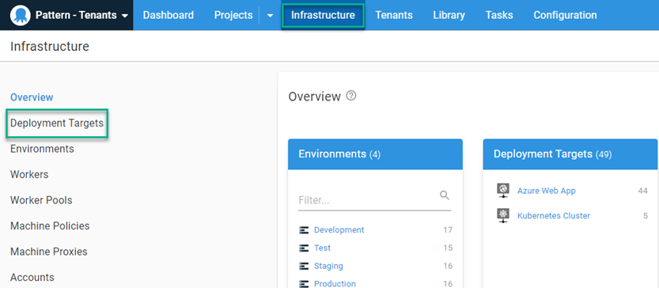
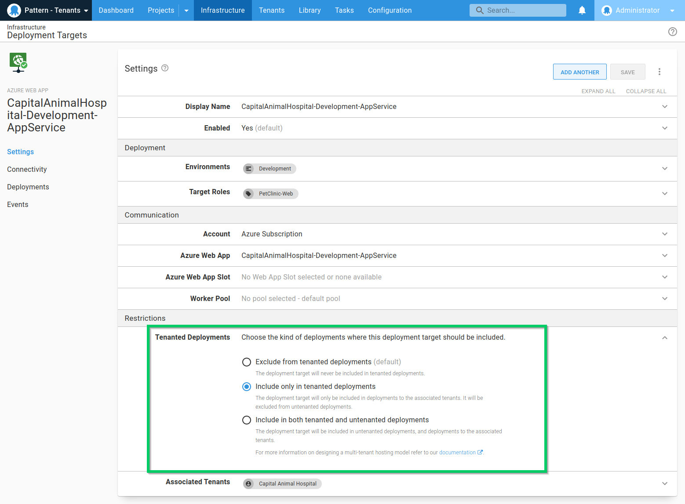
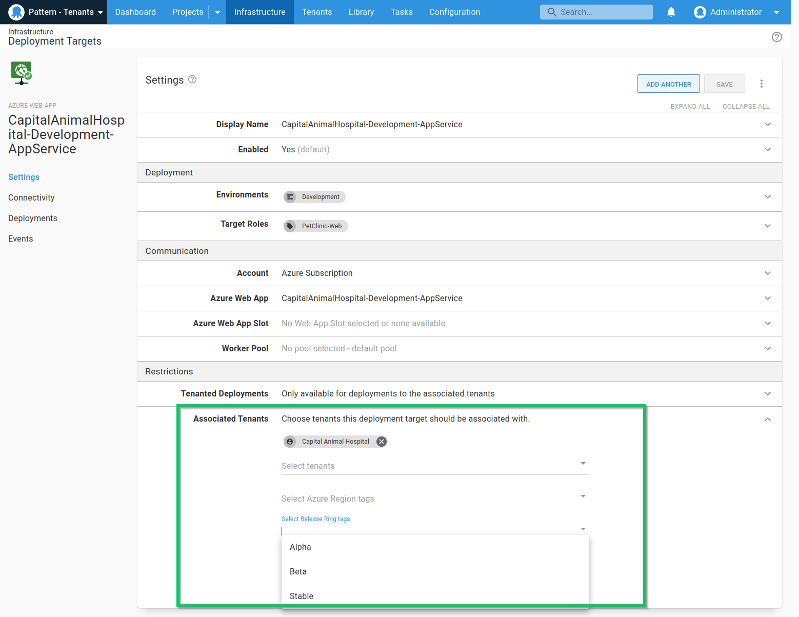

The hosting model for your infrastructure with tenants will vary depending on your application, customers, and sales model. Here we'll cover two of the most common implementations:

- [Dedicated hosting](#dedicated-hosting): You have dedicated deployment targets for each customer.
- [Shared hosting](#shared-hosting): You create farms or pools of servers to host all of your customers, achieving higher density.

You can design and implement both **dedicated** and **shared** multi-tenant hosting models in Octopus using [environments](/docs/infrastructure/environments/index.md), [deployment targets](/docs/infrastructure/index.md), and [tenant tags](/docs/tenants/tenant-tags.md).

## Tenanted and untenanted deployments

Although we focus on tenanted deployments in this section, untenanted deployments deserve some explanation with regards to hosting. Untenanted deployments provide a way for you to start introducing tenants into your existing Octopus configuration. An untenanted deployment is the default in Octopus; a deployment to an environment *without* a tenant. Octopus decides which deployment targets to include in a deployment like this:

- **Tenanted deployments** will use **matching tenanted deployment targets**.
- **Untenanted deployments** will only use **untenanted deployment targets**.

Learn more about the differences between [tenanted and untenanted deployments](/docs/tenants/index.md#tenanted-and-untenanted-deployments).

## Configuring targets for tenanted deployments

By default, deployment targets in Octopus Deploy aren't configured for tenanted deployments.  To configure the target for tenanted deployments, navigate to **{{Infrastructure, Deployment Targets}}**

Click on the deployment target you wish to configure for tenanted deployments. In the **{{Restrictions, Tenanted Deployments}}** section, you can choose the kinds of deployments the target can be involved in

- **Exclude from tenanted deployments** (default) - the deployment target will never be included in tenanted deployments.
- **Include only in tenanted deployments** - the deployment target will only be included in deployments to the associated tenants. It will be excluded from untenanted deployments.
- **Include in both tenanted and untenanted deployments** - The deployment target will be included in untenanted deployments, and deployments to the associated tenants.

### Choose tenants for target

To choose the tenants to associate with a deployment target navigate to the **{{Restrictions, Associated Tenant}}** section of the deployment target. You can select the tenants to allow to deploy to individually, or you can choose from any of the configured [tenant tags](/docs/tenants/tenant-tags.md).

:::hint
We generally recommend keeping tenanted and untenanted deployment targets separate, particularly in Production. You could use the same deployment targets for other environments but it's better to avoid this situation.
:::

## Dedicated hosting {#dedicated-hosting}

## Shared hosting {#shared-hosting}
