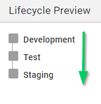
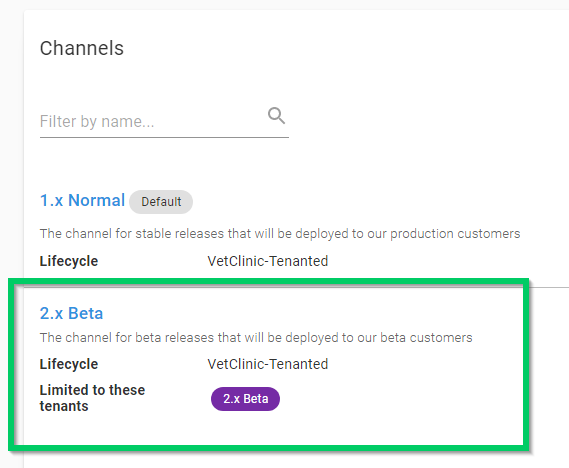
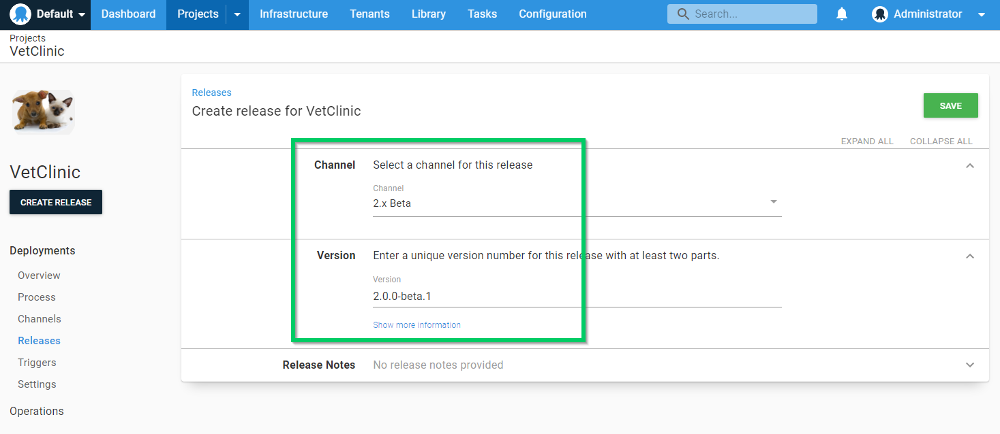
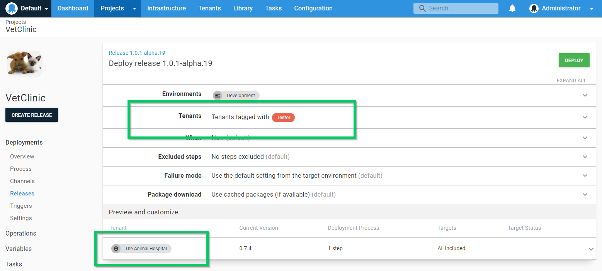

You can control which [releases](/docs/releases/index.md) will be deployed to certain Tenants using [Channels](/docs/releases/channels/index.md). 

This page discusses some scenarios for controlling release promotion for tenants:

- Implementing an Early access program (EAP)
- Restricting test releases to the test team
- Pinning tenants to a release

## Implementing an early access program {#early-access-program}

Quite often, you want to involve certain customers in testing early releases of major upgrades. By using a combination of [Channels](/docs/releases/channels/index.md) and [Tenant Tags](/docs/tenants/tenant-tags.md) you can implement an opt-in early access program using tenants, making sure the beta releases are only deployed to the correct tenants and environments.

Firstly we will create a new [Lifecycle](/docs/releases/lifecycles/index.md).

:::hint
Learn more about [defining a limited Lifecycle for your test Channel](/docs/releases/channels/index.md).
:::

### Step 2: Configure the tenant tags

Add a new tag called `2.x Beta` to a new or existing Tenant tag set.

### Step 3: Select the tenants participating in the beta program

Add the `2.x Beta` tag to one or more tenants who are included in the beta program

### Step 4: Configure a channel for the beta program

Create a channel called **2.x Beta** and restrict its use to Tenants tagged with `2.x Beta`

### Step 5: Create a beta release

Create a new release of the project choosing the **2.x Beta** channel for the release, and give it a [SemVer](http://semver.org/) version number like **2.0.0-beta.1**

### Step 6: Deploy

Now when you are deploying **2.0.0-beta.1**, you will be able to select tenants participating in the Beta program and prevent selecting tenants who are not participating.

## Restricting test releases {#restricting-test-releases}

You may decide to use channels as a safety measure, to restrict test releases to a limited set of test tenants. By using a combination of [Channels](/docs/releases/channels/index.md) and [Tenant Tags](/docs/tenants/tenant-tags.md) you can make sure test releases are only deployed to the correct tenants and environments.

### Step 1: Create the lifecycle

Firstly we will create a new [Lifecycle](/docs/releases/lifecycles/index.md).

:::hint
Learn more about [defining a limited Lifecycle for your test Channel](/docs/releases/channels/index.md).
:::

### Step 2: Configure the tenant tags

Add a new tag called `Tester` to a new or existing Tenant tag set.

### Step 3: Select the tenants participating in the betestta program

Add the `Tester` tag to one or more tenants who are included in the test program

### Step 4: Configure a channel for the test program

Create a channel called **1.x Test** and restrict its use to Tenants tagged with `Tester`

### Step 5: Create a test release

Now create a release in the new **1.x Test** channel giving it a [SemVer](http://semver.org/) pre-release version like **1.0.1-alpha.19** indicating this is a pre-release of **1.0.1** for testing purposes.

### Step 6: Deploy

When you deploy this release, you will be able to choose from the limited set of tenants tagged with the `Tester` tag and deploy into the test environments, but no further.

## Pinning tenants to a release {#pinning-tenants}