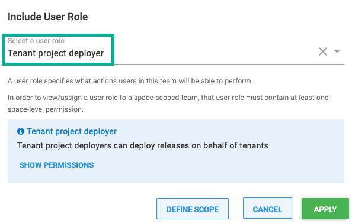
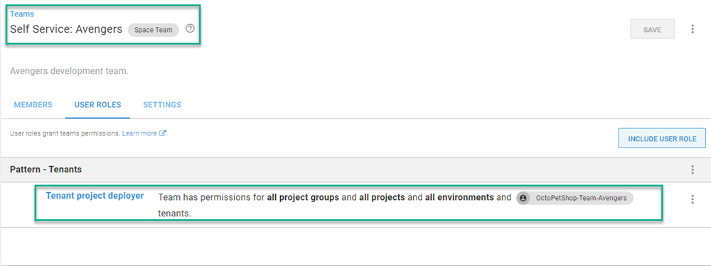

This page describes several conventional approaches to structuring roles and teams to secure a multi-tenant Octopus instance. Using the permissions system in Octopus, you can configure internal team members with different roles who interact with tenants in different ways. You can also configure Octopus to provide access for your external customers. This page explores several of those roles for both internal and external parties.

::success
To get the most out of this guide you will need to understand how to [manage users and teams](/docs/security/users-and-teams) and how to [work with custom roles](/docs/security/users-and-teams/user-roles). Octopus provides an expressive permissions system, and you can customize the security configuration to your particular scenario.
::

## Account manager {#account-manager}

Toby is a member of the sales team for [Vet Clinic](https://samples.octopus.app/app#/Spaces-682/projects/vetclinic/deployments) and manages the relationships for several of the largest customers. In his role Toby:

- The main point of contact for specific tenants.
- Manages the details/variables of particular tenants and keeps them up to date.
- Works with customers to deploy releases to their environments on their behalf.

### Step 1: Configure the tenant project deployer role {#step-1-configure-tenant-deployer}

Firstly we will create a custom role with the permissions required to deploy releases into tenant environments. This role is loosely based on the built-in **Project deployer** role but removing the permissions to edit the project.

:::success
It is usually a good idea to build smaller roles that can be composed together into a team to provide easier management of your team permissions. In this example, we are creating a single role to grant all of the required permissions to keep the example simple. In this case, you could create a **Tenant project viewer** role and a **Tenant project deployer** role and combine them into a single team.
:::

1. In **{{Configuration,Teams,Roles}}** click **Add custom role** and call it **Tenant project deployer**.
2. Set the description to **Tenant project deployers can deploy releases on behalf of tenants**
3. Choose the following permissions under [Space Permissions](/docs/security/users-and-teams/system-and-space-permissions.md):
   1. AccountView
   2. ArtifactView
   3. DeploymentCreate
   4. DeploymentView
   5. EnvironmentView
   6. EventView
   7. FeedView
   8. InterruptionView
   9. InterruptionViewSubmitResponsible
   10. LibraryVariableSetView
   11. LifecycleView
   12. MachinePolicyView
   13. MachineView
   14. ProcessView
   15. ProjectGroupView
   16. ProjectView
   17. ReleaseView
   18. TaskCancel
   19. TaskCreate
   20. TaskView
   21. TeamView
   22. TenantEdit
   23. TenantView
   24. VariableView
   25. VariableViewUnscoped

### Step 2: Configure the account managers team {#step-2-configure-account-managers-team}

Now we will create a team for all the Account Managers and add the role we created in the last step.

1. In **{{Configuration,Teams}}** click Add team and call it **Toby's clients**. Be sure to select "Accessible in the X space only" unless you have tenants spread over multiple [Spaces](/docs/administration/spaces/index.md) and then select **Save**.

2. Under **User Roles** select **Include User Role** button.

3. From the dropdown, select the **Tenant project deployer role**.

4. Under **{{Members,Add member}}**  and add any user accounts that will form part of this team.

### Step 3: Reduce the scope of the team {#step-3-reduce-team-scope}

After adding the **Tenant project deployer** role, we'll see that Toby has access to all tenants.  Toby only needs access to the accounts that he's responsible for; Midland Veterinary and Valley Veterinary Clinic.  To limit Toby to his accounts, click on the **{{elipses,Edit}}**

Select the tenants and click **APPLY**

:::hint
The scoping for a User Role can also be defined on the `Include User Role` screen by clicking on the **DEFINE SCOPE** button.
:::

## Infrastructure manager {#infrastructure-manager}

Bob is a member of the IT infrastructure team for [Car Rental](https://samples.octopus.app/app#/Spaces-682/projects/car-rental/deployments), and he manages all the virtual servers for the different regions in the cloud. His only interaction with tenants is to associate them with the appropriate [deployment targets](/docs/infrastructure/index.md) and [environments](/docs/infrastructure/environments/index.md).  He should have read-only access to tenant details required and have the ability to manage deployment targets and accounts. This time we will configure the team using a composition of built-in and custom roles.

### Step 1: Configure the tenant viewer role {#step-1-configure-tenant-viewer}

Similarly to the previous example, we will create a custom role with minimum permissions to view tenant details. Later on, we will create a team that combines multiple roles to achieve the desired effect.

1. Create a role called **Tenant viewer** with the following permissions:
  - TenantView

### Step 2: Configure the tenant environment managers team {#step-2-configure-environment-managers-team}

In this example, we will create a new team and combine multiple roles to achieve the desired result.

1. Create a new team called Tenant Environment Managers.
2. Add the Tenant viewer and Environment manager roles to the team:
   
3. Add any specific tenant/environment scoping that makes sense.
4. Add any specific members

## Self-service {#self-service}
 
[OctoPetShop](https://samples.octopus.app/app#/Spaces-682/projects/octopetshop/deployments) has development teams that work concurrently.  These teams deploy to Development in upwards of ten times a day and need the autonomy to deploy themselves.

### Step 1: Configure a team for the tenant {#step-1-configure-self-service-team}

Firstly we need to create a team with a scope limited to the single tenant.

1. Create a new team called **Self-Service: <TenantName>** like **Self-Service: Avengers** in our example.
2. Add any roles you desire. In our example, we're providing the tenant with the **Tenant project deployer** role.
3. Scope the team to a single tenant:

