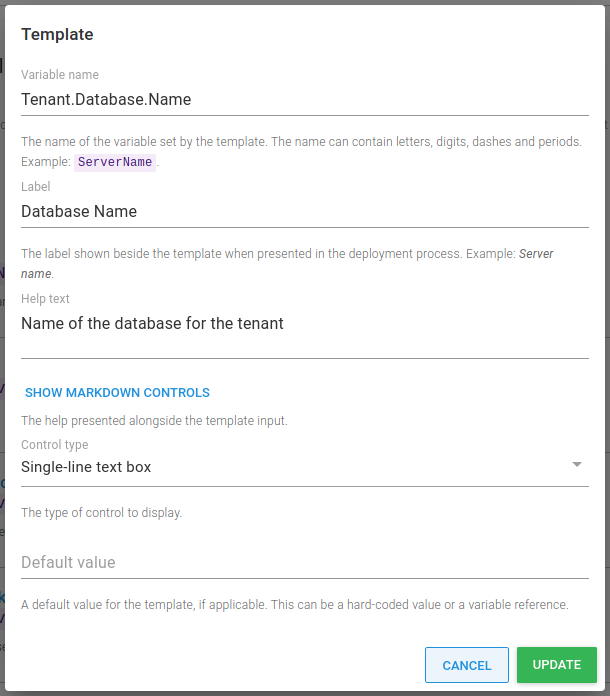
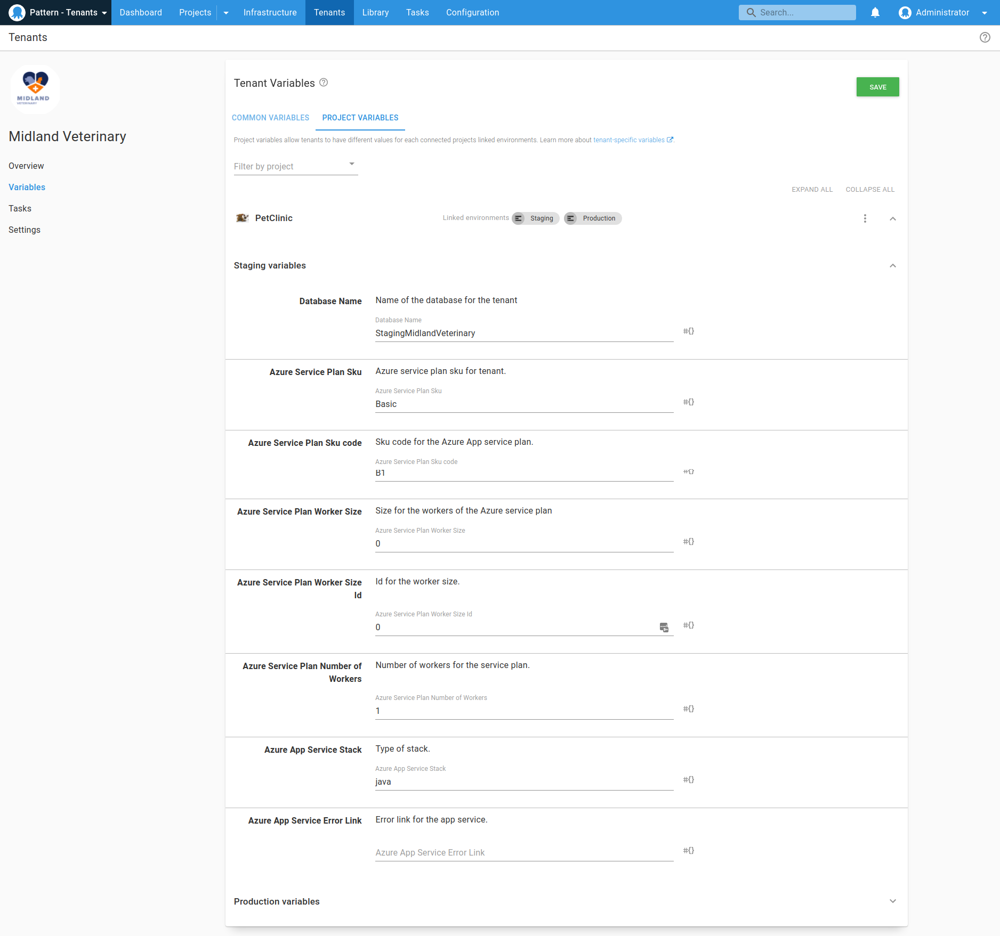

You often want to define variable values that are different for each tenant. For example:
- A database server name or connection string
- A tenant-specific URL
- Contact details for a tenant

If you were using an untenanted project, you would have previously defined these values in the project itself. With a tenanted project, you can set these values directly on the tenant for any connected projects.

## Variable templates

Tenant variable values can be provided in one of two ways:

- [Project variables](#project-variables)
- [Common variables](#common-variables)

Both of these methods use the [variable templates](/docs/projects/variables/variable-templates.md) feature.

### Which variable templates apply to each tenant? {#which-templates-apply}

!include <which-variable-templates-apply-to-tenants>

## Project variables {#project-variables}

Project variables allow you to specify a variable which a tenant can change. A perfect example would be a connection string or a database server. With project variables you define them at the project level using [project templates](/docs/projects/variables/variable-templates.md#project-templates):

You can specify the variable type for the project template, just like regular variables. You can also provide a default value which the tenant can overwrite.

On the tenant variable screen, you can set those variables.

The great thing about project template variables is that they are treated like any other variable, and can be used in steps like regular project variables:

## Common variables {#common-variables}

## Snapshots {#tenant-variables-and-snapshots}