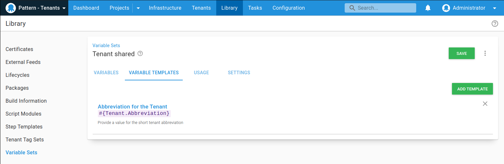

You often want to define variable values that are different for each tenant. For example:
- A database server name or connection string
- A tenant-specific URL
- Contact details for a tenant

If you were using an untenanted project, you would have previously defined these values in the project itself. With a tenanted project, you can set these values directly on the tenant for any connected projects.

## Variable templates

Tenant variable values can be provided in one of two ways:

- [Project variables](#project-variables)
- [Common variables](#common-variables)

Both of these methods use the [variable templates](/docs/projects/variables/variable-templates.md) feature.

### Which variable templates apply to each tenant? {#which-templates-apply}

!include <tenants-which-variable-templates-apply>

## Project variables {#project-variables}

Project variables allow you to specify a variable which a tenant can change. A perfect example would be a connection string or a database server. With project variables you define them at the project level using [project templates](/docs/projects/variables/variable-templates.md#project-templates).

You can specify the variable type for the project template, just like regular variables. You can also provide a default value which the tenant can overwrite.

On the tenant variable screen, you can set those variables.

The great thing about project template variables is that they are treated like any other variable, and can be used in steps like regular project variables.

## Common variables {#common-variables}

Common variables are similar to project variables. The main difference between the two is that common variables can be used across multiple projects, and they aren't scoped to environments. Common variables are defined using [Library variable set templates](/docs/projects/variables/variable-templates.md#adding-a-variable-template)

For example, if we wanted to define an abbreviation for the tenant to use in a deployment or runbook, we can configure a variable template for the library set.

:::success
To include common variables for a tenant, you must add the library variable set in the tenant connected project.
:::

Just like project variables, common variable values are supplied at the tenant level.

  
### Common variable permissions

When editing common variables for a tenant, a user requires variable editing permission (`VariableEdit`) for the tenant as well as **all projects** linked to the tenant. 

This can be achieved by scoping a User Role to:
- All projects individually 
- The correct Project Groups 
- A combination of individual projects and Project Groups

If you don't have the necessary permissions, you might receive an error like this:

## Snapshots {#tenant-variables-and-snapshots}

When you [create a release](/docs/octopus-rest-api/octopus-cli/create-release.md) in Octopus we take a snapshot of the deployment process and the current state of the [project variables](/docs/projects/variables/index.md). 

However, we *don't* take a snapshot of tenant variables. This enables you to add new tenants at any time and deploy to them without creating a new release. This means any changes you make to tenant-variables will take immediate effect.
