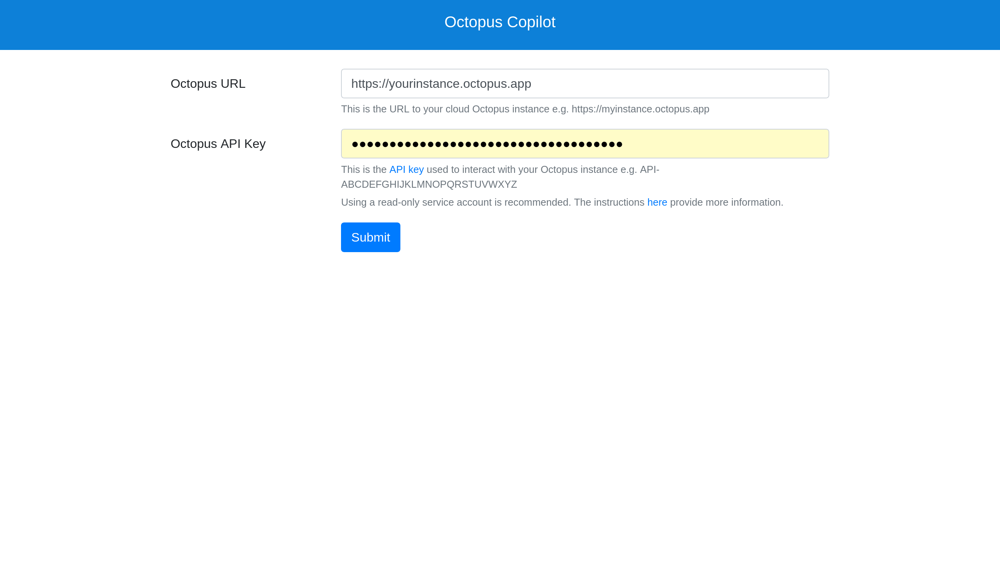

The Octopus Copilot integration allows read only queries of cloud Octopus instance via GitHub Copilot.

:::div{.warning}
Octopus Copilot is an experiment. It is not covered by service level agreements.
:::

The goal of Octopus Copilot is to provide a middle ground between the web based UI and the REST API. Prior to Octopus Copilot, tasks that can not be performed via the web UI could only be achieved through custom scripts that interacted with the REST API. Working with the REST API requires a good understanding of the Octopus domain model and the ability to write custom code. Octopus Copilot provides the ability to query the configuration and state of an Octopus instance via natural language prompts.

## Getting started

Octopus Copilot has 4 prerequisites:

* An Octopus Cloud instance
* An API key
* A GitHub Copilot account

### Creating an Octopus cloud instance
Octopus Copilot is available for cloud Octopus instances. Click [here](https://octopus.com/start) to sign up for trial cloud Octopus instance.

### Creating the Octopus API key
Octopus Copilot requires an API key to interact with the Octopus server. Octopus Copilot only requires read access to the Octopus instance. It is recommended that you create a service account that belongs to a team with read-only permissions. The documentation [here](https://github.com/OctopusSolutionsEngineering/OctopusCopilot?tab=readme-ov-file#creating-a-service-account) provides a sample Terraform module that creates a read-only role, a team referencing the role, and a service account belonging to the team.

### Creating a GitHub Copilot account

You can sign up for a GitHub Copilot account [here](https://github.com/features/copilot).

## Querying Octopus with Copilot

Queries directed to `@octopus-copilot` in the GitHub Copiloy chat window are answered by Octopus Copilot. For example, the following query displays the dashboard of the `Default` space:

```
@octopus-copilot Show the dashboard for the "Default" space
```

The first request to Octopus Copilot will prompt you to complete a login with the following response:

```
To continue chatting please log in
```

Clicking the `log in` link to open the Octopus Copilot login page. You will first be required to log in via GitHub. You must use the same GitHub credentials as the user logged into the GitHub Copilot chat. You are then prompted to enter the URL and API key of your Octopus instance:



Click the `Submit` button to save your Octopus details. You can then return to the Copilot chat.

:::div{.hint}
You must log in to Octopus every 8 hours. It is recommended you save the Octopus details in your web browser's password manager or other password manager to streamline this login process.
:::

## Example queries

The following are example queries you can use to test Octopus Copilot:

* `@octopus-copilot What projects exist in the "Default" space?`