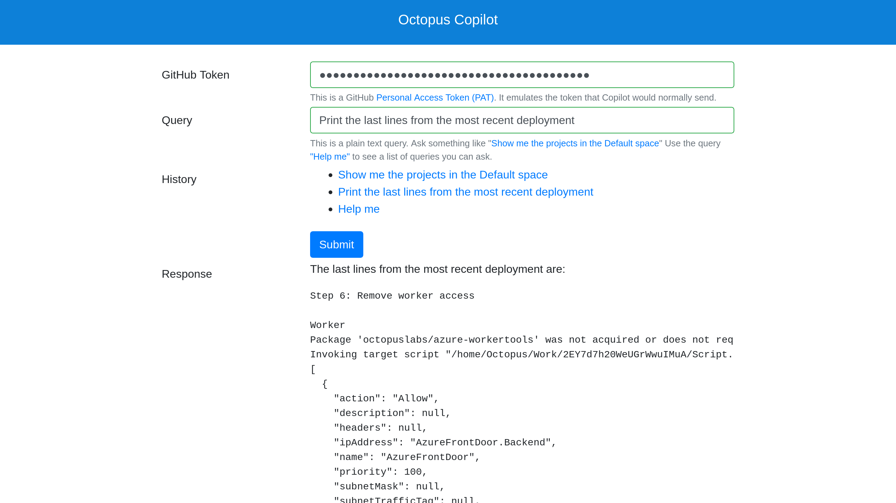

The Octopus Copilot integration allows read only queries of cloud Octopus instances via GitHub Copilot.

:::div{.warning}
Octopus Copilot is an experiment. It is not covered by service level agreements.
:::

The goal of Octopus Copilot is to provide a middle ground between the web based UI and the REST API. Prior to Octopus Copilot, tasks that can not be performed via the web UI could only be achieved through custom scripts that interacted with the REST API. Working with the REST API requires a good understanding of the Octopus domain model and the ability to write custom code. Octopus Copilot provides the ability to query the configuration and state of an Octopus instance via natural language prompts.

## Getting started

Octopus Copilot has 3 prerequisites:

* An Octopus Cloud instance
* An API key
* A GitHub Copilot account

### Creating an Octopus cloud instance
Octopus Copilot is available for cloud Octopus instances. Click [here](https://octopus.com/start) to sign up for a trial cloud Octopus instance.

### Creating the Octopus API key
Octopus Copilot requires an API key to interact with the Octopus server. 

Octopus Copilot only requires read access to the Octopus instance. It is recommended that you create a service account that belongs to a team with read-only permissions. The documentation [here](https://github.com/OctopusSolutionsEngineering/OctopusCopilot?tab=readme-ov-file#creating-a-service-account) provides a sample Terraform module to create a read-only role, a team referencing the role, and a service account belonging to the team.

### Creating a GitHub Copilot account

You can sign up for a GitHub Copilot account [here](https://github.com/features/copilot).

You can also use the web based interface without GitHub Copilot. See the section "Test query website" for more details.

## Querying Octopus with Copilot

Queries directed to `@octopus-copilot` in the GitHub Copilot chat window are answered by Octopus Copilot. For example, the following query displays the dashboard of the `Default` space:

```
@octopus-copilot Show the dashboard for the "Default" space
```

The first request to Octopus Copilot will prompt you to complete a login with the following response:

```
To continue chatting please log in
```

Click the `log in` link to open the Octopus Copilot login page. You will first be required to log in via GitHub. You must use the same GitHub credentials as the user logged into the GitHub Copilot chat. You are then prompted to enter the URL and API key of your Octopus instance:


Click the `Submit` button to save your Octopus details. You can then return to the Copilot chat.

:::div{.hint}
You must log in to Octopus every 8 hours. It is recommended you save the Octopus details in your web browser's password manager or other password manager to streamline this login process.
:::

## Test query website

A [test website](https://aiagent.octopus.com/api/form) allows you to query Octopus without Copilot. You must enter a GitHub token as identification, and complete the log in process with the same user as the one associated with the GitHub token. You can then query your Octopus instance via the web form in the same way you would query it from Copilot.

Queries entered into the test website do not need to mention `@octopus-copilot`.



## Saving default values

Users will often have a specific project, environment, space, tenant, and channel that they wish to query without explicitly typing the resource names in each prompt. To save default values for these resources, enter the following prompts:

* `@octopus-copilot Set the default space to "My Space"`
* `@octopus-copilot Set the default project to "My Project"`
* `@octopus-copilot Set the default environment to "My Environment"`
* `@octopus-copilot Set the default channel to "My Channel"`
* `@octopus-copilot Set the default tenant to "My Tenant"`

With default values set, you can enter a query like `@octopus-copilot Show me the state of the latest deployment` and the query will return the details of the latest deployment for the project `My Project` to the environment `My Environment` with the channel `My Channel` and tenant `My Tenant` in the space `My Space`. 

This is equivalent to the prompt `octopus-copilot Show me the state of the latest deployment of the project "My Project" to the environment "My Environment" for the channel "My Channel" and tenant "My Tenant" in the space "My Space"`.

Resource names included in a prompt override the defaults. So the query `octopus-copilot Show me the state of the latest deployment of the project "My Web App"` will show the details of the project `My Web App` and ignore the default project name.

Default values can be cleared with the prompt `@octopus-copilot Remove default values`.

## Example queries

The following are example queries you can use to test Octopus Copilot:

* `@octopus-copilot What projects exist in the "Default" space?`
* `@octopus-copilot Show the last lines from the latest deployment of "Octopus Copilot Function" to the "Production" enviroment in the "Default" space in a markdown code block.`
* `@octopus-copilot Show the step names from the "Octopus Copilot Function" project in the "Octopus Copilot" space`
* `@octopus-copilot How do I use the server side apply feature?`
* `@octopus-copilot Find the deployments created after 2024-04-16T00:00:00+10:00 and before 2024-04-17T00:00:00+10:00 for the "Octopus Copilot Function" project in the "Octopus Copilot" space to the "Production" environment. Then find the average deployment duration.`


## Prompt engineering tips

[This documentation](https://github.com/OctopusSolutionsEngineering/OctopusCopilot/wiki/Prompt-Engineering-with-Octopus) provides prompt engineering tips.

## Source code

The Octopus Copilot source code can be found on [GitHub](https://github.com/OctopusSolutionsEngineering/OctopusCopilot).

Octopus Copilot generates much of the prompt context using the Octoterra application. The source code for Octoterra is found on [GitHub](https://github.com/OctopusSolutionsEngineering/OctopusTerraformExport/actions).